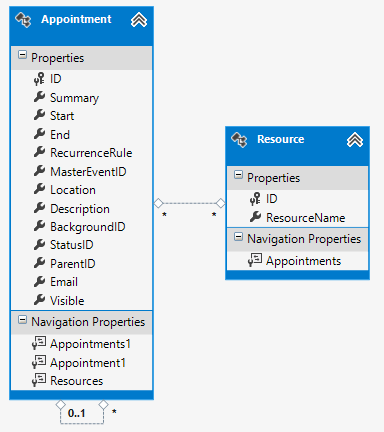

# Binding to EntityFramework and Telerik Data Access

Binding to an ORM is similar to binding to a [DataSet](). First you will need to create the models out of an existing database. You can read how to do that for Entity Framework [here](http://msdn.microsoft.com/en-us/data/jj206878.aspx). And for Telerik Data Access [here](http://docs.telerik.com/data-access/getting-started/getting-started-root-generating-model-mappings-taking-database-first-approach).

For the purpose of this tutorial you can download a sample database from the [ here]( http://www.telerik.com/docs/default-source/ui-for-winforms/schedulerdatasql.zip).

After you have mapped your database to local entities your tables should look like this:

>caption Figure 1: Tables Mapped by the ORM


Now, you need to create a form and add a RadScheduler, in this tutorial it is named *scheduler*. After this we will need to access out data from the database. For this we will need a [DbContext](http://msdn.microsoft.com/en-us/library/system.data.entity.dbcontext(v=vs.113).aspx) reference. In my case my DbContext is of type __SchedulerDataEntities1__, so we can create it as follows:

#### Create DbContext

{{source=..\SamplesCS\Scheduler\DataBinding\BindingToEntityFrameworkAndTelerikDataAccess.cs region=DbContext}} 
{{source=..\SamplesVB\Scheduler\DataBinding\BindingToEntityFrameworkAndTelerikDataAccess.vb region=DbContext}} 

````C#
private SchedulerDataEntities1 dbContext = new SchedulerDataEntities1();

````
````VB.NET
Private dbContext As New SchedulerDataEntities1()

````

{{endregion}} 

Then, we will need a __SchedulerBindingDataSource__, __AppointmentMappingInfo__ and __ResourceMappingInfo__ which we will use to map our data. You can create them in the Form's constructor.

#### Data Source Objects

{{source=..\SamplesCS\Scheduler\DataBinding\BindingToEntityFrameworkAndTelerikDataAccess.cs region=Mappings}} 
{{source=..\SamplesVB\Scheduler\DataBinding\BindingToEntityFrameworkAndTelerikDataAccess.vb region=Mappings}} 

````C#
SchedulerBindingDataSource schedulerBindingSource = new SchedulerBindingDataSource();
AppointmentMappingInfo appointmentMappingInfo = new AppointmentMappingInfo();
ResourceMappingInfo resourceMappingInfo = new ResourceMappingInfo();

````
````VB.NET
Dim schedulerBindingSource As New SchedulerBindingDataSource()
Dim appointmentMappingInfo As New AppointmentMappingInfo()
Dim resourceMappingInfo As New ResourceMappingInfo()

````

{{endregion}} 

Now you just need to setup the mappings. The approaches for *Entity Framework* and *Telerik Data Access* are a bit different.

#### Create Mappings for Entity Framework

Below you can see the code you need to use with *Entity Framework*:

{{source=..\SamplesCS\Scheduler\DataBinding\BindingToEntityFrameworkAndTelerikDataAccess.cs region=EFCode}} 
{{source=..\SamplesVB\Scheduler\DataBinding\BindingToEntityFrameworkAndTelerikDataAccess.vb region=EFCode}} 

````C#
dbContext.Appointments.Load();
dbContext.Resources.Load();
appointmentMappingInfo.BackgroundId = "BackgroundID";
appointmentMappingInfo.Description = "Description";
appointmentMappingInfo.End = "End";
appointmentMappingInfo.Exceptions = "FK_Appointments_Appointments";
appointmentMappingInfo.Location = "Location";
appointmentMappingInfo.MasterEventId = "ParentID";
appointmentMappingInfo.RecurrenceRule = "RecurrenceRule";
appointmentMappingInfo.ResourceId = "ID";
appointmentMappingInfo.Resources = "Resources";
appointmentMappingInfo.Start = "Start";
appointmentMappingInfo.StatusId = "StatusID";
appointmentMappingInfo.Summary = "Summary";
appointmentMappingInfo.Visible = "Visible";
schedulerBindingSource.EventProvider.Mapping = appointmentMappingInfo;
resourceMappingInfo.Id = "ID";
resourceMappingInfo.Name = "ResourceName";
schedulerBindingSource.ResourceProvider.Mapping = resourceMappingInfo;
schedulerBindingSource.ResourceProvider.DataSource = dbContext.Resources.Local.ToBindingList();
schedulerBindingSource.EventProvider.DataSource = dbContext.Appointments.Local.ToBindingList();

````
````VB.NET
dbContext.Appointments.Load()
dbContext.Resources.Load()
appointmentMappingInfo.BackgroundId = "BackgroundID"
appointmentMappingInfo.Description = "Description"
appointmentMappingInfo.[End] = "End"
appointmentMappingInfo.Exceptions = "FK_Appointments_Appointments"
appointmentMappingInfo.Location = "Location"
appointmentMappingInfo.MasterEventId = "ParentID"
appointmentMappingInfo.RecurrenceRule = "RecurrenceRule"
appointmentMappingInfo.ResourceId = "ID"
appointmentMappingInfo.Resources = "Resources"
appointmentMappingInfo.Start = "Start"
appointmentMappingInfo.StatusId = "StatusID"
appointmentMappingInfo.Summary = "Summary"
appointmentMappingInfo.Visible = "Visible"
schedulerBindingSource.EventProvider.Mapping = appointmentMappingInfo
resourceMappingInfo.Id = "ID"
resourceMappingInfo.Name = "ResourceName"
schedulerBindingSource.ResourceProvider.Mapping = resourceMappingInfo
schedulerBindingSource.ResourceProvider.DataSource = dbContext.Resources.Local.ToBindingList()
schedulerBindingSource.EventProvider.DataSource = dbContext.Appointments.Local.ToBindingList()

````

{{endregion}} 

>important In order to use the __Load__ extension method you need to add *System.Data.Entity* to your usings(C#) or Imports(VB).
>

And the following code needs to be used with *Telerik Data Access*:

#### Create Mappings for DataAccess

{{source=..\SamplesCS\Scheduler\DataBinding\BindingToEntityFrameworkAndTelerikDataAccess.cs region=TDACode}} 
{{source=..\SamplesVB\Scheduler\DataBinding\BindingToEntityFrameworkAndTelerikDataAccess.vb region=TDACode}} 

````C#
appointmentMappingInfo.BackgroundId = "BackgroundID";
appointmentMappingInfo.Description = "Description";
appointmentMappingInfo.End = "End";
appointmentMappingInfo.Exceptions = "FK_Appointments_Appointments";
appointmentMappingInfo.Location = "Location";
appointmentMappingInfo.MasterEventId = "ParentID";
appointmentMappingInfo.RecurrenceRule = "RecurrenceRule";
appointmentMappingInfo.ResourceId = "ResourceID";
appointmentMappingInfo.Resources = "AppointmentsResources";
appointmentMappingInfo.Start = "Start";
appointmentMappingInfo.StatusId = "StatusID";
appointmentMappingInfo.Summary = "Summary";
appointmentMappingInfo.Visible = "Visible";
            
this.schedulerBindingSource.EventProvider.Mapping = appointmentMappingInfo1;
            
resourceMappingInfo.Id = "ID";
resourceMappingInfo.Name = "ResourceName";
schedulerBindingSource.ResourceProvider.Mapping = resourceMappingInfo1;
schedulerBindingDataSource.ResourceProvider.DataSource = entityContext.Resources.ToList();
schedulerBindingDataSource.EventProvider.DataSource = entityContext.Appointments.ToList();

````
````VB.NET
appointmentMappingInfo.BackgroundId = "BackgroundID"
appointmentMappingInfo.Description = "Description"
appointmentMappingInfo.[End] = "End"
appointmentMappingInfo.Exceptions = "FK_Appointments_Appointments"
appointmentMappingInfo.Location = "Location"
appointmentMappingInfo.MasterEventId = "ParentID"
appointmentMappingInfo.RecurrenceRule = "RecurrenceRule"
appointmentMappingInfo.ResourceId = "ResourceID"
appointmentMappingInfo.Resources = "AppointmentsResources"
appointmentMappingInfo.Start = "Start"
appointmentMappingInfo.StatusId = "StatusID"
appointmentMappingInfo.Summary = "Summary"
appointmentMappingInfo.Visible = "Visible"
Me.schedulerBindingSource.EventProvider.Mapping = appointmentMappingInfo1
resourceMappingInfo.Id = "ID"
resourceMappingInfo.Name = "ResourceName"
schedulerBindingSource.ResourceProvider.Mapping = resourceMappingInfo1
schedulerBindingDataSource.ResourceProvider.DataSource = entityContext.Resources.ToList()
schedulerBindingDataSource.EventProvider.DataSource = entityContext.Appointments.ToList()

````

{{endregion}} 

The last step that you need to take in order to complete the binding process is to assign the DataSource property of __RadScheduler__ and group it by resource:

#### Set Data Source

{{source=..\SamplesCS\Scheduler\DataBinding\BindingToEntityFrameworkAndTelerikDataAccess.cs region=DataSourceAndGroup}} 
{{source=..\SamplesVB\Scheduler\DataBinding\BindingToEntityFrameworkAndTelerikDataAccess.vb region=DataSourceAndGroup}} 

````C#
this.scheduler.DataSource = schedulerBindingSource;
this.scheduler.GroupType = GroupType.Resource;

````
````VB.NET
Me.scheduler.DataSource = schedulerBindingSource
Me.scheduler.GroupType = GroupType.Resource

````

{{endregion}} 

Saving changes to the database happens when the __SaveChanges__ method of the DbContext is invoked. You can invoke it on a button click or when the form is closing:

#### Save Changes

{{source=..\SamplesCS\Scheduler\DataBinding\BindingToEntityFrameworkAndTelerikDataAccess.cs region=Closing}} 
{{source=..\SamplesVB\Scheduler\DataBinding\BindingToEntityFrameworkAndTelerikDataAccess.vb region=Closing}} 

````C#
protected override void OnClosing(CancelEventArgs e)
{
    this.dbContext.SaveChanges();
    base.OnClosing(e);
}

````
````VB.NET
Protected Overrides Sub OnClosing(e As CancelEventArgs)
    Me.dbContext.SaveChanges()
    MyBase.OnClosing(e)
End Sub

````

{{endregion}} 

# See Also

* [Design Time]()
* [Views]()
* [Scheduler Mapping]()
* [Working with Resources]()
