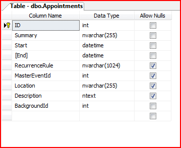
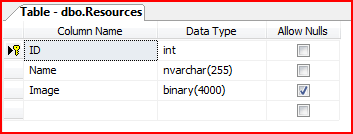
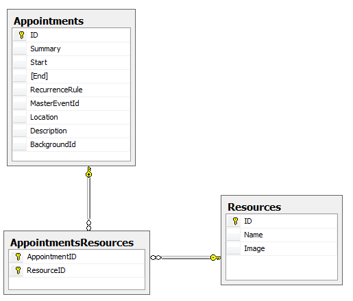

# Sample Database

To kick start your development, a sample database for RadScheduler can be found in your installation folder of Telerik UI for for WinForms (under the \Examples\DataSources folder).  The name of the file is SchedulerData.mdf. The sample database for RadScheduler contains the most simple scenario - two tables which can be used to bind the control to appointments and resources information.

## Database Structure

Here is the structure of the __Appointments__ table:



Note that the mandatory fields for __RadScheduler__ are __ID__, __Summary__, __Start__ and __End__ (those fields which do not allow null values to be stored in the database).

Here is the structure of the __Resources__ table:



And the cross relations table that allows many-to-many relations:


The general overview of the database is on the following diagram:



The __AppointmentsResources__ table has relations to the primary keys of the AppointmentsResources and Resources tables.

You can use schema script to automatically add the Scheduler data tables to an existing database. Here is the script that creates the __AppointmentsResources__ data table:

````SQL
	
	USE [SchedulerData]
	
	GO
	
	/****** Object:  Table [dbo].[AppointmentsResources] ******/
	
	SET ANSI_NULLS ON
	
	GO
	
	SET QUOTED_IDENTIFIER ON
	
	GO
	
	CREATE TABLE [dbo].[AppointmentsResources](
	
	      [AppointmentID] [int] NOT NULL,
	
	      [ResourceID] [int] NOT NULL,
	
	 CONSTRAINT [PK_AppointmentsResources] PRIMARY KEY CLUSTERED
	
	(
	
	      [AppointmentID] ASC,
	
	      [ResourceID] ASC
	
	)WITH (PAD_INDEX  = OFF, IGNORE_DUP_KEY = OFF) ON [PRIMARY]
	
	) ON [PRIMARY]
	
	 
	
	GO
	
	ALTER TABLE [dbo].[AppointmentsResources]  WITH CHECK ADD  CONSTRAINT [AppointmentsResources_Appointments] FOREIGN KEY([AppointmentID])
	
	REFERENCES [dbo].[Appointments] ([ID])
	
	ON DELETE CASCADE
	
	GO
	
	ALTER TABLE [dbo].[AppointmentsResources] CHECK CONSTRAINT [AppointmentsResources_Appointments]
	
	GO
	
	ALTER TABLE [dbo].[AppointmentsResources]  WITH CHECK ADD  CONSTRAINT [AppointmentsResources_Resources] FOREIGN KEY([ResourceID])
	
	REFERENCES [dbo].[Resources] ([ID])
	
	GO
	
	ALTER TABLE [dbo].[AppointmentsResources] CHECK CONSTRAINT [AppointmentsResources_Resources]
````


Here is the script that creates the __Resources__ data table:

````SQL
	
	USE [SchedulerData]
	
	GO
	
	/****** Object:  Table [dbo].[Resources] ******/
	
	SET ANSI_NULLS ON
	
	GO
	
	SET QUOTED_IDENTIFIER ON
	
	GO
	
	SET ANSI_PADDING ON
	
	GO
	
	CREATE TABLE [dbo].[Resources](
	
	      [ID] [int] IDENTITY(1,1) NOT NULL,
	
	      [Name] [nvarchar](255) COLLATE SQL_Latin1_General_CP1_CI_AS NOT NULL,
	
	      [Image] [binary](4000) NULL,
	
	 CONSTRAINT [PK_Resources] PRIMARY KEY CLUSTERED
	
	(
	
	      [ID] ASC
	
	)WITH (PAD_INDEX  = OFF, IGNORE_DUP_KEY = OFF) ON [PRIMARY]
	
	) ON [PRIMARY]
	
	 
	
	GO
	
	SET ANSI_PADDING OFF
	
````


Here is the script that creates the __Appointments__ data table:
        

````SQL
	
	USE [SchedulerData]
	
	GO
	
	/****** Object:  Table [dbo].[Appointments] ******/
	
	SET ANSI_NULLS ON
	
	GO
	
	SET QUOTED_IDENTIFIER ON
	
	GO
	
	CREATE TABLE [dbo].[Appointments](
	
	      [ID] [int] IDENTITY(1,1) NOT NULL,
	
	      [Summary] [nvarchar](255) COLLATE SQL_Latin1_General_CP1_CI_AS NOT NULL,
	
	      [Start] [datetime] NOT NULL,
	
	      [End] [datetime] NOT NULL,
	
	      [RecurrenceRule] [nvarchar](1024) COLLATE SQL_Latin1_General_CP1_CI_AS NULL,
	
	      [MasterEventId] [int] NULL,
	
	      [Location] [nvarchar](255) COLLATE SQL_Latin1_General_CP1_CI_AS NULL,
	
	      [Description] [ntext] COLLATE SQL_Latin1_General_CP1_CI_AS NULL,
	
	      [BackgroundId] [int] NOT NULL CONSTRAINT [DF_Appointments_BackgroundId]  DEFAULT ((1)),
	
	 CONSTRAINT [PK_Appointments] PRIMARY KEY CLUSTERED
	
	(
	
	      [ID] ASC
	
	)WITH (PAD_INDEX  = OFF, IGNORE_DUP_KEY = OFF) ON [PRIMARY]
	
	) ON [PRIMARY] TEXTIMAGE_ON [PRIMARY]
	
````

# See Also

* [Design Time]()
* [Views]()
* [Scheduler Mapping]()
* [Working with Resources]()


