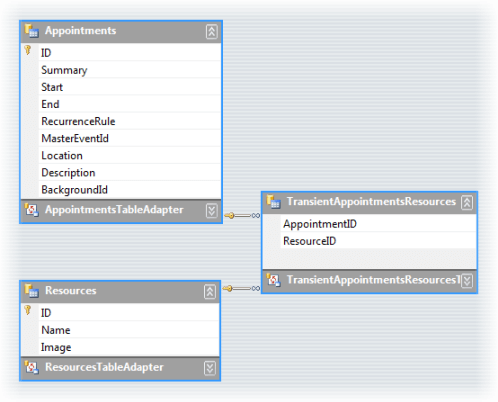

# Using DataSource property

RadScheduler.__DataSource__ property lets you bind to objects that inherit the base abstract __SchedulerDataSource__ class. The __SchedulerBindingDataSource__ implementation of scheduler data source binds traditional data stores like lists of business objects and database tables. You can find the __SchedulerBindingDataSource__ component in the Toolbox.        

The __SchedulerBindingDataSource__ class has two properties: __EventProvider__ and __ResourceProvider__ that correspond to the provider instances of type __EventBindingProvider__ and __ResourceBindingProvider__. The __EventBindingProvider__ class is used to handle CRUD operations against an events data store, while __ResourceBindingProvider__ class is used to handle the same against a resources data store. Both provider implementations are nested types to the SchedulerBindingDataSource class and are public. Also the base abstract class for binding providers - the __BindingProviderBase<T>__ is available (public) as well, so it can aid the process of creating scheduler data sources. There are also two methods that return base type implementations of the providers: __ISchedulerProvider<IEvent> GetEventProvider()__ and __ISchedulerProvider<IResource> GetResourceProvider()__.

An integral and vital part of the providers logic is the __Mapping__ property that requires instance implementing IMappingInfo interface. The __IMappingInfo__ handles the property mappings. Property names from the data store are mapped to corresponding property names of the classes that __RadScheduler__ uses to operate internally. For example a database field name from the table that handles the appointments information is mapped to the corresponding property of a object representing appointment inside the scheduler.        

To have the data source make any sense to the SchedulerBindingDataSource you also need to define mappings that link the expected information to columns in a database table or business object. There are two mapping objects that need to be loaded up and assigned, the __AppointmentMappingInfo__ and __ResourceMappingInfo__. AppointmentMappingInfo has a series of string properties that point to all appointment related data such as start date/time, end date/time, a description, etc. The __ResourcesMappingInfo__ object has a Name and Image.        

Here's a dataset design view for the SchedulerData.mdf database file that ships with Telerik UI for WinForms. You can see all the fields that can be defined for appointments and resources. Also notice a "join table" named "TransientAppointmentsResources" that assigns a particular resource to an appointment.

>note Notice that while the database structure allows for multiple resources, the built-in scheduler dialog only allows a single resource to be selected at a time.



The foreign key relationship between "TransientAppointmentsResources" and the "Appointments" table will also be defined in the AppointmentMappingInfo object.


>note You can find SchedulerData.mdb (Access) in the installation directory under \Examples\QuickStart\DataSources. You can find SchedulerData.mdf (MS SQL database file) [here](http://www.telerik.com/docs/default-source/ui-for-winforms/schedulerdatasql.zip)
>

Here's some example code that demonstrates loading the AppointmentMappingInfo fields with column names in a database table. The __Resources__ property is assigned the name of the foreign key that joins the Appointments and the "join table' that sits between the appointments and resources table. The __ResourceID__ property is assigned to the column in the "join table" of a unique resource identifier.

RadScheduler works from a provider model so that in the future, custom appointment and resource providers can be plugged in to replace the built-in providers. The AppointmentMappingInfo is assigned to the __Mapping__ property of the schedulers datasource event provider. Review the code below to see how this is done when binding to a database tables.

>note The __Exceptions__ and __Resources__ properties in the __AppointmentMappingInfo__ should be set to the names of the relations that are represented in the dataset.

>important As of **R1 2021** the EditAppointmentDialog provides UI for selecting multiple resources per appointment. In certain cases (e.g. unbound mode), the *Resource* **RadDropDownList** is replaced with a **RadCheckedDropDownList**. Otherwise, the default drop down with single selection for resources is shown. To enable the multiple resources selection in bound mode, it is necessary to specify the AppointmentMappingInfo. **Resources** property. The **Resources** property should be set to the name of the relation that connects the **Appointments** and the **AppointmentsResources** tables.  

#### EditAppointmentDialog with multiple resources


#### Create Mapping

{{source=..\SamplesCS\Scheduler\DataBinding\UsingDataSourceProperty.cs region=creatingAppointment}} 
{{source=..\SamplesVB\Scheduler\DataBinding\UsingDataSourceProperty.vb region=creatingAppointment}} 

````C#
AppointmentMappingInfo appointmentMappingInfo = new AppointmentMappingInfo();
appointmentMappingInfo.Start = "Start";
appointmentMappingInfo.End = "End";
appointmentMappingInfo.Summary = "Summary";
appointmentMappingInfo.Description = "Description";
appointmentMappingInfo.Location = "Location";
appointmentMappingInfo.BackgroundId = "BackgroundID";
appointmentMappingInfo.StatusId = "StatusID";
appointmentMappingInfo.RecurrenceRule = "RecurrenceRule";
appointmentMappingInfo.Resources = "Appointments_AppointmentsResources";
appointmentMappingInfo.ResourceId = "ResourceID";
appointmentMappingInfo.Exceptions = "Appointments_Appointments";
appointmentMappingInfo.MasterEventId = "ParentID";
schedulerBindingDataSource1.EventProvider.Mapping = appointmentMappingInfo;

````
````VB.NET
Dim appointmentMappingInfo As New AppointmentMappingInfo()
appointmentMappingInfo.Start = "Start"
appointmentMappingInfo.End = "End"
appointmentMappingInfo.Summary = "Summary"
appointmentMappingInfo.Description = "Description"
appointmentMappingInfo.Location = "Location"
appointmentMappingInfo.BackgroundId = "BackgroundID"
appointmentMappingInfo.StatusId = "StatusID"
appointmentMappingInfo.RecurrenceRule = "RecurrenceRule"
appointmentMappingInfo.Resources = "Appointments_AppointmentsResources"
appointmentMappingInfo.ResourceId = "ResourceID"
appointmentMappingInfo.Exceptions = "Appointments_Appointments"
appointmentMappingInfo.MasterEventId = "ParentID"
SchedulerBindingDataSource1.EventProvider.Mapping = appointmentMappingInfo

````

{{endregion}} 

The resource mapping has fewer columns and doesn't need any information about joining to the appointments table.

#### Set Mapping

{{source=..\SamplesCS\Scheduler\DataBinding\UsingDataSourceProperty.cs region=creatingResource}} 
{{source=..\SamplesVB\Scheduler\DataBinding\UsingDataSourceProperty.vb region=creatingResource}} 

````C#
ResourceMappingInfo resourceMappingInfo = new ResourceMappingInfo();
resourceMappingInfo.Id = "ID";
resourceMappingInfo.Name = "ResourceName";
schedulerBindingDataSource1.ResourceProvider.Mapping = resourceMappingInfo;
schedulerBindingDataSource1.EventProvider.DataSource = this.schedulerDataDataSet.Appointments;
schedulerBindingDataSource1.ResourceProvider.DataSource = this.schedulerDataDataSet.Resources;

````
````VB.NET
Dim resourceMappingInfo As New ResourceMappingInfo()
resourceMappingInfo.Id = "ID"
resourceMappingInfo.Name = "ResourceName"
SchedulerBindingDataSource1.ResourceProvider.Mapping = resourceMappingInfo
SchedulerBindingDataSource1.EventProvider.DataSource = Me.schedulerDataDataSet.Appointments
SchedulerBindingDataSource1.ResourceProvider.DataSource = Me.schedulerDataDataSet.Resources

````

{{endregion}} 

# See Also

* [Design Time]()
* [Views]()
* [Scheduler Mapping]()
* [Working with Resources]()
* [setting Appointments and Resources Relations]()
* [Scheduler Data Binding Tutorial]()

