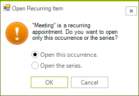
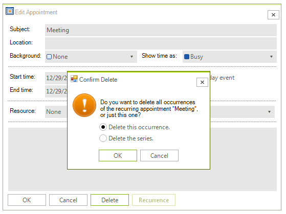
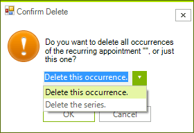

# DeleteRecurringAppointmentDialog

The **DeleteRecurringAppointmentDialog** is shown when you try to delete a recurring appointment.

>caption Figure 1. DeleteRecurringAppointmentDialog



It will pop up when you press the `Delete` key while a recurring appointment is selected. Alternatively, you can show it by pressing the **Delete** button in the **EditAppointmentDialog** while editing a single occurrence.


>caption Figure 2. Delete button in the EditAppointmentDialog



## Create a custom DeleteRecurringAppointmentDialog

You can extend the default **DeleteRecurringAppointmentDialog** and add custom fields or replace some of the existing ones. Alternatively, you can create a completely new dialog according to any specific requirements. For this purpose, it is necessary to create a class that inherits **RadSchedulerDialog** and implements the **IDeleteRecurringAppointmentDialog** interface. The **IDeleteRecurringAppointmentDialog** interface requires implementing the following methods and properties:
*  DialogResult **ShowDialog**() 
*  string **EventName**
*  bool **DeleteSeries**
*  string **ThemeName**

As a derivative of **RadSchedulerDialog** which inherits **RadForm**, the **ShowDialog** method and the **ThemeName** property are already available. It is left to implement the **EventName** and **DeleteSeries** properties. 

In the following example, we will create a derivative of the **DeleteRecurringAppointmentDialog** which contains **RadDropDownList** instead of two **RadRadioButton** controls for choosing to delete the occurrence/series.

>caption Figure 3. Custom DeleteRecurringAppointmentDialog



{{source=..\SamplesCS\Scheduler\Dialogs\CustomDeleteRecurringAppointmentDialog.cs region=MyDeleteRecurringAppointmentDialog}}
{{source=..\SamplesVB\Scheduler\Dialogs\CustomDeleteRecurringAppointmentDialog.vb region=MyDeleteRecurringAppointmentDialog}}    
       
````C#
public partial class CustomDeleteRecurringAppointmentDialog : DeleteRecurringAppointmentDialog
{
    Telerik.WinControls.UI.Localization.RadSchedulerLocalizationProvider localizationProvider;
    RadDropDownList deleteSelection;
    public CustomDeleteRecurringAppointmentDialog()
    {
        InitializeComponent();
        this.Text = localizationProvider.GetLocalizedString(Telerik.WinControls.UI.Localization.RadSchedulerStringId.DeleteRecurrenceDialogTitle);
    }
    protected override void OnLoad(EventArgs e)
    {
        base.OnLoad(e);
        this.radioDeleteOccurrence.Visible = false;
        this.radioDeleteSeries.Visible = false;
        if (deleteSelection == null)
        {
            deleteSelection = new RadDropDownList();
            deleteSelection.Width = 150;
            this.Controls.Add(deleteSelection);
            deleteSelection.Items.Add(this.radioDeleteOccurrence.Text);
            deleteSelection.Items.Add(this.radioDeleteSeries.Text);
            deleteSelection.SelectedIndex = 0;
            deleteSelection.Location = this.radioDeleteOccurrence.Location;
        }
    }
    public override bool DeleteSeries
    {
        get
        {
            return this.deleteSelection.SelectedIndex == 1;
        }
    }
    protected override void LocalizeDialog(Telerik.WinControls.UI.Localization.RadSchedulerLocalizationProvider localizationProvider)
    {
        base.LocalizeDialog(localizationProvider);
        this.localizationProvider = localizationProvider;
    }
}

````
````VB.NET
Partial Public Class CustomDeleteRecurringAppointmentDialog
    Inherits DeleteRecurringAppointmentDialog
    Private localizationProvider As Telerik.WinControls.UI.Localization.RadSchedulerLocalizationProvider
    Private deleteSelection As RadDropDownList
    Public Sub New()
        InitializeComponent()
        Me.Text = localizationProvider.GetLocalizedString(Telerik.WinControls.UI.Localization.RadSchedulerStringId.DeleteRecurrenceDialogTitle)
    End Sub
    Protected Overrides Sub OnLoad(ByVal e As EventArgs)
        MyBase.OnLoad(e)
        Me.radioDeleteOccurrence.Visible = False
        Me.radioDeleteSeries.Visible = False
        If deleteSelection Is Nothing Then
            deleteSelection = New RadDropDownList()
            deleteSelection.Width = 150
            Me.Controls.Add(deleteSelection)
            deleteSelection.Items.Add(Me.radioDeleteOccurrence.Text)
            deleteSelection.Items.Add(Me.radioDeleteSeries.Text)
            deleteSelection.SelectedIndex = 0
            deleteSelection.Location = Me.radioDeleteOccurrence.Location
        End If
    End Sub
    Public Overrides ReadOnly Property DeleteSeries As Boolean
        Get
            Return Me.deleteSelection.SelectedIndex = 1
        End Get
    End Property
    Protected Overrides Sub LocalizeDialog(ByVal localizationProvider As Telerik.WinControls.UI.Localization.RadSchedulerLocalizationProvider)
        MyBase.LocalizeDialog(localizationProvider)
        Me.localizationProvider = localizationProvider
    End Sub
End Class

````

{{endregion}}

Now, you can replace the default **DeleteRecurringAppointmentDialog** with the custom one by using the RadScheduler.**RecurrenceDeleteDialogShowing** event:

{{source=..\SamplesCS\Scheduler\Dialogs\SchedulerCustomDialogs.cs region=ReplaceDefaultDeleteRecurringAppointmentDialog}}
{{source=..\SamplesVB\Scheduler\Dialogs\SchedulerCustomDialogs.vb region=ReplaceDefaultDeleteRecurringAppointmentDialog}}    
       
````C#
CustomDeleteRecurringAppointmentDialog myDialog;
        
private void radScheduler1_RecurrenceDeleteDialogShowing(object sender, RecurrenceDeleteDialogShowingEventArgs e)
{
    if (myDialog == null)
    {
        myDialog = new CustomDeleteRecurringAppointmentDialog();
    }
    myDialog.EventName = e.Appointment.Summary;
    e.DeleteDialog = myDialog;
}

````
````VB.NET
Private myDialog As CustomDeleteRecurringAppointmentDialog
Private Sub RadScheduler1_RecurrenceDeleteDialogShowing(sender As Object, e As Telerik.WinControls.UI.RecurrenceDeleteDialogShowingEventArgs)
    If myDialog Is Nothing Then
        myDialog = New CustomDeleteRecurringAppointmentDialog()
    End If
    myDialog.EventName = e.Appointment.Summary
    e.DeleteDialog = myDialog
End Sub

````

{{endregion}}