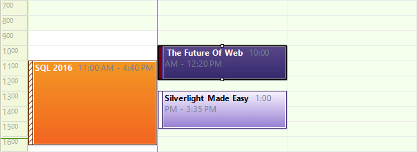
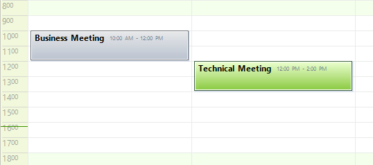

# Common Visual Properties

Some properties can modify the appearance of the appointments in __RadScheduler__ and are common for all views.

## Exact Time Rendering

Exact Time Rendering increases readability of the appointments by rendering them at its exact Start and End time corresponding  with the time slots around. When __ExactTimeRendering__ is enabled, appointments will not snap to the nearest cell border but will render exactly on the location where their Start and End dates are expected to be. To enable this functionality, use the __ExactTimeRendering__  property:

{{source=..\SamplesCS\Scheduler\Views\CommonProperties.cs region=exactTimeRendering}} 
{{source=..\SamplesVB\Scheduler\Views\CommonProperties.vb region=exactTimeRendering}} 

````C#
this.radScheduler1.EnableExactTimeRendering = true;

````
````VB.NET
Me.RadScheduler1.EnableExactTimeRendering = True

````

{{endregion}} 

>caption Figure 1: Exact Time Rendering


## AutoSize Appointments

When __AutoSizeAppointments__ is enabled, appointment elements will automatically adjust their height so that they can fully display their summary. This property will not have any effect in DayView and WeekView because the height in these views is determined by the appointment’s dates.

{{source=..\SamplesCS\Scheduler\Views\CommonProperties.cs region=autoSizeAppointments}} 
{{source=..\SamplesVB\Scheduler\Views\CommonProperties.vb region=autoSizeAppointments}} 

````C#
this.radScheduler1.AutoSizeAppointments = true;

````
````VB.NET
Me.RadScheduler1.AutoSizeAppointments = True

````

{{endregion}} 

>caption Figure 2: AutoSize Appointments


## Appointments’ Height

When __AutoSizeAppointments__ is disabled, the appointments in Month and Timeline views have a fixed height which can be modified by using the __AppointmentsHeight__ property.

{{source=..\SamplesCS\Scheduler\Views\CommonProperties.cs region=appointmentsHeight}} 
{{source=..\SamplesVB\Scheduler\Views\CommonProperties.vb region=appointmentsHeight}} 

````C#
((SchedulerMonthViewElement)this.radScheduler1.ViewElement).AppointmentHeight = 50;
((SchedulerTimelineViewElement)this.radScheduler1.ViewElement).AppointmentHeight = 50;

````
````VB.NET
DirectCast(Me.RadScheduler1.ViewElement, SchedulerMonthViewElement).AppointmentHeight = 50
DirectCast(Me.RadScheduler1.ViewElement, SchedulerTimelineViewElement).AppointmentHeight = 50

````

{{endregion}} 

## Spacing Between Appointments

Using the __AppointmentsMargin__ property, you can specify the spacing between the appointment elements:

{{source=..\SamplesCS\Scheduler\Views\CommonProperties.cs region=appointmentsMargin}} 
{{source=..\SamplesVB\Scheduler\Views\CommonProperties.vb region=appointmentsMargin}} 

````C#
this.radScheduler1.ViewElement.AppointmentMargin = new Padding(5, 0, 10, 0);

````
````VB.NET
Me.RadScheduler1.ViewElement.AppointmentMargin = New Padding(5, 0, 10, 0)

````

{{endregion}}

>caption Figure 3: Appointments Spacing


# See Also

* [Common Visual Properties]()
* [Working with Views]()
* [Views Walkthrough]()
* [Grouping by Resources]()
* [Exact Time Rendering]()
