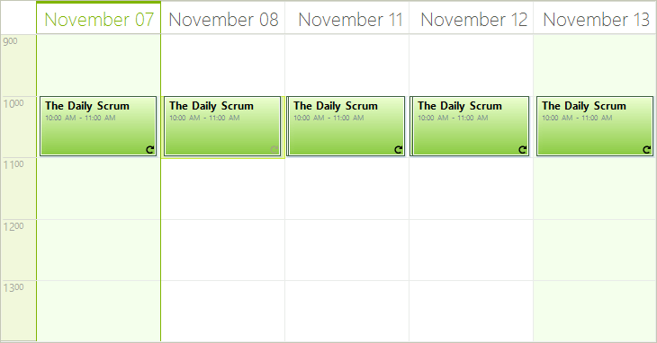

# MultiDay View

## Overview

__MultidayView__ shows multiple date-time intervals with appointments arranged one next to another. In the screenshot below we have __MultidayView__ with two intervals – the first one starts from November 07 with duration of two days and the second on starts from November 11 with duration of 3 days.

>caption Figure 1: Multi Day View


## Using MultidayView

1\. In order to set the current view of __RadScheduler__ to __MultidayView__, use the __ActiveViewType__ or __ActiveView__ properties:

{{source=..\SamplesCS\Scheduler\Views\MultiDayView.cs region=multiDay}} 
{{source=..\SamplesVB\Scheduler\Views\MultiDayView.vb region=multiDay}} 

````C#
this.radScheduler1.ActiveViewType = SchedulerViewType.MultiDay;
//or
SchedulerMultiDayView multiDayView = new SchedulerMultiDayView();
DateTime startDate = DateTime.Today;
multiDayView.Intervals.Add(startDate, 2);
multiDayView.Intervals.Add(startDate.AddDays(4), 3);
this.radScheduler1.ActiveView = multiDayView;

````
````VB.NET
Me.RadScheduler1.ActiveViewType = SchedulerViewType.MultiDay
'or
Dim multiDayView As New SchedulerMultiDayView()
Dim startDate As Date = Date.Today
multiDayView.Intervals.Add(startDate, 2)
multiDayView.Intervals.Add(startDate.AddDays(4), 3)
Me.RadScheduler1.ActiveView = multiDayView

````

{{endregion}} 

2\. To add, remove or modify a date-time __Interval__ in SchedulerMultiDayView instance use the __Intervals__ collection.

3\. To get all appointments in a particular interval, use the __GetAppointmentsInInterval__ helper method:

{{source=..\SamplesCS\Scheduler\Views\MultiDayView.cs region=interval}} 
{{source=..\SamplesVB\Scheduler\Views\MultiDayView.vb region=interval}} 

````C#
DateTimeInterval interval = new DateTimeInterval();
interval.Duration = new TimeSpan(20, 5, 25);
multiDayView.GetAppointmentsInInterval(interval);

````
````VB.NET
Dim interval As New DateTimeInterval()
interval.Duration = New TimeSpan(20, 5, 25)
multiDayView.GetAppointmentsInInterval(interval)

````

{{endregion}} 

4\. To get all appointments in the view, use the __Appointments__ collection.

>note  __SchedulerMultiDayView__ inherits the rest of its properties from the base __SchedulerDayView__ and therefore you can refer to the [Day View]() article for additional options.
>

# See Also

* [Common Visual Properties]()
* [Working with Views]()
* [Views Walkthrough]()
* [Grouping by Resources]()
* [Exact Time Rendering]()
