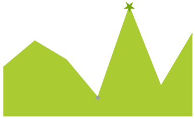

# SparkAreaSeries

As a derivative of Categorical series, SparkAreaSeries plot their data points using CategoricalSparkDataPoints. Once positioned on a plane the points are connected to form a line. Further, the area enclosed by this line and the categorical axis is filled. Below is a sample snippet that demonstrates how to set up SparkAreaSeries:

#### Create SparkAreaSeries

{{source=..\SamplesCS\Sparkline\SparklineCode.cs region=AreaSeries}} 
{{source=..\SamplesCS\Sparkline\SparklineCode.vb region=AreaSeries}}
 

{{endregion}} 

>caption Figure 1: SparkAreaSeries

### The essential properties of SparkAreaSeries coincide with these of SparkLineSeries:

|__Property__|__Description__|
|---|---|
|__MarkerSize__|Gets or sets the size of the points of the series.|
|__MarkerShape__| Gets or sets the shape of the points of the series.|
|__HighPointSize__|Gets or sets the size of the high point of the series.|
|__HighPointShape__|Gets or sets the shape of the low point of the series.|
|__LowPointSize__|Gets or sets the size of the low point of the series.|
|__LowPointShape__|Gets or sets the shape of the low point of the series.|
|__FirstPointSize__|Gets or sets the size of the first point of the series.|
|__FirstPointShape__|Gets or sets the shape of the first point of the series.|
|__LastPointSize__|Gets or sets the size of the last of the series.|
|__LastPointShape__|Gets or sets the shape of the last point of the series.|
|__NegativePointSize__|Gets or sets the size of the negative points of the series.|
|__NegativePointShape__|Gets or sets the shape of the negative points of the series.|
|__BaselineValue__|Gets or sets the value of the base line splitting the area into top and bottom half.|

