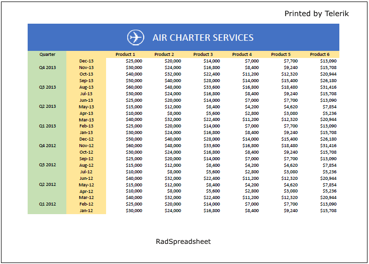
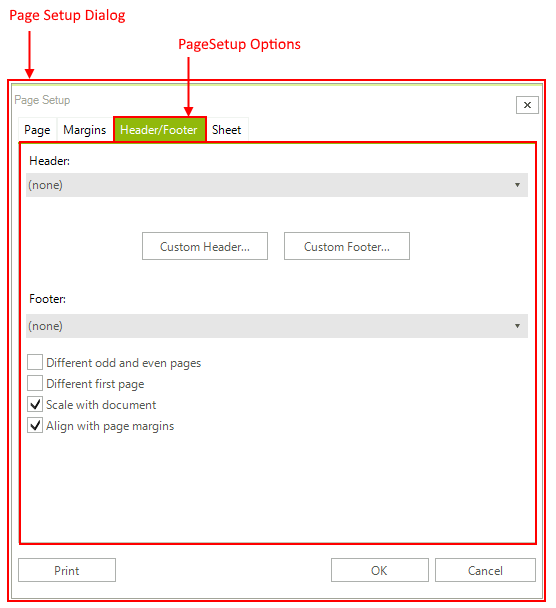
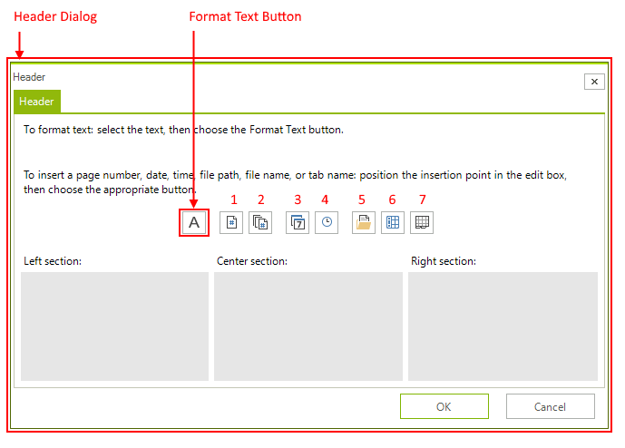

# Headers and Footers

The Headers and Footers functionality enables you to add rich text content in the page margins when laying out a worksheet to pages. This functionality is useful in scenarios like [exporting to PDF](https://docs.telerik.com/devtools/document-processing/libraries/radspreadprocessing/formats-and-conversion/pdf/pdfformatprovider), [printing]() or [importing/exporting to XLSX](https://docs.telerik.com/devtools/document-processing/libraries/radspreadprocessing/formats-and-conversion/xlsx/xlsxformatprovider). 

## Overview

**RadSpreadsheet** enables you to add headers and footers in a spreadsheet’s worksheet. The headers and footers appear when you print the worksheet or export it to a PDF document; they are not displayed on the worksheet when the document is visualized when you work with it in the application.

>caption Figure 1: Headers and footers in a spreadsheet

## Insert Header and Footer

You can insert headers or footers using the **Header/Footer tab** of the **Page Setup** section in the ribbon.

>caption Figure 2: Page Setup section in ribbon

>caption Figure 3: Header/Footer in the Page Setup dialog box

This tab enables you to set the content of headers and footers using predefined templates. 

>The *Custom Header...* and *Custom Footer...* buttons open the Header and the Footer dialog boxes respectively where you can set your own content to the headers or footers.

* **Different odd and even pages**: Select this setting if you want to add different content on odd and even page headers or footers. 

* **Different first page**: Allows you to set a different header and footer on the first page compared to the rest of the document. When this setting is enabled, you can set the content of the headers/footers through the Header and Footer dialog boxes respectively. You can set the header and footer for the first page using the additional First Page Header and Footer tab.

    > Depending on whether the *Different first page* and *Different odd and even pages* settings are enabled or not, different tabs are available in the *Header* and *Footer* dialogs.

* **Scale with document**: Indicates whether headers and footers should be scaled along with the document when being rendered. When this option is disabled, headers and footers are always rendered at 100% scale.

* **Align with page margins**: Indicates whether headers and footers should align with the left and right margins of the document. When this setting is disabled, headers and footers are aligned with the default left and right margins.

## Custom Header/Footer

The content of the header or footer is customizable.You can insert the text that you want to include using the *Custom Header...* and *Custom Footer...* buttons in the Page Setup dialog. 

* **Left section**: Contains the content of the left section of the header or footer. The content is set horizontally between the left and right page margins, and is left aligned.

* **Center section**: Contains the content of the center section of the header or footer. The content is set in the center horizontally between the left and right page margins, and is center aligned.

* **Right section**: Contains the content of the right section of the header or footer. The content is set horizontally between the right and left page margins, and is right aligned.

Keep in mind that the amount of content that can be inserted in the three sections of a header or footer depends on the space available for rendering them. 

>caption Figure 4: Additional fields in Header and Footer dialog boxes

Along with text, you can insert several fields in a header or footer as shown in **Figure 4**.

1. **Insert Page Number**: Allows you to insert a page number field. This field is evaluated for each page and is rendered as the current page number value.

2. **Insert Number of Pages**: Allows you to insert a number of pages field. This field is evaluated and displayed as the total number of pages.

3. **Insert Date**: Allows you to insert a date field. This field is evaluated as the date on which printing or PDF export started.

4. **Insert Time**: Allows you to insert a time field. This field is evaluated as the time when printing or PDF export started.

5. **Insert File Path**: Allows you to insert the file folder field. This field is evaluated as the full folder path of the currently opened file. Note that this field is respected when printing. When exporting a Workbook, this field is evaluated as an empty string because the Workbook instance is not related to any file in the system.

6. **Insert File Name**: Allows you to insert a Workbook name field. This field is evaluated as the Workbook Name property value.

7. **Insert Sheet Name**: Allows you to insert a Sheet name field. This field is evaluated as the Sheet Name property value.

>note You can format the text of each section using the *Format Text* button.

## See Also

* [Headers and Footers for SpreadProcessing](https://docs.telerik.com/devtools/document-processing/libraries/radspreadprocessing/features/headers-and-footers)
* [Printing]()
