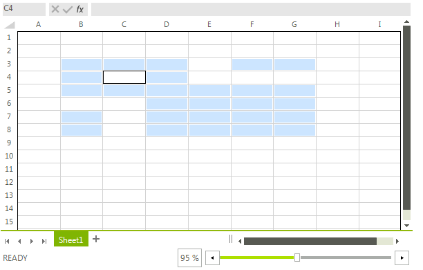
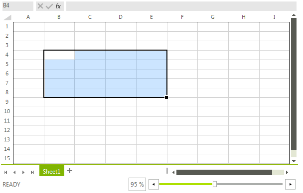
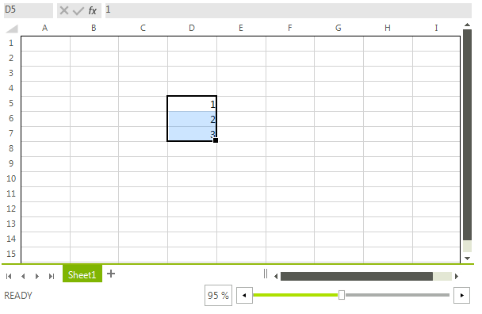
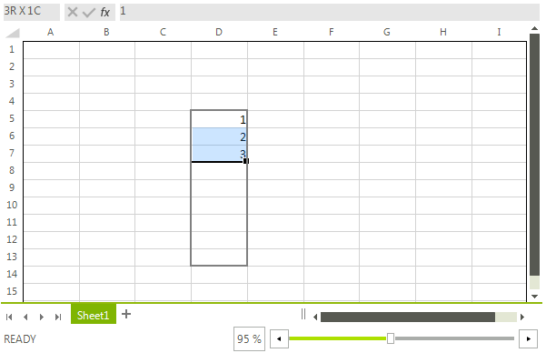
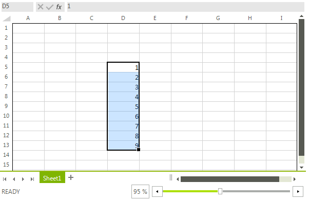
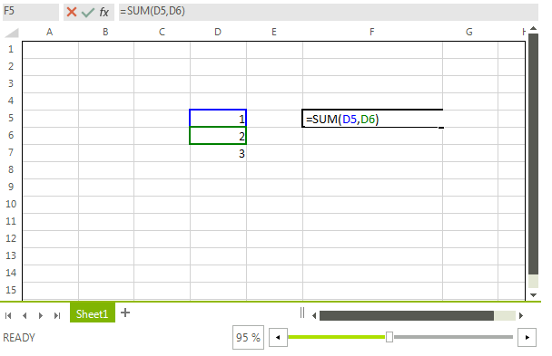
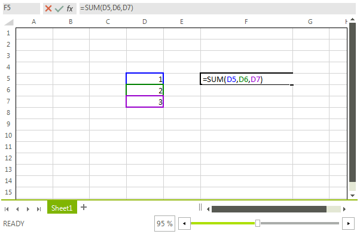

# Working with UI Selection

This article aims to present the API of the Selection class and demonstrate how to retrieve and change the current selection and also store and restore its state. It contains the following subsections:
      

* [What is UI Selection](#what-is-ui-selection?)

* [Selection Properties](#selection-properties)

* [Retrieving the Active Cell and All Selected Cells](#retrieving-the-active-cell-and-all-selected-cells)

* [Changing the UI Selection](#changing-the-ui-selection)

* [Selecting All Cells in Worksheet](#selecting-all-cells-in-a-worksheet)

* [Selection Events](#selection-events)

* [Saving and Restoring UI Selection](#saving-and-restoring-the-ui-selection)

* [Filling the Selection with Data](#filling-the-selection-with-data)

* [Using Selection to Complete Formulas](#using-selection-to-complete-formulas)

## What is UI Selection?

In order to interact with the working surface of RadSpreadsheet, the user creates a UI selection. The selection can be two types: cell selection and shape selection.

The cell selection designates a region/regions of cells and performs a given action onto these cells. The selection can be a single cell, a rectangular region of cells, or a composition of rectangular regions. The UI selection can contain numerous selected cells, however, only one of the cells is active at a time.



The shape selection can contain one or more shapes.

## Selection Properties

The RadWorksheetEditor class exposes a __Selection__ property of type __Selection__ that provides rich API for retrieving and changing the UI Selection of the RadSpreadsheet. The class Selection exposes several properties that provide information about the current selection. The following list outlines the properties of Selection:

* __ActiveCell__: Returns a CellSelection instance containing the active cell.
            

* __ActiveCellMode__: Gets or sets the ActiveCellMode to either __Display__ or __Edit__.
            

* __ActiveCellIndex__: The CellIndex of the ActiveCell.
            

* __ActiveRange__: The CellRange containing the ActiveCell.
            

* __SelectedRanges__: The collection of selected ranges.
            

* __IsRowSelection__: A Boolean value indicating if the selection is a single row selection.
            

* __IsColumnSelection__: A Boolean value indicating if the selection is a single column selection.
            

* __Cells__: Returns an object that represents the cells contained in the selection.
            

* __Rows__: Returns object that describes the contained rows.
            

* __Columns__: Returns object that describes the contained columns.
            

* __IsCellSelection__: Gets a value indicating whether the active selection at the moment is cell selection or shape selection.
            

* __ShapeSelection__: Returns an object that represents the shapes contained in the selection.
            

The cell selection and the properties related to it can be accessed and used, even if the current active selection is shape selection. In such case, while the shape selection is the one which is visible, the underlying cell selection continues to exist.
        

## Retrieving the Active Cell and All Selected Cells

To get the region of cells that are currently selected, first you need to get the __Selection__ property of the __RadWorksheetEditor__. Once you have an instance of the __Selection__ class, you can use its __Cells__ property to retrieve the selected regions.
        

The __Selection__ class also exposes an __ActiveCell__ property that designates the current active cell. The next example demonstrates how to change the __ActiveCellMode__ to __Edit__.
        

#### Change the ActiveCellMode

{{source=..\SamplesCS\Spreadsheet\SelectionCode.cs region=Selection_1}} 
{{source=..\SamplesVB\Spreadsheet\SelectionCode.vb region=Selection_1}}
````C#
Selection selection = this.radSpreadsheet.SpreadsheetElement.ActiveWorksheetEditor.Selection;
selection.ActiveCellMode = ActiveCellMode.Edit;

````
````VB.NET
Dim selection = Me.radSpreadsheet.SpreadsheetElement.ActiveWorksheetEditor.Selection
selection.ActiveCellMode = ActiveCellMode.Edit

```` 

 
{{endregion}} 
 
## Changing the UI Selection

The UI cell selection can be a single cell or a rectangular region of cells. If you hold down the Ctrl key, you can select multiple rectangular regions of cells. Note that these cell ranges do not have to be adjacent. In fact, they can be dispersed across the worksheet and can even intersect. The next several examples aim to illustrate how to create one and multiple-region selection through the API of the RadSpreadsheet.

The UI shape selection can consist of a single shape or more. If you hold down the Ctrl key you can add multiple shapes to the selection or remove them from it. If you remove all shapes from the shape selection, the cell selection will become the active selection automatically. The cells included in the selection will be the cells which were selected when this selection was used last.

The __Selection__ class exposes an overloaded __Select__ method that offers flexible ways to change the UI selection. All of the overloads have an optional Boolean parameter named clearSelection. As its name suggests the argument indicates whether the current selection will be cleared. If set to *true*, the parameter will cause the current selection to be wiped out and if set to *false*, the newly selected region will be added to the current selection.

One of the Select overloads gets a CellIndex parameter that points to the cell to be selected (or added to the selection). The following example demonstrates how the clearSelection parameter changes the outcome of this Select() method.



#### Selecting a Cell

{{source=..\SamplesCS\Spreadsheet\SelectionCode.cs region=Selection_2}} 
{{source=..\SamplesVB\Spreadsheet\SelectionCode.vb region=Selection_2}}
````C#
Selection selection_2 = this.radSpreadsheet.SpreadsheetElement.ActiveWorksheetEditor.Selection;
selection_2.Select(new CellIndex(0, 0), false);

````
````VB.NET
Dim selection_2 = Me.radSpreadsheet.SpreadsheetElement.ActiveWorksheetEditor.Selection
selection_2.Select(New CellIndex(0, 0), False)

```` 

 
{{endregion}} 
 


The Selection class also offers a Select() method that takes a CellRange as an argument. The overload selects (or adds to the current selection) the designated region and makes the top left cell to be the Active one. The next sample snippet shows how to select the C3:D4 cell region:
        

#### Select using CellRange


{{source=..\SamplesCS\Spreadsheet\SelectionCode.cs region=Selection_3}} 
{{source=..\SamplesVB\Spreadsheet\SelectionCode.vb region=Selection_3}}
````C#
Selection selection_3 = this.radSpreadsheet.SpreadsheetElement.ActiveWorksheetEditor.Selection;
selection_3.Select(new CellRange(0, 0, 2, 2));

````
````VB.NET
Dim selection_3 = Me.radSpreadsheet.SpreadsheetElement.ActiveWorksheetEditor.Selection
selection_3.Select(New CellRange(0, 0, 2, 2))

```` 

 
{{endregion}} 

Another overload of the __Select__ method takes as input two __CellIndex__ instances that indicate the start and the end cell indexes of the selected region. Note that unlike the Select(CellRange) method, this overload makes the cell with the start CellIndex the active one. The following snippet illustrates how use the method to select the region B7 to E3. Note that the active cell is B7, not B3.


Here is a sample code on how you can achieve the result from the above image through the RadSpreadsheet API:

#### Select Region

{{source=..\SamplesCS\Spreadsheet\SelectionCode.cs region=Selection_1}} 
{{source=..\SamplesVB\Spreadsheet\SelectionCode.vb region=Selection_1}}
````C#
Selection selection = this.radSpreadsheet.SpreadsheetElement.ActiveWorksheetEditor.Selection;
selection.ActiveCellMode = ActiveCellMode.Edit;

````
````VB.NET
Dim selection = Me.radSpreadsheet.SpreadsheetElement.ActiveWorksheetEditor.Selection
selection.ActiveCellMode = ActiveCellMode.Edit

```` 

 
{{endregion}} 

<!--- A similar logic applies to the Select() methods which take shapes as their parameters.

The following result can be achieved with the sample code below:


#### Select Image

{{source=..\SamplesCS\Spreadsheet\SelectionCode.cs region=Selection_5}} 
{{source=..\SamplesVB\Spreadsheet\SelectionCode.vb region=Selection_5}}
````C#
Selection selection_5 = this.radSpreadsheet.SpreadsheetElement.ActiveWorksheetEditor.Selection;
var image = this.radSpreadsheet.SpreadsheetElement.ActiveWorksheet.Shapes.First() as FloatingShapeBase;
selection_5.Select(image);

````
````VB.NET
Dim selection_5 = Me.radSpreadsheet.SpreadsheetElement.ActiveWorksheetEditor.Selection
Dim image = TryCast(Me.radSpreadsheet.SpreadsheetElement.ActiveWorksheet.Shapes.First(), FloatingShapeBase)
selection_5.Select(image)

```` 

 
{{endregion}} 

If you would like to select the second image while deselecting the first one, this can be achieved with the following code:

#### Select Next Image


{{source=..\SamplesCS\Spreadsheet\SelectionCode.cs region=Selection_6}} 
{{source=..\SamplesVB\Spreadsheet\SelectionCode.vb region=Selection_6}}
````C#
Selection selection_6 = this.radSpreadsheet.SpreadsheetElement.ActiveWorksheetEditor.Selection;
var image2 = this.radSpreadsheet.SpreadsheetElement.ActiveWorksheet.Shapes.ElementAt(1) as FloatingShapeBase;
selection_6.Select(image2, true);

````
````VB.NET
Dim selection_6 = Me.radSpreadsheet.SpreadsheetElement.ActiveWorksheetEditor.Selection
Dim image2 = TryCast(Me.radSpreadsheet.SpreadsheetElement.ActiveWorksheet.Shapes.ElementAt(1), FloatingShapeBase)
selection_6.Select(image2, True)

```` 

 
{{endregion}} 

The result will be the following:


Note that even though the clearSelection parameter is set to true, this will clear only the shape selection. The underlying cell selection will remain intact and will become visible in its previous state if the shape selection becomes empty.
-->

>important The static class [NameConverter](https://docs.telerik.com/devtools/document-processing/api/telerik.windows.documents.spreadsheet.utilities.nameconverter) provides some methods for converting cell names to indexes and vice versa. You could use the method NameConverter.**ConvertCellNameToIndex** which takes the cell name (e.g. "a3") and returns the row and column index of the cell. 

## Selecting All Cells in a Worksheet

The __Selection__ class also exposes a __SelectAll__ method that selects all cells in the worksheet. Keep in mind, though, that each worksheet contains over 16 000 columns and 1 000 000 rows. That said, performing a computationally intensive task on all cells may slow down the performance of RadSpreadsheet. To avoid such issues in performance crucial scenarios we highly recommend you to select only the __UsedCellRange__ of the worksheet. This is a property of Worksheet class that returns a CellRange starting from A1 to the bottom-right cell that comprises all cells containing a value.
        

The following code snippet demonstrates how to use the __SelectAll__ method and the __UsedCellRange__ property with the Select(CellRange) method:
        
#### Selecting all or the used Cells 

{{source=..\SamplesCS\Spreadsheet\SelectionCode.cs region=Selection_7}} 
{{source=..\SamplesVB\Spreadsheet\SelectionCode.vb region=Selection_7}}
````C#
Selection selection_7 = this.radSpreadsheet.SpreadsheetElement.ActiveWorksheetEditor.Selection;
selection_7.SelectAll();
CellRange usedRange = this.radSpreadsheet.SpreadsheetElement.ActiveWorksheet.UsedCellRange;
selection_7.Select(usedRange);

````
````VB.NET
Dim selection_7 = Me.radSpreadsheet.SpreadsheetElement.ActiveWorksheetEditor.Selection
selection_7.SelectAll()
Dim usedRange As CellRange = Me.radSpreadsheet.SpreadsheetElement.ActiveWorksheet.UsedCellRange
selection_7.Select(usedRange)

```` 

 
{{endregion}} 
 

## Selection Events

RadSpreadsheet has several selection events you can subscribe to:

* __SelectionUpdate__: Raised when the selection is updated in any way, this may mean that a change has only begun or it has finished.
            

* __SelectionChanging__: Raised when an update of the selection has begun.
            

* __SelectionChanged__: Raised when the update of the selection has finished.
            

* __SelectionChangingCanceled__: Raised when an update was started but subsequently canceled.
            

* __ActiveCellModeChanged__: Raised when the mode of the active cell changes, from Display to Edit or vice versa.
            

* __SelectionTypeChanged__: Raised when the active selection changes between cell selection and shape selection.
            

In some scenarios when you make a complex selection and want an event to be fired only once (at the end of this complex selection) it is convenient to use __BeginUpdate()__ and __EndUpdate()__ methods.
        

The following example shows how to make a complex selection from three parts, which will fire SelectionChanged event only once, instead of three times, thanks to the use of BeginUpdate() and EndUpdate() methods.


{{source=..\SamplesCS\Spreadsheet\SelectionCode.cs region=Selection_8}} 
{{source=..\SamplesVB\Spreadsheet\SelectionCode.vb region=Selection_8}}
````C#
Selection selection = this.radSpreadsheet.SpreadsheetElement.ActiveWorksheetEditor.Selection;
selection.BeginUpdate();
selection.Select(new CellRange(4, 3, 8, 5));
selection.Select(new CellRange(5, 2, 3, 3), clearSelection: false);
selection.Select(new CellIndex(2, 1), clearSelection: false);
selection.EndUpdate();

````
````VB.NET
Dim selection = Me.radSpreadsheet.SpreadsheetElement.ActiveWorksheetEditor.Selection
selection.BeginUpdate()
selection.Select(New CellRange(4, 3, 8, 5))
selection.Select(New CellRange(5, 2, 3, 3), clearSelection:=False)
selection.Select(New CellIndex(2, 1), clearSelection:=False)
selection.EndUpdate()

```` 

 
{{endregion}} 
  

## Saving and Restoring the UI Selection

With the RadSpreadsheet API you have the ability to save the current selection in a __SelectionState__ instance and later easily restore the selection with a single method call. For such scenarios the Selection class exposes two methods: __CreateSelectionState__ and __RestoreSelectionState__ that save and restore the selection, respectively.
        

The following example makes a single CellRange selection and saves it in a __SelectionState__ instance. After adding some new cells to the selection the old selection is restored through the __RestoreSelectionState__ method.


{{source=..\SamplesCS\Spreadsheet\SelectionCode.cs region=Selection_9}} 
{{source=..\SamplesVB\Spreadsheet\SelectionCode.vb region=Selection_9}}
````C#
Selection selection = this.radSpreadsheet.SpreadsheetElement.ActiveWorksheetEditor.Selection;
selection.Select(new CellRange(4, 3, 8, 5));
SelectionState selectionState = selection.CreateSelectionState();
selection.Select(new CellRange(5, 2, 3, 3), clearSelection: false);
selection.Select(new CellIndex(2, 1), clearSelection: false);
selection.RestoreSelectionState(selectionState);

````
````VB.NET
Dim selection = Me.radSpreadsheet.SpreadsheetElement.ActiveWorksheetEditor.Selection
selection.Select(New CellRange(4, 3, 8, 5))
Dim selectionState As SelectionState = selection.CreateSelectionState()
selection.Select(New CellRange(5, 2, 3, 3), clearSelection:=False)
selection.Select(New CellIndex(2, 1), clearSelection:=False)
selection.RestoreSelectionState(selectionState)

```` 

 
{{endregion}} 
 

## Filling the Selection with Data

The automatic filling of data in RadSpreadsheet can also be performed through the selection to ease the access to the feature. This is done by using the fill handle, which can be found at the bottom right corner of the current selection, provided that this selection consists of only one range.

>tip More information concerning automatically filling data is available in RadSpreadProcessing's documentation that represents the model of RadSpreadsheet. Check the [Repeat Values](http://docs.telerik.com/devtools/document-processing/libraries/radspreadprocessing/features/fill-data-automatically/repeat-values) and [Series](http://docs.telerik.com/devtools/document-processing/libraries/radspreadprocessing/features/fill-data-automatically/series) articles.

In order to use the fill handle, select the initial set of data, click and hold the handle and drag it in the desired direction.



The initially selected area will remain marked while the part of selection you are dragging will be colored in Grey.



Once you've selected the desired range, you can drop the selection. The selected range will be filled with data the same way as it would be if you had used the autofill data series.




## Using Selection to Complete Formulas

Selection can also be used to help entering formulas and to give visual cues for understanding these which are already there. 

In order to use the selection to enter a formula, start typing it by entering the equals (=) sign. Then, use the mouse to select other cells and enter operators between them. On each click references to the cells or ranges will be entered in the formula. Just as with the regular mode of the selection, holding down __Ctrl__ selects multiple ranges and __Shift__ can be used to expand the current selection.

This mode of the selection can be also used when entering the arguments of a function and is available both in the cell editor and the formula bar.



If a formula is already entered and you would like to see the references used in it, enter edit mode and they will be selected automatically.


