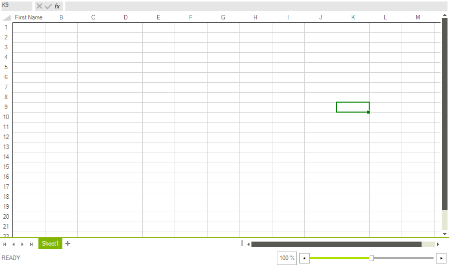

# Customize Row and Column Headers

Giving your data meaningful names helps you better understand it. For example, if your document contains a column with the first names of your employees, the column name A does not necessarily help you understand the meaning of the data contained in that column. For the same reason, you probably are likely to have one header row in the document that will store the names of your columns. But when a user scrolls down, the content of the header row would be hidden and the user would not see the names.

It will be useful if you can set the column heading name when the first row is not visible as shown in the image below.

>caption Figure 1: Column with custom heading name


## Change the Row and Column Headings

Each worksheet has a property called __RenderNameConverter__, which provides a mechanism for changing the row and column headings for UI purposes, including the PDF export. All you need to do is create a custom name converter and assign an instance of it to the RenderNameConverter property. The converter class must inherit from __HeaderNameRenderingConverterBase__.
        

__Example 1__ shows a simple implementation for the converter class used for creating the snapshots above.
        

#### Example 1: Create a custom name converter


{{source=..\SamplesCS\Spreadsheet\NameConverter.cs region=name_canverter_0}} 
{{source=..\SamplesVB\Spreadsheet\NameConverter.vb region=name_canverter_0}}
````C#
public class CustomNameConverter : HeaderNameRenderingConverterBase
{
    protected override string ConvertColumnIndexToNameOverride(HeaderNameRenderingConverterContext context, int columnIndex)
    {
        if (columnIndex == 0)
        {
            return "First Name";
        }
        return base.ConvertColumnIndexToNameOverride(context, columnIndex);
    }
}

````
````VB.NET
Public Class CustomNameConverter
    Inherits HeaderNameRenderingConverterBase
    Protected Overrides Function ConvertColumnIndexToNameOverride(ByVal context As HeaderNameRenderingConverterContext, ByVal columnIndex As Integer) As String
        If columnIndex = 0 Then
            Return "First Name"
        End If
        Return MyBase.ConvertColumnIndexToNameOverride(context, columnIndex)
    End Function
End Class

```` 

 
{{endregion}} 
 


After implementing your custom name converter you need to instantiate it and assign it to the worksheet __RenderNameConverter__ property. __Example 2__ sets a new instance of the CustomNameConverter created in __Example 1__ to a __RadSpreadsheet__'s worksheet.
        

>caption Example 2: Instantiate and assign a custom converter

{{source=..\SamplesCS\Spreadsheet\NameConverter.cs region=name_canverter_1}} 
{{source=..\SamplesVB\Spreadsheet\NameConverter.vb region=name_canverter_1}}
````C#
this.radSpreadsheet.SpreadsheetElement.Workbook.Worksheets[0].HeaderNameRenderingConverter = new CustomNameConverter();

````
````VB.NET
Me.radSpreadsheet.SpreadsheetElement.Workbook.Worksheets(0).HeaderNameRenderingConverter = New CustomNameConverter()

```` 

 
{{endregion}} 
 


That's it. The column heading is changed.
        
<!-- 

## States of the Row and Column Headings

The headings of the rows and columns have different states. You can use these states to apply different styles of the items depending on whether they appear in a selection. This section will describe the possible states of the headings in RadSpreadsheet.
 
* **HeadingState**: A property of type RowColumnHeadingBase that gets or sets the heading state. It is an enum and it can have the following values:
    * **Normal**: The heading is not included in any selection.
    
    * **Selected**: A cell from the row/column appears in a selection. 
    
    * **FullySelected**: All the cells included in the row/column are selected. 

          
* **SelectAllControlState**: A property of the SelectAllControl which is of type SelectAllControlState. The property gets or sets a value indicating whether the control is selected. It is an enum and it can have the following values:
    
    * **Normal**: The control is not selected.
    
        >caption Figure 2: SelectAllControl in normal state
        

    
    * **Selected**: The control is selected.
    
>       >caption **Figure 3: SelectAllControl in selected state**
        

-->

## See Also

 * [Hide Row and Column Headers and Gridlines]()
 * [Customize Selection]()