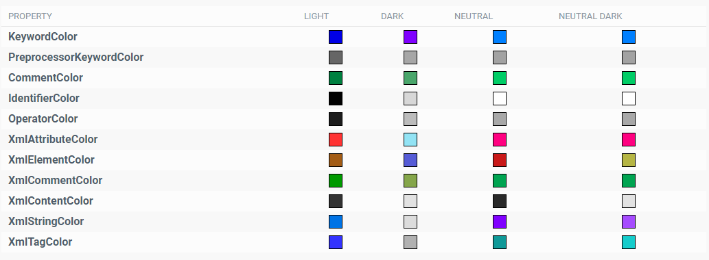
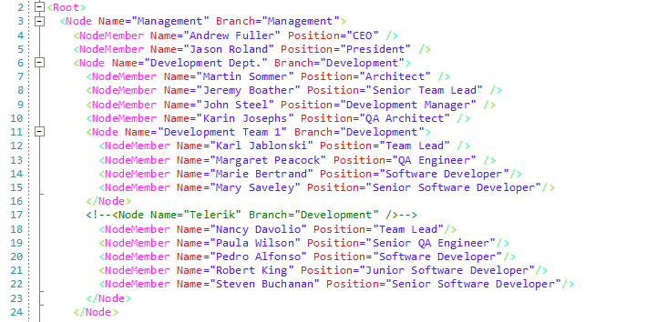

# Palettes

**RadSyntaxEditor** comes with 4 different palettes which you can choose from - **Light**, **Dark**, **Neutral** and **Neutral Dark**. They are responsible for applying different colors to the syntax-related words of the control.

## Palette List

Here is a list of all the colors in the palettes and their default values for each palette.



It is possible to change the palette according to which theme you prefer to use in your application. Here is an example:

{{source=..\SamplesCS\SyntaxEditor\SyntaxEditorGettingStarted.cs region=ChangeTheme}} 
{{source=..\SamplesVB\SyntaxEditor\SyntaxEditorGettingStarted.vb region=ChangeTheme}}

````C#
 if (TelerikHelper.IsDarkTheme(themeName))
 {
     this.radSyntaxEditor1.Palette = SyntaxPalettes.NeutralDark;
 }
 else
 {
     this.radSyntaxEditor1.Palette = SyntaxPalettes.Light;
 }

````
````VB.NET
If TelerikHelper.IsDarkTheme(themeName) Then
    Me.RadSyntaxEditor1.Palette = SyntaxPalettes.NeutralDark
Else
    Me.RadSyntaxEditor1.Palette = SyntaxPalettes.Light
End If

````

{{endregion}} 

## Custom Palettes

If you want to customize the colors shown in your **RadSyntaxEditor** control, you can do so by either modifying one of the default palettes or by creating a new instance of the **SyntaxEditorPalette** class and setting all of its colors according your own preferences.

>important It is not possible to edit the colors of the currently applied palette at run time.

### Modify a Default Pallete

Here is an example how to modify specific elements og the **NeutralDark** palette:

{{source=..\SamplesCS\SyntaxEditor\SyntaxEditorGettingStarted.cs region=ModifyPalette}} 
{{source=..\SamplesVB\SyntaxEditor\SyntaxEditorGettingStarted.vb region=ModifyPalette}}

````C#
SyntaxPalettes.NeutralDark.XmlTagColor = Color.YellowGreen;
SyntaxPalettes.NeutralDark.XmlElementColor = Color.Blue;
this.radSyntaxEditor1.Palette = SyntaxPalettes.NeutralDark;

````
````VB.NET
SyntaxPalettes.NeutralDark.XmlTagColor = Color.YellowGreen
SyntaxPalettes.NeutralDark.XmlElementColor = Color.Blue
Me.RadSyntaxEditor1.Palette = SyntaxPalettes.NeutralDark

````

{{endregion}} 

#### Difference between NeutralDark palette and modified NeutralDark pallete


### Creating custom SyntaxEditorPalette in code behind

{{source=..\SamplesCS\SyntaxEditor\SyntaxEditorGettingStarted.cs region=CreateCustomPallete}} 
{{source=..\SamplesVB\SyntaxEditor\SyntaxEditorGettingStarted.vb region=CreateCustomPallete}}

````C#
 SyntaxEditorPalette customPalette = new SyntaxEditorPalette();
 customPalette.KeywordColor = ColorTranslator.FromHtml("#3232eb");
 customPalette.PreprocessorKeywordColor = ColorTranslator.FromHtml("#848484");
 customPalette.CommentColor = ColorTranslator.FromHtml("#006633");
 customPalette.IdentifierColor = ColorTranslator.FromHtml("#000000");
 customPalette.OperatorColor = ColorTranslator.FromHtml("#323232");
 customPalette.XmlAttributeColor = ColorTranslator.FromHtml("#cc2828");
 customPalette.XmlElementColor = ColorTranslator.FromHtml("#ff28e9");
 customPalette.XmlCommentColor = ColorTranslator.FromHtml("#007b00");
 customPalette.XmlContentColor = ColorTranslator.FromHtml("#491cff");
 customPalette.XmlStringColor = ColorTranslator.FromHtml("#491cff");
 customPalette.XmlTagColor = ColorTranslator.FromHtml("#3aff4e");
 this.radSyntaxEditor1.Palette = customPalette;

````
````VB.NET
Dim customPalette As SyntaxEditorPalette = New SyntaxEditorPalette()
customPalette.KeywordColor = ColorTranslator.FromHtml("#3232eb")
customPalette.PreprocessorKeywordColor = ColorTranslator.FromHtml("#848484")
customPalette.CommentColor = ColorTranslator.FromHtml("#006633")
customPalette.IdentifierColor = ColorTranslator.FromHtml("#000000")
customPalette.OperatorColor = ColorTranslator.FromHtml("#323232")
customPalette.XmlAttributeColor = ColorTranslator.FromHtml("#cc2828")
customPalette.XmlElementColor = ColorTranslator.FromHtml("#ff28e9")
customPalette.XmlCommentColor = ColorTranslator.FromHtml("#007b00")
customPalette.XmlContentColor = ColorTranslator.FromHtml("#491cff")
customPalette.XmlStringColor = ColorTranslator.FromHtml("#491cff")
customPalette.XmlTagColor = ColorTranslator.FromHtml("#3aff4e")
Me.RadSyntaxEditor1.Palette = customPalette

````

{{endregion}} 

#### Figure 2: RadSyntaxEditor with a custom palette
