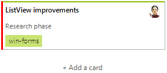

# Adding Task Cards

Each column element in **RadTaskBoard** has a button at the bottom for adding new task cards to this particular column. This button can be accessed by the RadTaskBoardColumnElement.**AddTaskCardButton** property. If you want to disable it for certain columns, manage the AddTaskCardButton.**Visibility** property respectively. 

However, if the button is enabled, the default **RadTaskCardElement** that is generated is almost empty and it contains only a title:


**RadTaskBoardColumnElement** offers the **TaskCardAdding** event which allows you to define default values for the new task card of a certain column element.

>note The **TaskCardAdding** event is also an appropriate place to show a custom dialog and present the end user an appropriate UI for filling in the necessary information. Just make sure that such a dialog is modal and its information is used when assigning the TaskCardAddingEventArgs.TaskCard.

#### Create a Predefined RadTaskCardElement

{{source=..\SamplesCS\TaskBoard\TaskBoardGettingStarted.cs region=PredefinedCard}} 
{{source=..\SamplesVB\TaskBoard\TaskBoardGettingStarted.vb region=PredefinedCard}} 

````C#

private void RadTaskBoardColumnElement_TaskCardAdding(RadTaskBoardColumnElement.TaskCardAddingEventArgs args)
{
    RadTaskCardElement defaultTaskCard = new RadTaskCardElement();
    defaultTaskCard.TitleText = "ListView improvements";
    defaultTaskCard.DescriptionText = "Research phase";
    defaultTaskCard.AccentSettings.Color = Color.Red;

    UserInfo user1 = new UserInfo();
    user1.FirstName = "Anne";
    user1.LastName = "Dodsworth";
    user1.Avatar = Properties.Resources.anne;
    defaultTaskCard.Users.Add(user1);

    //assign a user defined in RadTaskBoard
    //defaultTaskCard.Users.Add(this.radTaskBoard1.Users[1]);

    RadTaskCardTagElement tagWF = new RadTaskCardTagElement();
    tagWF.Text = "win-forms"; 
    defaultTaskCard.TagElements.Add(tagWF);
    args.TaskCard = defaultTaskCard;
}

````
````VB.NET

Private Sub RadTaskBoardColumnElement_TaskCardAdding(args As RadTaskBoardColumnElement.TaskCardAddedEventArgs)
    Dim defaultTaskCard As RadTaskCardElement = New RadTaskCardElement()
    defaultTaskCard.TitleText = "ListView improvements"
    defaultTaskCard.DescriptionText = "Research phase"
    defaultTaskCard.AccentSettings.Color = Color.Red
    Dim user1 As UserInfo = New UserInfo()
    user1.FirstName = "Anne"
    user1.LastName = "Dodsworth"
    user1.Avatar = My.Resources.anne
    defaultTaskCard.Users.Add(user1)

    'assign a user defined in RadTaskBoard
    'defaultTaskCard.Users.Add(this.radTaskBoard1.Users(1))

    Dim tagWF As RadTaskCardTagElement = New RadTaskCardTagElement()
    tagWF.Text = "win-forms"
    defaultTaskCard.TagElements.Add(tagWF)
    args.TaskCard = defaultTaskCard
End Sub


````

{{endregion}}  


  
# See Also

* [Design Time]()
* [Structure]()
 
        
