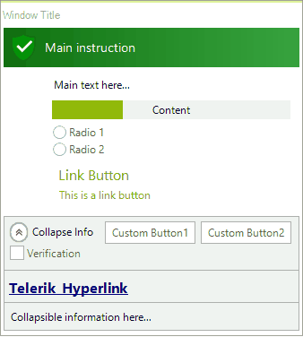

# Getting Started

Before proceeding further with this article, it is recommended to get familiar with the internal structure of **RadTaskDialog** and how the elements are being organized: [Task Dialog's Structure]()

This article will walk you through the creation of a sample task dialog that contains a link button, several radio buttons, a progress bar and collapsible information in the footer via code.

 


{{source=..\SamplesCS\TaskDialog\TaskDialogGettingStarted.cs region=Example1}} 
{{source=..\SamplesVB\TaskDialog\TaskDialogGettingStarted.vb region=Example1}}

````C#

RadTaskDialogPage page = new RadTaskDialogPage();
page.Caption = "Window Title";
page.Heading = "Main instruction";
page.Text = "Main text here...";
page.Icon = RadTaskDialogIcon.ShieldSuccessGreenBar;
page.Icon.SvgImage = RadTaskDialogIcon.GetSvgImage(RadTaskDialogIconImage.FlatShieldSuccess, new Size(32, 32));

RadTaskDialogButton button1 = new RadTaskDialogButton();
button1.Text = "Custom Button1";
button1.Click += new EventHandler(delegate(object sender, EventArgs e) { RadMessageBox.Show("Clicked Button1!"); });
page.DefaultButton = button1;
page.CommandAreaButtons.Add(button1);
RadTaskDialogButton button2 = new RadTaskDialogButton();
button2.Text = "Custom Button2";
button2.Click += new EventHandler(delegate(object sender, EventArgs e) { RadMessageBox.Show("Clicked Button2!"); });
page.CommandAreaButtons.Add(button2);

RadTaskDialogCommandLinkButton linkButton = new RadTaskDialogCommandLinkButton();
linkButton.Text = "Link Button";
linkButton.DescriptionText = "This is a link button"; 
page.ContentArea.Buttons.Add(linkButton);

RadTaskDialogProgressBar taskProgressBar = new RadTaskDialogProgressBar();
taskProgressBar.Value = 30;
page.ProgressBar = taskProgressBar;
page.ProgressBar.Text = "Content";

page.RadioButtons = new RadItemOwnerGenericCollection<RadTaskDialogRadioButton>()
{
    new RadRadioButtonElement() { Text = "Radio 1" },
    new RadRadioButtonElement() { Text = "Radio 2" }
};

RadTaskDialogVerificationCheckBox verificationCheck = new RadTaskDialogVerificationCheckBox();
verificationCheck.Text = "Verification";
verificationCheck.CheckStateChanged += new EventHandler(delegate(object sender, EventArgs e) 
    { RadMessageBox.Show(verificationCheck.CheckState.ToString()); });
page.Verification = verificationCheck;

page.Expander.Text = "Collapsible information here...";
page.Expander.Expanded = true;
page.Expander.ExpandedButtonText = "Collapse Info";
page.Expander.CollapsedButtonText = "More Info"; 
page.Expander.Position = RadTaskDialogExpanderPosition.AfterFootnote;

page.Footnote.Text = "<html><b><size=12><a href=www.telerik.com>Telerik Hyperlink</a> ";

RadTaskDialog.ShowDialog(page);


````
````VB.NET

Dim page As RadTaskDialogPage = New RadTaskDialogPage()
page.Caption = "Window Title"
page.Heading = "Main instruction"
page.Text = "Main text here..."
page.Icon = RadTaskDialogIcon.ShieldSuccessGreenBar
page.Icon.SvgImage = RadTaskDialogIcon.GetSvgImage(RadTaskDialogIconImage.FlatShieldSuccess, New Size(32, 32))
Dim button1 As RadTaskDialogButton = New RadTaskDialogButton()
button1.Text = "Custom Button1"
AddHandler button1.Click, AddressOf New EventHandler(Function(sender As Object, e As EventArgs)
                                                         RadMessageBox.Show("Clicked Button1!")
                                                     End Function)
page.DefaultButton = button1
page.CommandAreaButtons.Add(button1)
Dim button2 As RadTaskDialogButton = New RadTaskDialogButton()
button2.Text = "Custom Button2"
AddHandler button2.Click, AddressOf New EventHandler(Function(sender As Object, e As EventArgs)
                                                         RadMessageBox.Show("Clicked Button2!")
                                                     End Function)
page.CommandAreaButtons.Add(button2)
Dim linkButton As RadTaskDialogCommandLinkButton = New RadTaskDialogCommandLinkButton()
linkButton.Text = "Link Button"
linkButton.DescriptionText = "This is a link button"
page.ContentArea.Buttons.Add(linkButton)
Dim taskProgressBar As RadTaskDialogProgressBar = New RadTaskDialogProgressBar()
taskProgressBar.Value = 30
page.ProgressBar = taskProgressBar
page.ProgressBar.Text = "Content"
page.RadioButtons = New RadItemOwnerGenericCollection(Of RadTaskDialogRadioButton)() From {
    New RadRadioButtonElement() With {
        .Text = "Radio 1"
    },
    New RadRadioButtonElement() With {
        .Text = "Radio 2"
    }
}
Dim verificationCheck As RadTaskDialogVerificationCheckBox = New RadTaskDialogVerificationCheckBox()
verificationCheck.Text = "Verification"
AddHandler verificationCheck.CheckStateChanged, AddressOf New EventHandler(Function(sender As Object, e As EventArgs)
                                                                               RadMessageBox.Show(verificationCheck.CheckState.ToString())
                                                                           End Function)
page.Verification = verificationCheck
page.Expander.Text = "Collapsible information here..."
page.Expander.Expanded = True
page.Expander.ExpandedButtonText = "Collapse Info"
page.Expander.CollapsedButtonText = "More Info"
page.Expander.Position = RadTaskDialogExpanderPosition.AfterFootnote
page.Footnote.Text = "<html><b><size=12><a href=www.telerik.com>Telerik Hyperlink</a> "
RadTaskDialog.ShowDialog(page)


````

{{endregion}}

## Multiple Pages

**RadTaskDialogPage** offers the **Navigate** method which allows you to navigate from the current page to another page and thus simulate a simple wizard. 
 In the above code snippet, it is possible to subscribe to the **Click** event of the **RadTaskDialogCommandLinkButton** and call the **Navigate** method of the current page passing the next page as an input argument.

>important Please make sure that the **AllowCloseDialog** property is set to *false* for the **RadTaskDialogCommandLinkButton**. Otherwise, the task dialog is expected to be closed when the user clicks the button. 

{{source=..\SamplesCS\TaskDialog\TaskDialogGettingStarted.cs region=MultiplePages}} 
{{source=..\SamplesVB\TaskDialog\TaskDialogGettingStarted.vb region=MultiplePages}}

````C#
linkButton.AllowCloseDialog = false;
linkButton.Click += new EventHandler(delegate(object sender, EventArgs e)
{ 
    RadTaskDialogPage nextPage = new RadTaskDialogPage();
    //construct the next page's content here
    page.Navigate(nextPage);
});

````
````VB.NET

linkButton.AllowCloseDialog = False
AddHandler linkButton.Click, New EventHandler(Function(sender As Object, e As EventArgs)
                                                  Dim nextPage As RadTaskDialogPage = New RadTaskDialogPage()
                                                  'construct the next page's content here
                                                  page.Navigate(nextPage)
                                              End Function)


````

{{endregion}}

# See Also

* [Structure]()
* [Element Types]()
 
        
