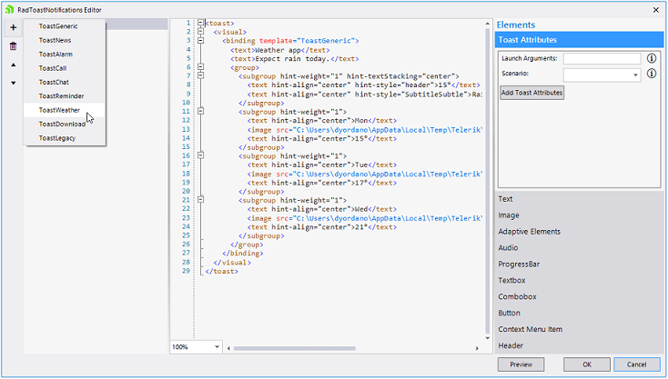
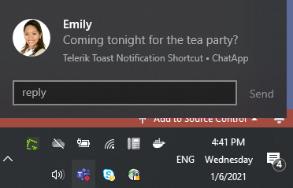

# Getting Started

To start using **RadToastNotificationManager** just drag it from the toolbox and drop it on the form.

### Assembly References

You can find listed below the required references for using a **RadToastNotificationManager** which are automatically added after you drag the **RadToastNotificationManager** from the toolbox:

* Telerik.WinControls

* Telerik.WinControls.UI

* TelerikCommon

* Telerik.WinControls.RadToastNotification

* Microsoft.Toolkit.Uwp.Notifications

>important RadToastNotificationManager requires .NET Framework 4.6.1 or higher.

>important Toast notifications can only be displayed in Windows 8.0 or higher. For older Windows versions, use RadDesktopAler instead.

By using the [RadToastNotifications Editor]() you can add different toast notifications to the manager at design time. They are serialized as Telerik toasts which generate Windows system toasts. 

 

Then, if you want to show a toast notification at run time, e.g. when clicking a button, you must [register]() the **RadToastNotificationManager** first. 

#### Register RadToastNotificationManager and Show a Notification

{{source=..\SamplesCS\ToastNotification\ToastNotificationGettingsStarted.cs region=RegisterGettingStarted}} 
{{source=..\SamplesVB\ToastNotification\ToastNotificationGettingsStarted.vb region=RegisterGettingStarted}}

````C#

public ToastNotificationGettingsStarted()
{
    InitializeComponent();

    this.radToastNotificationManager1.Register();
    this.radButton1.Click+=radButton1_Click;
}

private void radButton1_Click(object sender, EventArgs e)
{
    this.radToastNotificationManager1.ShowNotification(3);
}

protected override void OnClosed(EventArgs e)
{
    base.OnClosed(e);
    this.radToastNotificationManager1.Unregister();
}


````
````VB.NET
Public Sub New()
    InitializeComponent()
    Me.RadToastNotificationManager1.Register()
    AddHandler Me.RadButton1.Click, AddressOf radButton1_Click
End Sub

Private Sub radButton1_Click(ByVal sender As Object, ByVal e As EventArgs)
    Me.radToastNotificationManager1.ShowNotification(3)
End Sub

Protected Overrides Sub OnClosed(ByVal e As EventArgs)
    MyBase.OnClosed(e)
    Me.radToastNotificationManager1.Unregister()
End Sub

````

As a result, the toast notification is successfully shown when you click teh button:

 

# See Also

* [Notification Templates]()
* [Design Time]()
 
        
