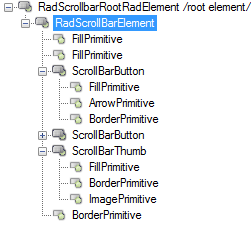

# Structure

This article illustrates the inner structure and organization of the elements which build the **RadScrollBar** control.

>caption Figure 1: RadScrollBar's elements hierarchy

>caption Figure 2: RadScrollBar's visual structure

 
 
As every control which is build with Telerik Presentation Framework, __RadVScrollBar__ and __RadHScrollBar__ consist of building elements ordered in a tree where property values are inherited in direction from the root to the leaves. The rest of the article discusses the most important nodes for the scroll bar controls.

__RadScrollBarElement__ (the second node in the hierarchy) is an abstraction node so that the __element__ can be used in other controls i.e. **RadGridView**. 

* The __FillPrimitive__ sets the overall background properties that are inherited by the other elements. 

* The __ScrollBarButton__ elements represent the arrows at both ends of the scroll bar. Each one consists of a __FillPrimitive__, an __ArrowPrimitive__, and a __BorderPrimitive__. 

* The __ScrollBarThumb__ element represents the scroll bar thumb. It consists of a __FillPrimitive__ and a __BorderPrimitive__. 

# See Also

* [RadControlSpy]()