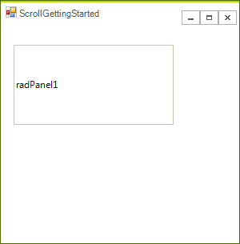
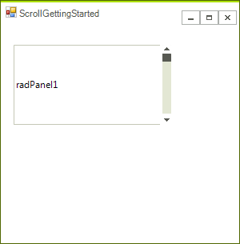
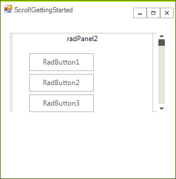
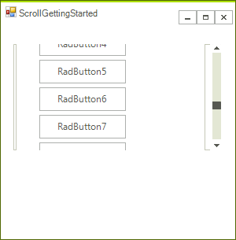

# Getting Started

Using Telerik scroll bars is a bit more intricate compared to using the standard scroll bars because you have to handle scroll event manually. The rest of this article demonstrates how you can use two panels to implement scrolling for the content of the second panel.

1\. Add a **RadPanel** to your form (*TelerikMetro* theme was used for both panels. This theme is contained in the Miscellaneous theme component):



2\. Add a **RadVScrollbar** in the panel and dock it to the *Right*:



3\. Add another **RadPanel** in the already added one and set its height to the *total* height you want to be available upon scrolling. This value can be statics e.g. *1000* pixels or dynamic determined by the scrollable content. For the purpose, of this example it is set to *1000* pixels. 


4\. The next step is to add controls to the second **RadPanel** (the controls which are to be scrolled):

#### Adding controls to the panel

{{source=..\SamplesCS\TrackAndStatus\ScrollBar\ScrollGettingStarted.cs region=buttons}} 
{{source=..\SamplesVB\TrackAndStatus\ScrollBar\ScrollGettingStarted.vb region=buttons}} 

````C#
for (int i = 1; i < 15; i++)
{
    RadButton button = new RadButton();
    button.Location = new Point(30, i * 30 + 5 * i);
    button.Size = new Size(70, 30);
    button.Text = "RadButton" + i.ToString();
    this.radPanel2.Controls.Add(button);
}

````
````VB.NET
For i As Integer = 1 To 14
    Dim button As New RadButton()
    button.Location = New Point(30, i * 30 + 5 * i)
    button.Size = New Size(70, 30)
    button.Text = "RadButton" & i.ToString()
    Me.RadPanel2.Controls.Add(button)
Next i

````

{{endregion}} 

>note You can add controls by drag and drop at design time as well.
>



5\. Then, subscribe to the **Scroll** event of the vertical scroll bar and assign its negated value to the **Top** property of the second **RadPanel**:

#### Handling the Scroll event

{{source=..\SamplesCS\TrackAndStatus\ScrollBar\ScrollGettingStarted.cs region=scroll}} 
{{source=..\SamplesVB\TrackAndStatus\ScrollBar\ScrollGettingStarted.vb region=scroll}} 

````C#
void radVScrollBar1_Scroll(object sender, ScrollEventArgs e)
{
    this.radPanel2.Top = -this.radVScrollBar1.Value;
}

````
````VB.NET
Private Sub radVScrollBar1_Scroll(ByVal sender As Object, ByVal e As ScrollEventArgs)
    Me.RadPanel2.Top = -Me.RadVScrollBar1.Value
End Sub

````

{{endregion}} 

6\. The last required step is to set the __Maximum__ property of the scroll bar to reflect the size of the __scrollable height__ which is the __total height__ of the scrollable content minus the __visible height__. For the example of this section in particular, that is the height of the second panel minus the height of the first panel.

#### Specify RadVScrollBar's maximum

{{source=..\SamplesCS\TrackAndStatus\ScrollBar\ScrollGettingStarted.cs region=maximum}} 
{{source=..\SamplesVB\TrackAndStatus\ScrollBar\ScrollGettingStarted.vb region=maximum}} 

````C#
this.radVScrollBar1.Maximum = this.radPanel2.Size.Height - this.radPanel1.Size.Height;

````
````VB.NET
Me.RadVScrollBar1.Maximum = Me.RadPanel2.Size.Height - Me.RadPanel1.Size.Height

````

{{endregion}} 



# See Also

* [Properties, Methods and Events]()	