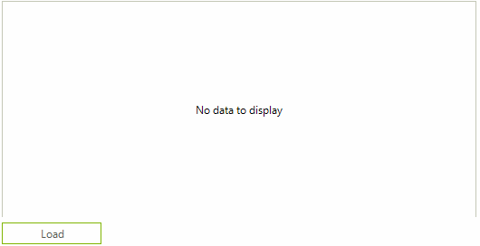

# Associated Control

__RadWaitingBar__ allows you to associate it to any control indicating its load time.

>caption Fig.1 Load indication

 

The following tutorial demonstrates how to indicate the data loading operation in __RadGridView__.

>caption Fig.2 Load data

 

1. Add __RadWaitingBar__, __RadGridView__ and __RadButton__ to the form.
2. Subscribe to the __Click__ event of __RadButton__ and set the RadWaitingBar.__AssociatedControl__ property to the grid. Thus, the waiting bar will be displayed over the grid while data is loading. After the data is loaded, set the __AssociatedControl__ property to *null*. Use the following code snippet:

#### Data loading

{{source=..\SamplesCS\TrackAndStatus\WaitingBar\WaitingBarAssociatedControl.cs region=BusyIndicator}} 
{{source=..\SamplesVB\TrackAndStatus\WaitingBar\WaitingBarAssociatedControl.vb region=BusyIndicator}}

````C#
System.Windows.Forms.Timer timer = new System.Windows.Forms.Timer();
private void radButton1_Click(object sender, EventArgs e)
{
    timer.Interval = 3000;
    timer.Tick += timer_Tick;
    this.radWaitingBar1.AssociatedControl=this.radGridView1;
    this.radWaitingBar1.StartWaiting();
    timer.Start();
}
private void timer_Tick(object sender, EventArgs e)
{
    timer.Stop();
    this.radWaitingBar1.AssociatedControl=null;
    this.radGridView1.DataSource = this.categoriesBindingSource;
}

````
````VB.NET
Private timer As New System.Windows.Forms.Timer()
Private Sub RadButton1_Click(sender As Object, e As EventArgs) Handles RadButton1.Click
    Timer.Interval = 3000
    AddHandler Timer.Tick, AddressOf timer_Tick
    Me.RadWaitingBar1.AssociatedControl = Me.RadGridView1
    Me.RadWaitingBar1.StartWaiting()
    Timer.Start()
End Sub
Private Sub timer_Tick(sender As Object, e As EventArgs)
    timer.[Stop]()
    Me.RadWaitingBar1.AssociatedControl = Nothing
    Me.radGridView1.DataSource = Me.categoriesBindingSource
End Sub

````

{{endregion}} 