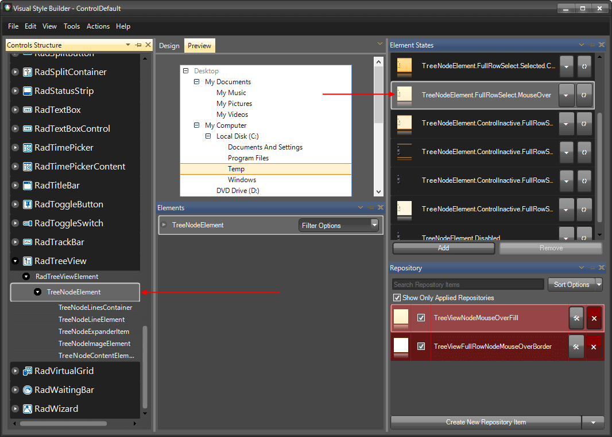
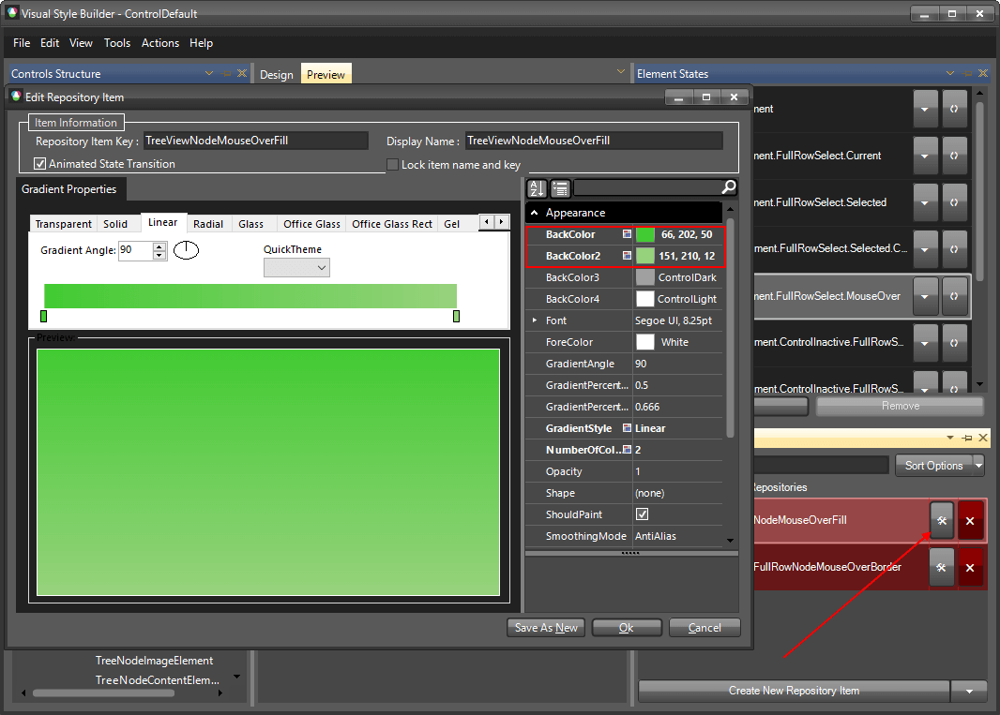
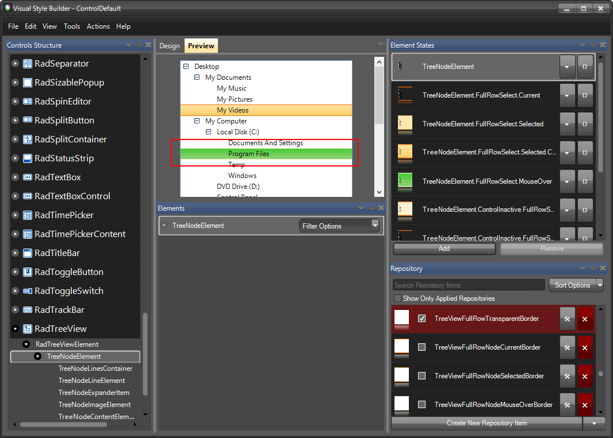

# Editing Themes

This help article will demonstrate a step by step tutorial how to customize the ControlDefault theme for __RadTreeView__. 

1. Open [VisualStyleBuilder](): Start menu (Start >> Programs >> Telerik >> UI for WinForms [version] >> Tools).

1. Export the built-in themes in a specific folder by selecting *File >> Export Built-in Themes*.

1. Load a desired theme from the just exported files by selecting *File >> Open Package*

1. Select __TreeNodeElement__ in *Controls Structure* on the left side. Then, select __FullRowSelect.MouseOver__ in the *Element States* section.

    

1. Modify the applied *fill* repository item. 

    
    The result is illustrated below. The new fill color is applied when hovering the item:

    

1. Save the theme by selecting *File >> Save As*.

1. Now, you can apply your custom theme to __RadTreeView__ by using the demonstrated approach in the following link: [Using custom themes]()

# See Also 

* [Getting Started with VisualStyleBuilder]()
* [Working With Repository Items]()
