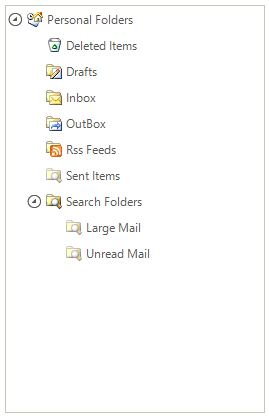
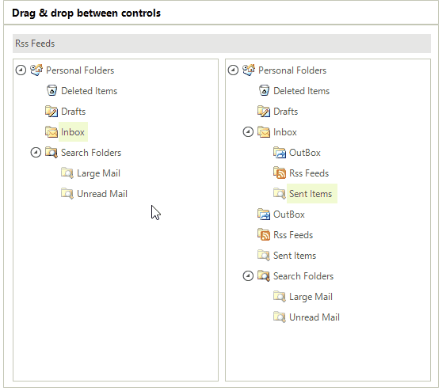
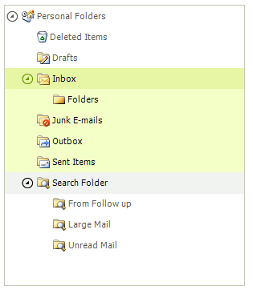
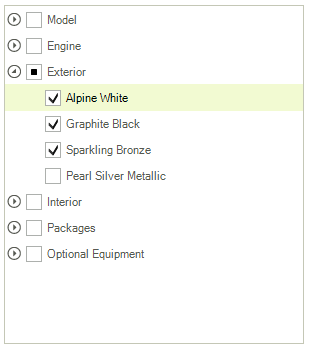
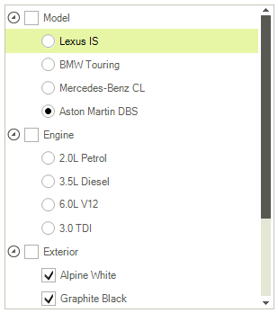
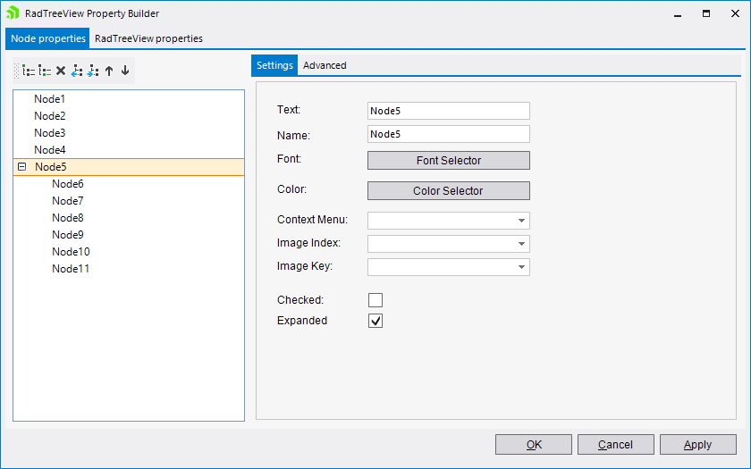

# TreeView

Telerik **RadTreeView** is the supercharged tree view component for Windows Forms. It facilitates display, management, and navigation of hierarchical data structures. The product offers many advanced features like drag-and-drop, load on demand, context menus and data binding. **RadTreeView** features an extremely rich API, allowing you to achieve complex behavior in your applications. The skinning support nicely blends **RadTreeView** into the interface of your application.





## Key Features:

### Drag & drop

**RadTreeView** supports drag and drop within the same tree and between **RadTreeView** controls. The position indication cursor provides feedback to the user so that nodes can be dropped above, below or within a given node. When dragging to a hidden or collapsed node the control will scroll up/down and automatically open the collapsed node. Drag and drop behavior is customizable at the TreeView and node levels, allowing you to restrict interactions between source and target nodes.

### Rich styling capabilities 

RadTreeView uses the innovative theming mechanism that the Telerik Presentation Framework (TPF) provides. You can build your own themes interactively using the Visual Style Builder or select one of the predefined themes.

### Load on demand

For industrial strength applications with heavy data requirements, the Load On Demand feature reduces loading time and performance overhead.

### Rich data binding support

**RadTreeView** binds to hierarchical data for most popular databases, custom business objects and XML. **RadTreeView** binds to any object that supports *IList*, *IListSource* or *IBindingList*. **RadTreeView** can also load and save XML directly to file or string.

### Context menus

Expand **RadTreeView** functionality by adding context menus either for the entire control or to each node. You have the capability to attach a different context menu to each tree node.

### Multiple selection

**RadTreeView** allows multiple items to be selected using the `Shift` and `Ctrl` keys. Multiple selections can be dragged and dropped and can also be iterated programmatically.

### Tri-state check boxes

Check boxes can have a third "indeterminate" state to provide feedback to the user. For example, the screenshot below shows the "Exterior" node in an indeterminate state to show the user that not all child nodes are checked.

### Mixed Check Boxes and Radio Buttons

### RTL Support

**RadTreeView** supports right-to-left layout and can be used in multilingual applications.

### Rich design time environment

The Property Builder provides a quick, intuitive way to work with **RadTreeView** at design time. A preview window displays instant feedback and an Advanced Mode allows maximum control.

# See Also

* [Breadcrumb]()

* [Getting Started]()

* [Properties, Methods and Events]()

* [Structure]()

* [Touch Support]()

