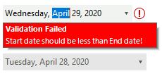

# Validation Rules

**RadValidationProvider** supports three types of validation rules all of which implements the **IRadValidationRule** interface:

* **RadValidationRule**: allows you to define validation logic for a single control considering a validation operator and a value.
* **RadValidationRuleWithSecondControl**: allows you to define validation logic of a control against a second control, e.g. if you have two **RadDateTimePicker** controls for selecting start/end date and you need to ensure that start date is less than end date. 
* **RadCompositeValidationRule**: allows defining more complex validation logic by adding multiple simpler **RadValidationRules**.

## RadValidationRule

**RadValidationRule** requires the following properties to be set in order to define a validation logic for a single control:

* **AutoToolTip**: a boolean value indicating whether a tool tip will be shown when the validation fails. 
* **Controls**: a collection that contains all controls to which this rule is applied, e.g. you can use one rule for multiple controls.
* **Operator**: specifies the operator to be used for the validation logic. It is of type [FilterOperator](https://docs.telerik.com/devtools/winforms/api/telerik.wincontrols.data.filteroperator.html). Hence, similar to the filter operator, you can use the same validation operators.
* **Value**: specifies the value for the validation comparison. 
* **ToolTipText**: specifies the text to be displayed when the validation fails.
* **ToolTipTitle**: specifies the title of the error tool tip. Its default value is *"Validation Failed"*.

The following code snippet demonstrates how to add a validation rule ensuring that a **RadTextBox** is not empty. When you focus the control and try to exit without entering any text, the validation logic won't succeed and the error tool tip will be displayed: 

 

{{source=..\SamplesCS\ValidationProvider\ValidationProviderGettingStarted.cs region=SimpleRule}} 
{{source=..\SamplesVB\ValidationProvider\ValidationProviderGettingStarted.vb region=SimpleRule}}

````C#
RadValidationRule radValidationRule1 = new RadValidationRule();
radValidationRule1.AutoToolTip = true;
radValidationRule1.Controls.Add(this.radTextBox1);
radValidationRule1.Operator = Telerik.WinControls.Data.FilterOperator.IsNotLike;
radValidationRule1.ToolTipText = "Location can\'t be empty!";
radValidationRule1.Value = "";

radValidationProvider1.ValidationRules.Add(radValidationRule1);


````
````VB.NET
Dim radValidationRule1 As RadValidationRule = New RadValidationRule()
radValidationRule1.AutoToolTip = True
radValidationRule1.Controls.Add(Me.RadTextBox1)
radValidationRule1.[Operator] = Telerik.WinControls.Data.FilterOperator.IsNotLike
radValidationRule1.ToolTipText = "Location can't be empty!"
radValidationRule1.Value = ""
radValidationProvider1.ValidationRules.Add(radValidationRule1)


````

{{endregion}} 

## RadValidationRuleWithSecondControl

**RadValidationRuleWithSecondControl** requires the following properties to be set in order to define a validation logic for a control against a second control:

* **AutoToolTip**: a boolean value indicating whether a tool tip will be shown when the validation fails. 
* **Controls**: a collection that contains all controls to which this rule is applied, e.g. you can use one rule for multiple controls.
* **Operator**: specifies the operator to be used for the validation logic. It is of type [FilterOperator](https://docs.telerik.com/devtools/winforms/api/telerik.wincontrols.data.filteroperator.html). Hence, similar to the filter operator, you can use the same validation operators.
* **PropertyName**: specifies the name of the property which to be used for the validation comparison.
* **SecondControl**: specifies the second control against which the validation logic will be performed.  
* **SecondControlPropertyName**: specifies the name of the second control's property which to be used for the validation comparison.
* **ToolTipText**: specifies the text to be displayed when the validation fails.
* **ToolTipTitle**: specifies the title of the error tool tip. Its default value is *"Validation Failed"*.

The following rule will ensure that the first **RadDateTimePicker**'s value is less than the value of the second one:

 

{{source=..\SamplesCS\ValidationProvider\ValidationProviderGettingStarted.cs region=SecondControl}} 
{{source=..\SamplesVB\ValidationProvider\ValidationProviderGettingStarted.vb region=SecondControl}}

````C#

RadValidationRuleWithSecondControl radValidationRuleWithSecondControl1 = new RadValidationRuleWithSecondControl();
radValidationRuleWithSecondControl1.AutoToolTip = true;
radValidationRuleWithSecondControl1.Controls.Add(this.radDateTimePicker1);
radValidationRuleWithSecondControl1.Operator = Telerik.WinControls.Data.FilterOperator.IsLessThan;
radValidationRuleWithSecondControl1.PropertyName = "Value";
radValidationRuleWithSecondControl1.SecondControl = this.radDateTimePicker2;
radValidationRuleWithSecondControl1.SecondControlPropertyName = "Value";
radValidationRuleWithSecondControl1.ToolTipText = "Start date should be less than End date!";

radValidationProvider1.ValidationRules.Add(radValidationRuleWithSecondControl1);


````
````VB.NET
Dim radValidationRuleWithSecondControl1 As RadValidationRuleWithSecondControl = New RadValidationRuleWithSecondControl()
radValidationRuleWithSecondControl1.AutoToolTip = True
radValidationRuleWithSecondControl1.Controls.Add(Me.RadDateTimePicker1)
radValidationRuleWithSecondControl1.[Operator] = Telerik.WinControls.Data.FilterOperator.IsLessThan
radValidationRuleWithSecondControl1.PropertyName = "Value"
radValidationRuleWithSecondControl1.SecondControl = Me.RadDateTimePicker2
radValidationRuleWithSecondControl1.SecondControlPropertyName = "Value"
radValidationRuleWithSecondControl1.ToolTipText = "Start date should be less than End date!"
radValidationProvider1.ValidationRules.Add(radValidationRuleWithSecondControl1)


````

{{endregion}}


## RadCompositeValidationRule

**RadCompositeValidationRule** allows you to define a collection of multiple validation rules added to the **ValidationRules** collection. 


The following code snippet demonstrates how to define a **RadCompositeValidationRule** composed of two **RadValidationRuleWithSecondControls** ensuring that start date (radDateTimePicker1) is less than end date (radDateTimePicker2) and end date is greated than start date:

 

{{source=..\SamplesCS\ValidationProvider\ValidationProviderGettingStarted.cs region=CompositeRule}} 
{{source=..\SamplesVB\ValidationProvider\ValidationProviderGettingStarted.vb region=CompositeRule}}

````C#
RadValidationRuleWithSecondControl radValidationRuleWithSecondControl1 = new RadValidationRuleWithSecondControl();
radValidationRuleWithSecondControl1.AutoToolTip = true;
radValidationRuleWithSecondControl1.Controls.Add(this.radDateTimePicker1);
radValidationRuleWithSecondControl1.Operator = Telerik.WinControls.Data.FilterOperator.IsLessThan;
radValidationRuleWithSecondControl1.PropertyName = "Value";
radValidationRuleWithSecondControl1.SecondControl = this.radDateTimePicker2;
radValidationRuleWithSecondControl1.SecondControlPropertyName = "Value";
radValidationRuleWithSecondControl1.ToolTipText = "Start date should be less than End date!";

radValidationProvider1.ValidationRules.Add(radValidationRuleWithSecondControl1);

RadValidationRuleWithSecondControl radValidationRuleWithSecondControl2 = new RadValidationRuleWithSecondControl();
radValidationRuleWithSecondControl2.AutoToolTip = true;
radValidationRuleWithSecondControl2.Controls.Add(this.radDateTimePicker2);
radValidationRuleWithSecondControl2.Operator = Telerik.WinControls.Data.FilterOperator.IsGreaterThan;
radValidationRuleWithSecondControl2.PropertyName = "Value";
radValidationRuleWithSecondControl2.SecondControl = this.radDateTimePicker1;
radValidationRuleWithSecondControl2.SecondControlPropertyName = "Value";
radValidationRuleWithSecondControl2.ToolTipText = "Start date should be less than End date!";

radValidationProvider1.ValidationRules.Add(radValidationRuleWithSecondControl2);

````
````VB.NET
Dim radValidationRuleWithSecondControl1 As RadValidationRuleWithSecondControl = New RadValidationRuleWithSecondControl()
radValidationRuleWithSecondControl1.AutoToolTip = True
radValidationRuleWithSecondControl1.Controls.Add(Me.RadDateTimePicker1)
radValidationRuleWithSecondControl1.[Operator] = Telerik.WinControls.Data.FilterOperator.IsLessThan
radValidationRuleWithSecondControl1.PropertyName = "Value"
radValidationRuleWithSecondControl1.SecondControl = Me.RadDateTimePicker2
radValidationRuleWithSecondControl1.SecondControlPropertyName = "Value"
radValidationRuleWithSecondControl1.ToolTipText = "Start date should be less than End date!"
radValidationProvider1.ValidationRules.Add(radValidationRuleWithSecondControl1)
Dim radValidationRuleWithSecondControl2 As RadValidationRuleWithSecondControl = New RadValidationRuleWithSecondControl()
radValidationRuleWithSecondControl2.AutoToolTip = True
radValidationRuleWithSecondControl2.Controls.Add(Me.RadDateTimePicker2)
radValidationRuleWithSecondControl2.[Operator] = Telerik.WinControls.Data.FilterOperator.IsGreaterThan
radValidationRuleWithSecondControl2.PropertyName = "Value"
radValidationRuleWithSecondControl2.SecondControl = Me.RadDateTimePicker1
radValidationRuleWithSecondControl2.SecondControlPropertyName = "Value"
radValidationRuleWithSecondControl2.ToolTipText = "Start date should be less than End date!"
radValidationProvider1.ValidationRules.Add(radValidationRuleWithSecondControl2)


````

{{endregion}}


# See Also

* [Getting Started]()
* [Design Time]()
 
        
