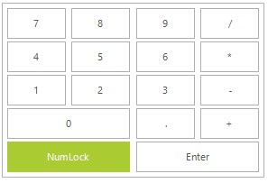

# Default Layouts

The **LayoutType** property of **RadVirtualKeyboard** controls the keyboard layout type. Changing the value will automatically set the **MainLayoutPanel** property with a predefined value.

The available options in the **KeyboardLayoutType** enumeration are:

### **Extended** 
A keyboard layout that includes the functions keys, main keys, home buttons and numpad keyboard groups. This layout is of **ExtendedVirtualKeyboardLayoutPanel** type and offers the following useful properties:

* **FunctionButtonsLayout** - Gets the **VirtualKeyboardLayout** that holds all function keys of the keyboard.
* **MainButtonsLayout** - Gets the **VirtualKeyboardLayout** that holds all keys from the main group of the keyboard.
* **HomeButtonsLayout** - Gets the **VirtualKeyboardLayout** that holds all buttons from the home keys group of the keyboard.
* **NumpadButtonsLayout** - Gets the **VirtualKeyboardLayout** that holds all buttons from the numpad keys group of the keyboard.

 

### **Simplified**
A keyboard layout that includes the main buttons group with escape key and arrow keys included. This layout is of **SimplifiedVirtualKeyboardLayoutPanel** type and offers the following useful properties:
* **MainButtonsLayout** - Gets the **VirtualKeyboardLayout** that holds all keys from the main group of the keyboard.
* **HomeButtonsLayout** - Gets the **VirtualKeyboardLayout** that holds all buttons from the home keys group of the keyboard.

 

### **Numpad**
A keyboard layout that includes the numpad buttons group. This layout is of **NumpadVirtualKeyboardLayoutPanel** type and offers:
* **NumpadButtonsLayout** - Gets the **VirtualKeyboardLayout** that holds all buttons from the numpad keys group of the keyboard.

 

## Customizing default layouts

**RadVirtualKeyboard** arranges its keys in logical layouts which control the specific position for each key. Before proceeding further, it is recommended to get yourself familiar with the [Structure]() and [Logical Keyboard Layout]() of the virtual keyboard. 

The following code snippet demonstrates how to add a **Z** button in the *Home* layout when using KeyboardLayoutType.*Extended*:

 


#### Adding a key to the default Home layout

{{source=..\SamplesCS\VirtualKeyboard\KeyboardGettingStarted.cs region=AddKeyToHome}} 
{{source=..\SamplesVB\VirtualKeyboard\KeyboardGettingStarted.vb region=AddKeyToHome}}

````C#
radVirtualKeyboard1.LayoutType = Telerik.WinControls.VirtualKeyboard.KeyboardLayoutType.Extended;
ExtendedVirtualKeyboardLayoutPanel extendedLayoutPanel = radVirtualKeyboard1.MainLayoutPanel as ExtendedVirtualKeyboardLayoutPanel;
int keysRowIndex = 2;
int keyColSpan = 3;
int KeyRowSpan = 1;
extendedLayoutPanel.HomeButtonsLayout.Rows[keysRowIndex].Keys.Add(new Key((int)Keys.Z, KeyType.Normal, keyColSpan, KeyRowSpan));
extendedLayoutPanel.ResetLayout();

````
````VB.NET
Me.radVirtualKeyboard1.LayoutType = Telerik.WinControls.VirtualKeyboard.KeyboardLayoutType.Extended
Dim extendedLayoutPanel As ExtendedVirtualKeyboardLayoutPanel = TryCast(radVirtualKeyboard1.MainLayoutPanel, ExtendedVirtualKeyboardLayoutPanel)
Dim keysRowIndex As Integer = 2
Dim keyColSpan As Integer = 3
Dim KeyRowSpan As Integer = 1
extendedLayoutPanel.HomeButtonsLayout.Rows(keysRowIndex).Keys.Add(New Key(CInt(Keys.Z), KeyType.Normal, keyColSpan, KeyRowSpan))
extendedLayoutPanel.ResetLayout()

```` 

{{endregion}}

# See Also

* [Structure]()
* [Getting Started]()
 
        
