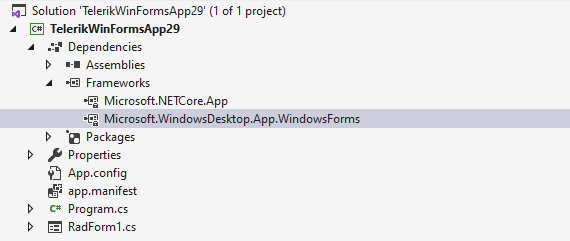
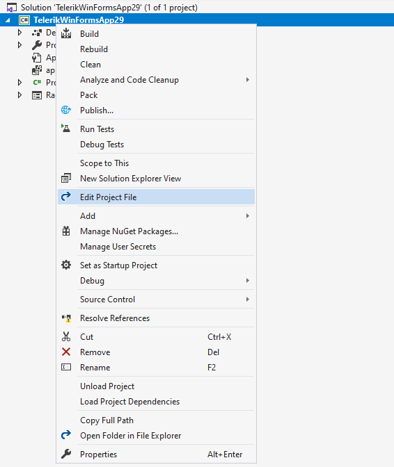
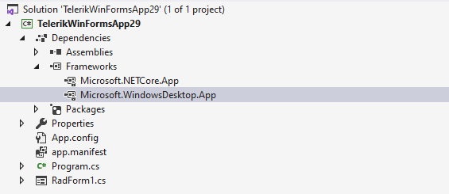

# Document Processing Library and WinForms .NET Core application. 

Since the Document Processing Library is depends on some types from WPF using the library in a WinForms application requires making changes in the project file. This is not necessary in the .NET framework projects where you can just add the refences in Visual Studio. 

By default, when creating a WinForms .NET Core application the **Microsoft.WindowsDesktop.App.WindowsForms** framework is added. This does not include the required WPF references. 

To add the required references you need to edit the project file.  

Under the **UseWindowsForms** line add the **UseWPF** tag. The file should look like this.

Save and reload the file. Now you should see the **Microsoft.WindowsDesktop.App** in the frameworks node.

This is all that is required and now you can continue with your application. 

