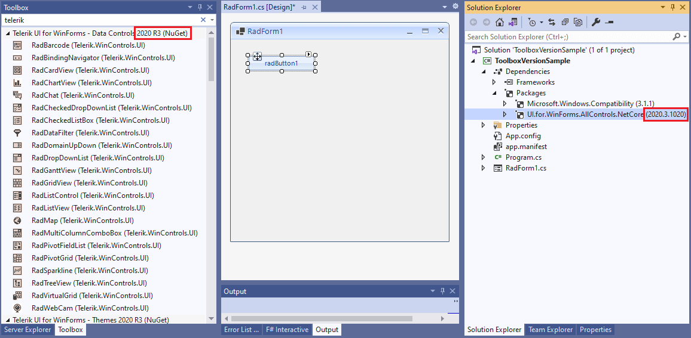
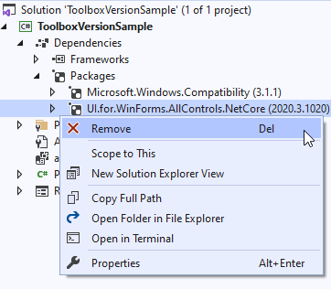
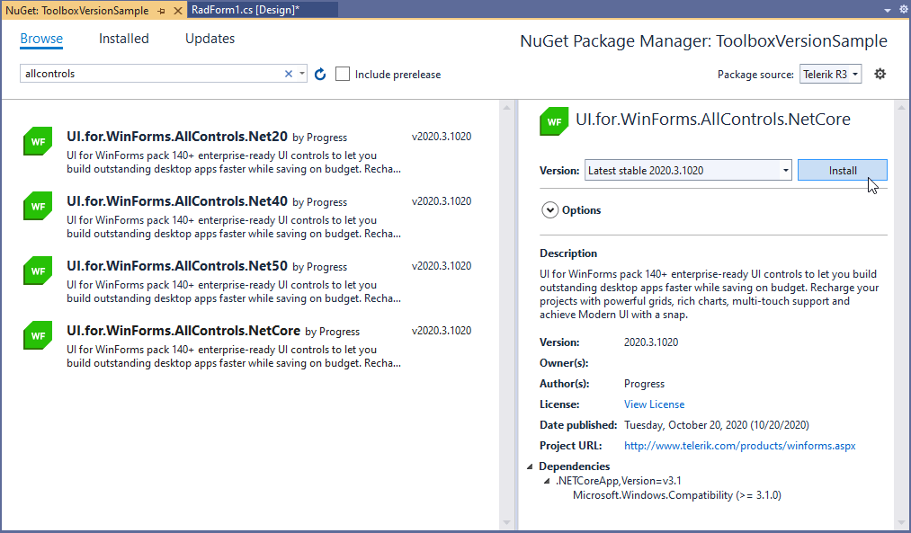

# Toolbox Version

Telerik UI for WinForms controls used to be automatically added to Visual Studio's Toolbox during the [installation]() process when using **.NET 2.0 (up to 4.8)** Framework in your project. This means that the Toolbox population relies on the Telerik WinForms version available in the Global Assembly Cache.

With the introduction of .NET Core/.NET 5 and the WinForms designer, the Toolbox configuration doesn't rely on the GAC anymore and it is not necessary to have an installation of the Telerik UI for WinForms suite. 

>important In order to enable the WinForms Designer, please get familiar with the requirements you need to meet: [Design Time]().

The Toolbox version depends on the installed NuGet package:

>caption Toolbox version R3 2020 SP1 (2020.3.10.20)

If you want to get another version in the Toolbox, it is necessary to:

1\. Remove the current version of the **UI.for.WinForms.AllControls.NetCore** package:

2\. Install the desired NuGet version: [Install using NuGet Packages]()

3\. Rebuild the project.

# See Also

* [Design Time]()
* [Migrating to .NET Core]()
* [.NET Core Project Converter]()
* [Windows Forms Designer for .NET Core Released](https://devblogs.microsoft.com/dotnet/windows-forms-designer-for-net-core-released/)
* [Handle Toolbox Issues with .NET Core]()
