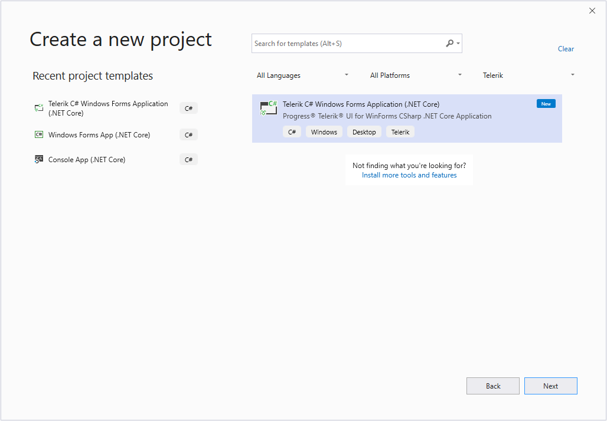
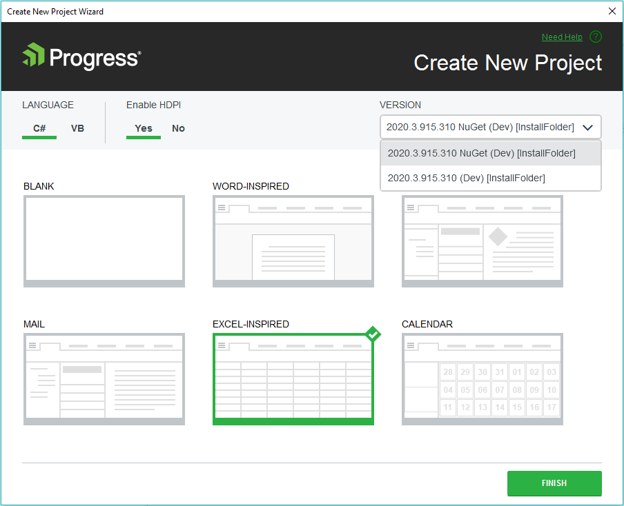
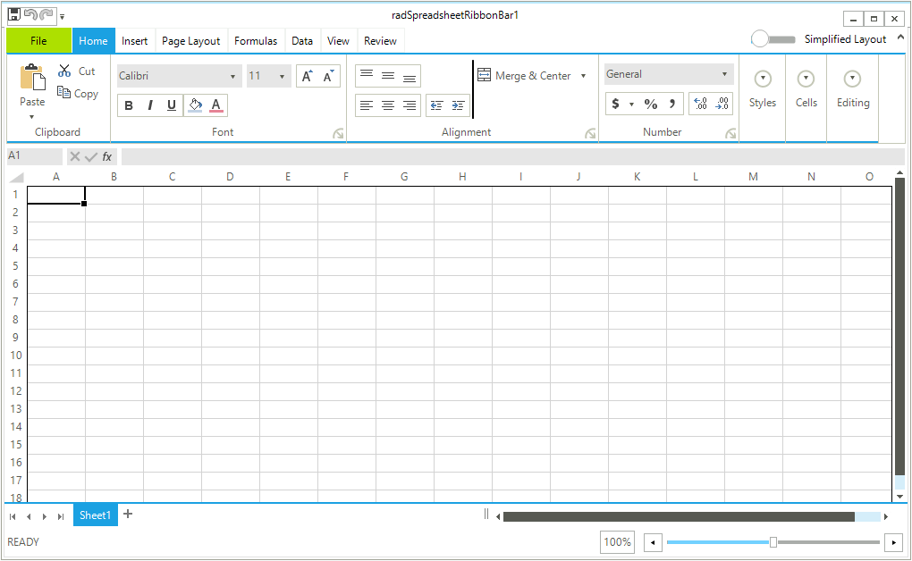
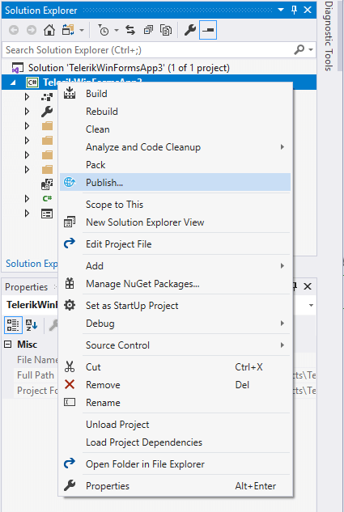
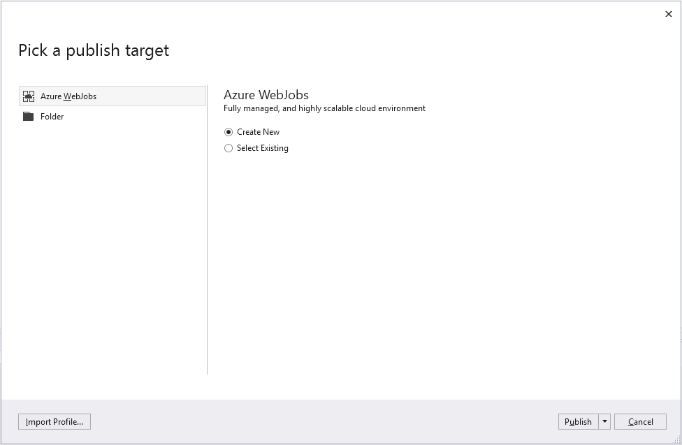
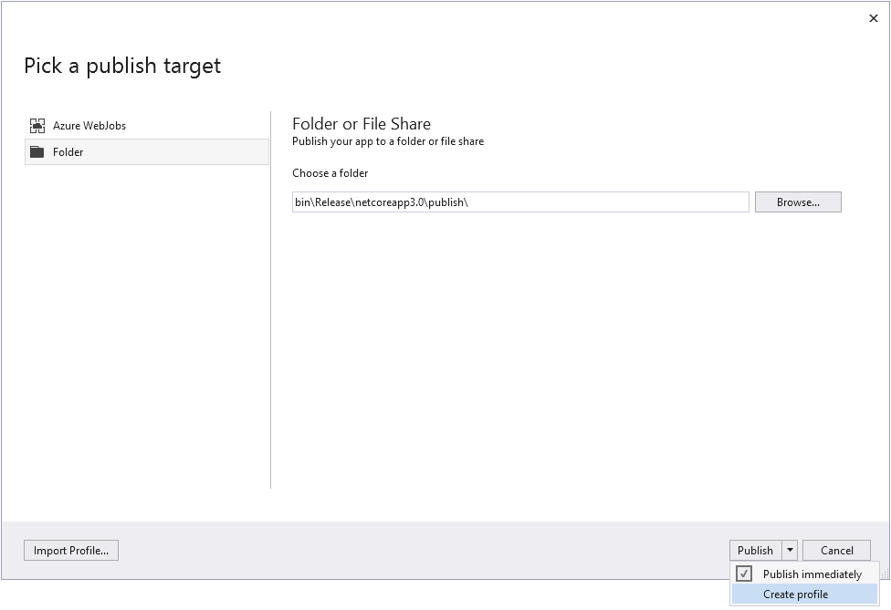
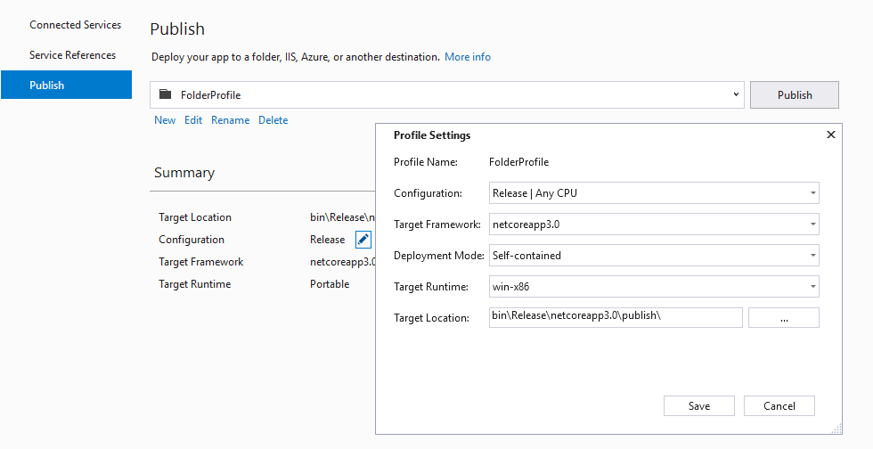

# Deploying WinForms .NET Core Application

This article shows how to deploy a WinForms .NET Core Application using Visual Studio.

>tip Read more about the deployment approaches, their benefits and differences, in the [3 Ways to Deploy a WinForms or WPF .NET Core Application](https://www.telerik.com/blogs/3-ways-to-deploy-a-winforms-or-wpf-net-core-application) blog post.

## Create an Application

>tip This step is described only for testing purposes. If you prefer, you can go directly to the [Deploy the Application](#deploy-the-application) section of this article.

1\. Create a new WinForms project using the [Telerik Visual Studio Extensions](). If the VSX is installed you will see the **Telerik C# WinForms Application (.NET Core)** template in the Visual Studio's project templates list.
   

2\. Select one of the application templates from the New Project Wizard. For this example, I use the excel-inspired template.

>caption Figure 1: Spreadsheet application created with the New Project Wizard

## Deploy the Application

>important The approach shown here is available with the official Visual Studio 2019 and later versions. If you use a previous build of VS, check the [Deploy .NET Core apps with Visual Studio](https://docs.microsoft.com/en-us/dotnet/core/deploying/deploy-with-vs?tabs=vs156) MSDN article.

1\. Right click the project in Visual Studio and select the **Publish** option. This will open the **Pick a publish taget** dialog.
   

2\. Choose a publish location. For this example, click on the **Folder** option and choose a directory where the application should be deployed. Then click **Create profile**.

3\. Open the **Profile Settings** via the **Configuration** options and set the **Deployment Mode** to **Self-contained**. Then select a **Target Runtime**.

4\. Save the configuration and click the **Publish** button. This will generate files in the publish location.

5\. Copy the output files from the publish location to your deployment environment.

>tip You can package your application using the MSIX format. Read more, in the [What is MSIX?](https://docs.microsoft.com/en-us/windows/msix/overview) MSDN article.
