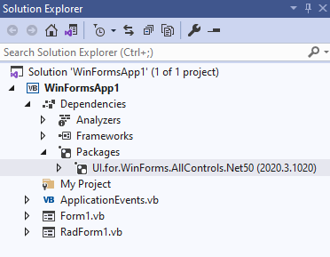

# Design Time

Telerik UI for WinForms supports the Visual Studio .NET Core WinForms designer. All of the Telerik designers are migrated and the controls are populated in the toolbox. We have special control designers, action lists, property builders and editors achieving a design time experience similar to the one seen on the full .NET framework. 

>caption Figure 1: RadGridView .NET Core Designer

## Requirements

The design time assemblies in .NET Core are resolved via the installed in the project NuGet packages. In order use the new designers, please make sure that the following requirements are met:

*  **Visual Studio 2019 v16.8 or newer**
    - The VS 2019 Preview [versions](https://visualstudio.microsoft.com/vs/preview/) are also supported. 
    
	>caution Check the compatibility table below with details about matching Telerik and Visual Studio versions.
	
    - Don’t forget to enable the designer in *Tools > Options > Environment > Preview Features*.
* **Telerik UI for WinForms NuGet installed in the project**: [Install using NuGet Packages]()
     - Telerik UI for Winforms R3 2020 or newer.

	>caution Even though you may have an installation of the Telerik UI for WinForms suite with the correct version according to the compatibility table below, it is not enough to load the designer. It requires installing the appropriate Telerik UI for WinForms NuGet package.

	

* **Target .NET Core 3.1/.NET 5.0 in your project**: [https://docs.microsoft.com/en-us/dotnet/standard/frameworks#supported-target-frameworks](https://docs.microsoft.com/en-us/dotnet/standard/frameworks#supported-target-frameworks)

>important Our designers target a specific version of the WinForms Designer SDK and this SDK is also inserted into Visual Studio. Sometimes there might be breaking changes in the WinForms Designer SDK and as it is part of Visual Studio itself this will break our designers. As things are dynamically changing one needs to pay attention of the Telerik NuGet version and the Visual Studio version. The table below is a mapping between the Telerik and the Visual Studio versions.
>

|Telerik NuGet Version|Visual Studio Version|
|----|----|
|Hotfix 2021 v2021.2.802-hotfix|VS2019 v16.11 GA; VS2019 v16.11 Preview 4; VS2022 v17.0 Preview 2|
|Hotfix 2021 v2021.2.712-hotfix|VS2019 v16.11 GA; VS2019 v16.11 Preview 1 & 2; VS2022 v17.0 Preview 2|
|R2 2021 SP1 v2021.2.615|VS2019 v16.10 GA; VS2019 v16.11 Preview 1 & 2; VS2022 v17.0 Preview 1|
|Hotfix 2021 v2021.2.607-hotfix|VS2019 v16.10 GA; VS2019 v16.11 Preview 1|
|R2 2021 v2021.2.511|VS2019 v16.9 GA; VS2019 v16.9 Preview 2 to v16.10 Preview 1|
|Hotfix 2021 v2021.1.329-hotfix|VS2019 v16.9 GA; VS2019 v16.9 Preview 2 to v16.10 Preview 1|
|R1 2021 SP3 v2021.1.326|VS2019 v16.9 GA; VS2019 v16.9 Preview 2 to v16.10 Preview 1|
|R1 2021 SP2 v2021.1.223|VS2019 v16.9 GA; VS2019 v16.9 Preview 2 to v16.10 Preview 1|
|R1 2021 SP1 v2021.1.204|VS2019 v16.9 Preview 2 or newer|
|R1 2021 v2021.1.122|VS2019 v16.9 Preview 2 or newer|
|Hotfix v2020.3.1215-hotfix|VS2019 v16.9 Preview 2|
|Hotfix v2020.3.1116-hotfix|VS2019 v16.9 Preview 1|
|R3 2020 SP1 v2020.3.1020|VS2019 v16.8 GA; VS2019 v16.8 Preview 4|
|R3 2020 v2020.3.915|VS2019 v16.8 Preview 3|

>note The Hotfix NuGet packages are uploaded to the Telerik NuGet server as part of our [Latest Internal Builds](https://docs.telerik.com/devtools/winforms/installation-and-upgrades/latest-internal-builds#latest-internal-builds).
>

>note The toolbox is populated from the UI controls added to the referenced NuGet package/s.  
>

>important As the *AllControls* package contains all UI controls it should not be mixed with other packages containing the same UI controls.

## Tips and Tricks

Note that the design-time assemblies are resolved from the installed NuGet package by the new Microsoft SDK which is a part of Visual Studio. When you rebuild the project, the server process will be restarted, the SDK will load all of the .NET Core designer assemblies and this may take some time. Having a designer opened while all this is happening will only make it slower. That is why I would recommend you to close all designers, install the desired NuGet package, clean the project and rebuild it.
 
Please also have in mind that if you have a designer opened and you rebuild your project, this will kill the .NET Core process hosting the design server, ultimately this will lead to restarting the design surface by starting a new server process. That is why it is recommended to consider closing the designers before rebuilding your project.

## What's coming next 

* Custom glyphs
* Embedded in the designer editors

# See Also
* [Migrating to .NET Core]()
* [.NET Core Project Converter]()
* [Windows Forms Designer for .NET Core Released](https://devblogs.microsoft.com/dotnet/windows-forms-designer-for-net-core-released/)
