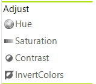
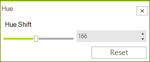
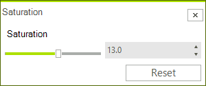
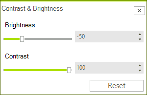
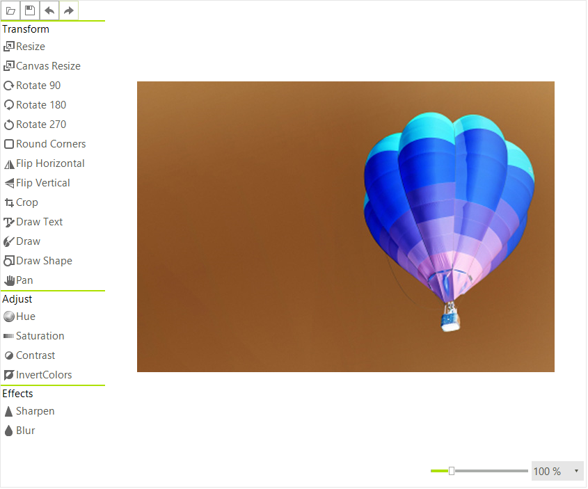

# Adjustments

RadImageEditor supports the following image adjustments.

* [Hue](#hue-adjusment)
* [Saturation](#saturation-adjusment)
* [Contrast](#contrast-and-brightness-adjusment)
* [Invert Colors](#invert-colors) 

>caption Figure 1: Adjust section




# Hue adjustment

The Hue can be adjusted with the respective dialog, the values can be from 0 to 360.

>caption Figure 2: Hue Dialog



This can be done in the code behind as well.

{{source=..\SamplesCS\ImageEditor\ImageEditorFeatures.cs region=Hue}} 
{{source=..\SamplesVB\ImageEditor\ImageEditorFeatures.vb region=Hue}}
````C#
radImageEditor1.ImageEditorElement.SetHue(200);

````
````VB.NET
radImageEditor1.ImageEditorElement.SetHue(200)

````

{{endregion}}

# Saturation adjustment

The Saturation can be adjusted with the respective dialog the values can be from -100 to 100.

>caption Figure 3: Saturation Dialog



To do this programmatically use the __SetSaturation__ method.

{{source=..\SamplesCS\ImageEditor\ImageEditorFeatures.cs region=Sat}} 
{{source=..\SamplesVB\ImageEditor\ImageEditorFeatures.vb region=Sat}}

````C#
radImageEditor1.ImageEditorElement.SetSaturation(-50);

````
````VB.NET
radImageEditor1.ImageEditorElement.SetSaturation(-50)

````

{{endregion}}

# Contrast and Brightness adjustment

The Contrast and Brightness can be adjusted with the respective dialog the values can be from -100 to 100.

>caption Figure 4: Brightness and Contrast Dialog



This can be done in the code behind as well.

{{source=..\SamplesCS\ImageEditor\ImageEditorFeatures.cs region=Contrast}} 
{{source=..\SamplesVB\ImageEditor\ImageEditorFeatures.vb region=Contrast}}

````C#
radImageEditor1.ImageEditorElement.SetContrastAndBrightness(100, 10);

````
````VB.NET
radImageEditor1.ImageEditorElement.SetContrastAndBrightness(100, 10)

````

{{endregion}}

# Invert Colors

The Invert Color button just inverts the colors in the image pixel by pixel.
 
>caption Figure 5: Inverted Colors



This action can be performed in code with the following method.

{{source=..\SamplesCS\ImageEditor\ImageEditorFeatures.cs region=Invert}} 
{{source=..\SamplesVB\ImageEditor\ImageEditorFeatures.vb region=Invert}}

````C#
radImageEditor1.ImageEditorElement.InvertColors();

````
````VB.NET
radImageEditor1.ImageEditorElement.InvertColors()

````

{{endregion}}

# See Also

* [Getting Started]()
* [Structure]()
* [Properties and Events]()