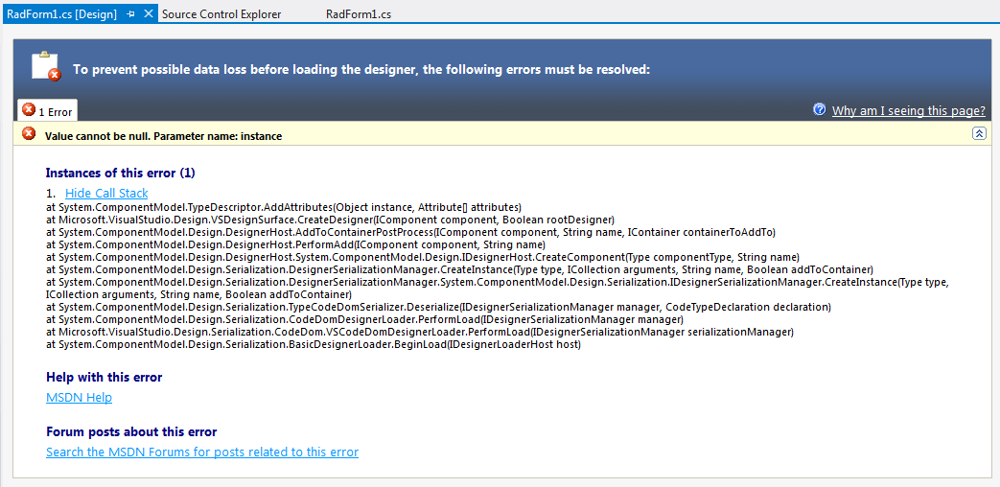

# Versions Upgrade 

After [installing a new version]() of the Telerik UI for WinForms suite you may encounter design time errors and inability to build your project.

>caption Figure 1. Error after installing a new version

A common reason for this error is if the project is still referring to the previous version of the Telerik UI for WinForms. In this case, carefully check the references to all Telerik controls in your project and make sure that they are the same version considering the suffix as well (.20 or .40). Better yet, you can remove all references and add them anew by using the DLLs from your fresh installation. Delete the *license.licx* file. After that, you should rebuild your project, close Visual Studio and open it again to make sure that no references are kept in the memory by Visual Studio.  

# See Also

* [Upgrade project]()