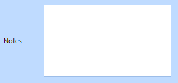

## Environment
<table>
	<tr>
		<td>Product Version</td>
		<td>2018.1 220</td>
	</tr>
	<tr>
		<td>Product</td>
		<td>RadEditors (TextBox, MaskedEditBox, DateTimePicker, TimePicker, SpinEditor, ColorBox, BrowseEditor, Clock, AutoCompleteBox, TextBoxControl, PopupEditor) for WinForms</td>
	</tr>
</table>


## Description
An example on how to programmatically rearrange the DataEntry item child controls.

### Before



### After


## Solution

The RadDataEntry **[ItemInitialized](https://docs.telerik.com/devtools/winforms/api/html/e_telerik_wincontrols_ui_raddataentry_iteminitialized.htm)** event is appropriate for adjusting the position of the whole panel that holds the label and editor per field.  

```
void radDataEntry1_ItemInitialized(object sender, Telerik.WinControls.UI.ItemInitializedEventArgs e)
{
    if (e.Panel.Controls[1].Text == "FirstName")
    {
        e.Panel.Size = new Size(150, 25);
        e.Panel.Controls[1].Text = "Name";
    }
    else
    {
        e.Panel.Location = new Point(e.Panel.Location.X, e.Panel.Location.Y - 25);
    }
}
```

However, when the **DataSource** is set, the item's Label and Editor will be automatically arranged horizontally. 

To override this automatic arrangement, subscribe to the **LocationChanged** event of the respective control(s) in order to override the automatically set location of the layout arrangement. If you change the editor, you can subscribe to the LocationChanged event in the event handler where you specify the editor.


```
int y = 70;

private void RadDataEntry1_ItemInitialized(object sender, Telerik.WinControls.UI.ItemInitializedEventArgs e)
{
    if (e.Panel.Controls[1].Text == "ProductName")
    {
        e.Panel.Size = new Size(300, 120);
        e.Panel.Location = new Point(210, radDataEntry1.ItemSpace);
        e.Panel.Controls[0].Location = new Point(20, y);
        e.Panel.Controls[1].Location = new Point(0, 0);
        e.Panel.Controls[1].Size = new Size(100, 100);
        e.Panel.Controls[0].LocationChanged -= RadForm2_LocationChanged;
        e.Panel.Controls[0].LocationChanged += RadForm2_LocationChanged;
        e.Panel.Controls[1].LocationChanged -= RadForm2_LocationChanged;
        e.Panel.Controls[1].LocationChanged += RadForm2_LocationChanged;
    }
}

private void RadForm2_LocationChanged(object sender, EventArgs e)
{
    RadTextBox tb = sender as RadTextBox;
    if (tb != null && tb.Location.Y != y)
    {
        tb.Location = new Point(0, y);
    }

    RadLabel lbl = sender as RadLabel;
    if (lbl != null)
    {
        lbl.Location = new Point(0, 0);
    }
}

```


## See Also
- [RadDataEntry - Overview](https://docs.telerik.com/devtools/winforms/dataentry/dataentry)
- [RadDataEntry - Structure](https://docs.telerik.com/devtools/winforms/dataentry/control-element-structure-)
- [RadDataEntry - Programmatically Arrange Items](https://docs.telerik.com/devtools/winforms/dataentry/programmatically-arrange-items-)


