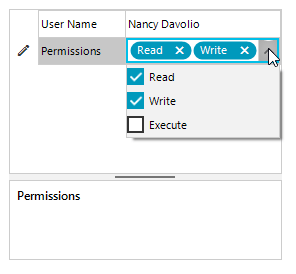

## Environment
 
|Product Version|Product|Author|
|----|----|----|
|2019.2.917|RadPropertyGrid for WinForms|[Desislava Yordanova](https://www.telerik.com/blogs/author/desislava-yordanova)|
 

## Description

This tutorial demonstrates how to implement a [custom editor]() in **RadPropertyGrid** in order to simulate the behavior of a **FlagEnumEditor**.  It enables the user to store any combination of the values that are defined in the enumerator list:



## Solution 

Create a derivative of **BaseInputEditor** and override its **CreateEditorElement** method where you will specify that a **RadCheckedDropDownListElement** will be used. The **DataType** property should indicate the type of the editor value. The **Value** property of the editor needs to return a valid value from the **RadCheckedDropDownListElement** back to the property grid item. It also has be able to parse the value coming from the item to the editor's element.

Last, but not least, the default editor for the **Permissions** item should be replaced with the custom one in the **EditorRequired** event.  

#### FlagEnumEditor's implementation


````C#
public RadForm1()
{
    InitializeComponent();
    this.radPropertyGrid1.EditorRequired += radPropertyGrid1_EditorRequired;
    PropertyStoreItem item1 = new PropertyStoreItem(typeof(string), "User Name", "Nancy Davolio");
    PropertyStoreItem item2 = new PropertyStoreItem(typeof(string), "Permissions", "Read;Write;");

    RadPropertyStore store = new RadPropertyStore();
    store.Add(item1);
    store.Add(item2);
    this.radPropertyGrid1.SelectedObject = store;
}

private void radPropertyGrid1_EditorRequired(object sender, PropertyGridEditorRequiredEventArgs e)
{
    if (e.Item.Label == "Permissions")
    {
        FlagEnumEditor editor = new FlagEnumEditor();
        RadCheckedDropDownListElement element = editor.EditorElement as RadCheckedDropDownListElement;
        element.DataSource = Enum.GetValues(typeof(Permissions));
        e.Editor = editor;
    }
}

public enum Permissions
{
    Read = 1,
    Write = 2,
    Execute = 4
}

public class FlagEnumEditor : BaseInputEditor
{
    public override Type DataType
    {
        get
        {
            return typeof(string);
        }
    }

    protected override RadElement CreateEditorElement()
    {
        return new RadCheckedDropDownListElement();
    }

    public override object Value
    {
        get
        {
            RadCheckedDropDownListElement element = this.EditorElement as RadCheckedDropDownListElement;
            return element.Text;
        }
        set
        {
            RadCheckedDropDownListElement element = this.EditorElement as RadCheckedDropDownListElement;
            element.Text = value + "";
        }
    }
}
        

````
````VB.NET

Public Sub New()
    InitializeComponent()
    AddHandler Me.RadPropertyGrid1.EditorRequired, AddressOf radPropertyGrid1_EditorRequired
    Dim item1 As PropertyStoreItem = New PropertyStoreItem(GetType(String), "User Name", "Nancy Davolio")
    Dim item2 As PropertyStoreItem = New PropertyStoreItem(GetType(String), "Permissions", "Read;Write;")
    Dim store As RadPropertyStore = New RadPropertyStore()
    store.Add(item1)
    store.Add(item2)
    Me.RadPropertyGrid1.SelectedObject = store
End Sub

Private Sub radPropertyGrid1_EditorRequired(ByVal sender As Object, ByVal e As PropertyGridEditorRequiredEventArgs)
    If e.Item.Label = "Permissions" Then
        Dim editor As FlagEnumEditor = New FlagEnumEditor()
        Dim element As RadCheckedDropDownListElement = TryCast(editor.EditorElement, RadCheckedDropDownListElement)
        element.DataSource = [Enum].GetValues(GetType(Permissions))
        e.Editor = editor
    End If
End Sub

Public Enum Permissions
    Read = 1
    Write = 2
    Execute = 4
End Enum

Public Class FlagEnumEditor
Inherits BaseInputEditor

    Public Overrides ReadOnly Property DataType As Type
        Get
            Return GetType(String)
        End Get
    End Property

    Protected Overrides Function CreateEditorElement() As RadElement
        Return New RadCheckedDropDownListElement()
    End Function

    Public Overrides Property Value As Object
        Get
            Dim element As RadCheckedDropDownListElement = TryCast(Me.EditorElement, RadCheckedDropDownListElement)
            Return element.Text
        End Get
        Set(ByVal value As Object)
            Dim element As RadCheckedDropDownListElement = TryCast(Me.EditorElement, RadCheckedDropDownListElement)
            element.Text = value & ""
        End Set
    End Property
End Class
     

```` 
 

# See Also

* [Custom Editor in PropertyGrid]() 


    
   
  
    
 
