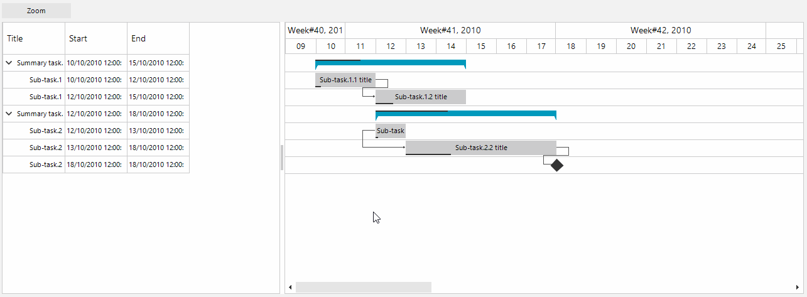

## Environment
<table>
	<tr>
		<td>Product Version</td>
		<td>2018.1 220</td>
	</tr>
	<tr>
		<td>Product</td>
		<td>RadGanttView for WinForms</td>
	</tr>
</table>


## Description

The RadGanttView.GanttViewElement.**GraphicalViewElement** exposes the **OnePixelTime** property. This property determines how much time a single pixel represents. This property can be also manipulated so that the view is zoomed to a particular date range. The example below will zoom the view-port to fit the first and last tasks.

## Solution

The gif file below demonstrates the end result.

>caption Figure 1: Zooming to a Specified Date Range


>note Depending on the actual local setup it may also be necessary to change the [TimelineRange]() 

#### OnePixelTime Calculation

````C#
private void radButton1_Click(object sender, EventArgs e)
{
    // You can consider changing the time line range if necessary
    //this.radGanttView1.GanttViewElement.GraphicalViewElement.TimelineRange = TimeRange.YearQuarters;

    DateTime start = this.radGanttView1.Items[0].Start;
    DateTime end = this.radGanttView1.Items[this.radGanttView1.Items.Count - 1].End;
    int totalPixels = this.radGanttView1.GanttViewElement.GraphicalViewElement.BoundingRectangle.Width;
    double span = (end - start).TotalSeconds;
    this.radGanttView1.GanttViewElement.GraphicalViewElement.OnePixelTime = TimeSpan.FromSeconds((int)(span / totalPixels));

    // The code beloow will scroll the timeline so that it starts on the selected start date.
    int scroll = (int)((start - this.radGanttView1.GanttViewElement.GraphicalViewElement.TimelineBehavior.AdjustedTimelineStart).TotalSeconds / this.radGanttView1.GanttViewElement.GraphicalViewElement.OnePixelTime.TotalSeconds);
    this.radGanttView1.GanttViewElement.GraphicalViewElement.HorizontalScrollBarElement.Value = scroll;

}

````
````VB.NET
Private Sub radButton1_Click(ByVal sender As Object, ByVal e As EventArgs)
    Dim start As DateTime = Me.radGanttView1.Items(0).Start
    Dim [end] As DateTime = Me.radGanttView1.Items(Me.radGanttView1.Items.Count - 1).[End]
    Dim totalPixels As Integer = Me.radGanttView1.GanttViewElement.GraphicalViewElement.BoundingRectangle.Width
    Dim span As Double = ([end] - start).TotalSeconds
    Me.radGanttView1.GanttViewElement.GraphicalViewElement.OnePixelTime = TimeSpan.FromSeconds(CInt((span / totalPixels)))
    Dim scroll As Integer = CInt(((start - Me.radGanttView1.GanttViewElement.GraphicalViewElement.TimelineBehavior.AdjustedTimelineStart).TotalSeconds / Me.radGanttView1.GanttViewElement.GraphicalViewElement.OnePixelTime.TotalSeconds))
    Me.radGanttView1.GanttViewElement.GraphicalViewElement.HorizontalScrollBarElement.Value = scroll
End Sub

````

# See Also

* [Timeline Views]()