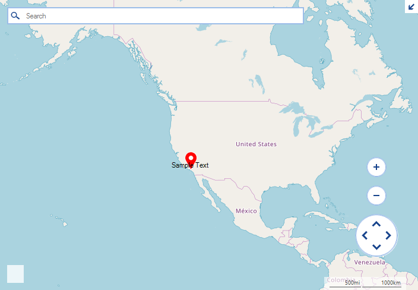

## Environment
|Product Version|Product|Author|
|----|----|----|
|2021.3.1123|RadMap for WinForms|[Hristo Merdjanov](https://www.telerik.com/blogs/author/hristo-merdjanov)|


## Description

An example demonstrating the **MapPin** class can be customized to support text.  

## Solution

We will create a custom **MapPin** implementation overriding its **Paint** method. The **Paint** method will be customized so that the text can be actually painted.

>caption Figure 1: Pin with Text



#### Custom Pin Implementation

````C#
public class MyMapPin : MapPin
{
    private PointL pixelLocation;

    private RectangleL drawRect;

    public MyMapPin(PointG location) : base(location)
    {
    }

    public override void Paint(IGraphics graphics, IMapViewport viewport)
    {
        object state = graphics.SaveState();
        graphics.ChangeSmoothingMode(SmoothingMode.AntiAlias);
        MapVisualElementInfo info = this.GetVisualElementInfo(viewport);
        GraphicsPath path = info.Path.Clone() as GraphicsPath;
        GraphicsPath dotPath = new GraphicsPath();
        long mapSize = MapTileSystemHelper.MapSize(viewport.ZoomLevel);
        Matrix matrixOffset = new Matrix();
        matrixOffset.Translate(viewport.PanOffset.Width + info.Offset.X, viewport.PanOffset.Height + info.Offset.Y);
        path.Transform(matrixOffset);
        Matrix matrixWraparound = new Matrix();
        matrixWraparound.Translate(mapSize, 0);

        for (int i = 0; i <= viewport.NumberOfWraparounds - 1; i++)
        {
            RectangleF bounds = path.GetBounds();
            float diameter = bounds.Width / 3 ;
            dotPath.AddEllipse(bounds.X + diameter, bounds.Y + diameter, diameter, diameter);
            graphics.FillPath(this.BorderColor, dotPath);
            FillPrimitiveImpl fill = new FillPrimitiveImpl(this, null);
            fill.PaintFill(graphics, path, bounds);
            BorderPrimitiveImpl border = new BorderPrimitiveImpl(this, null);
            border.PaintBorder(graphics, null/* TODO Change to default(_) if this is not a reference type */, path, bounds);

            StringFormat stringFormat = new StringFormat();
            stringFormat.Alignment = TelerikAlignHelper.TranslateAlignment(ContentAlignment.MiddleLeft);
            stringFormat.LineAlignment = TelerikAlignHelper.TranslateLineAlignment(ContentAlignment.MiddleLeft);
            SizeF size = RadGdiGraphics.MeasurementGraphics.MeasureString(this.Text, this.Font);
            graphics.DrawString(this.Text, new Rectangle((int)bounds.X, (int)bounds.Y, (int)size.Width + 10, 
                (int)size.Height), this.Font, this.ForeColor, stringFormat, Orientation.Horizontal, false);

            path.Transform(matrixWraparound);
        }

        graphics.RestoreState(state);
    }
}


````
````VB.NET
Public Class MyMapPin
Inherits MapPin

    Private pixelLocation As PointL

    Private drawRect As RectangleL

    Public Sub New(ByVal location As PointG)
        MyBase.New(location)
    End Sub

    Public Overrides Sub Paint(ByVal graphics As IGraphics, ByVal viewport As IMapViewport)

        Dim state As Object = graphics.SaveState()
        graphics.ChangeSmoothingMode(SmoothingMode.AntiAlias)
        Dim info As MapVisualElementInfo = Me.GetVisualElementInfo(viewport)
        Dim path As GraphicsPath = TryCast(info.Path.Clone(), GraphicsPath)
        Dim dotPath As GraphicsPath = New GraphicsPath()
        Dim mapSize As Long = MapTileSystemHelper.MapSize(viewport.ZoomLevel)
        Dim matrixOffset As Matrix = New Matrix()
        matrixOffset.Translate(viewport.PanOffset.Width + info.Offset.X, viewport.PanOffset.Height + info.Offset.Y)
        path.Transform(matrixOffset)
        Dim matrixWraparound As Matrix = New Matrix()
        matrixWraparound.Translate(mapSize, 0)

        For i As Integer = 0 To viewport.NumberOfWraparounds - 1
            Dim bounds As RectangleF = path.GetBounds()
            Dim diameter As Single = bounds.Width / 3.0F
            dotPath.AddEllipse(bounds.X + diameter, bounds.Y + diameter, diameter, diameter)
            graphics.FillPath(Me.BorderColor, dotPath)
            Dim fill As FillPrimitiveImpl = New FillPrimitiveImpl(Me, Nothing)
            fill.PaintFill(graphics, path, bounds)
            Dim border As BorderPrimitiveImpl = New BorderPrimitiveImpl(Me, Nothing)
            border.PaintBorder(graphics, Nothing, path, bounds)

            Dim stringFormat As StringFormat = New StringFormat()
            stringFormat.Alignment = TelerikAlignHelper.TranslateAlignment(ContentAlignment.MiddleLeft)
            stringFormat.LineAlignment = TelerikAlignHelper.TranslateLineAlignment(ContentAlignment.MiddleLeft)
            Dim size As SizeF = RadGdiGraphics.MeasurementGraphics.MeasureString(Me.Text, Me.Font)
            graphics.DrawString(Me.Text, New Rectangle(bounds.X, bounds.Y, size.Width + 10, size.Height), Me.Font, Me.ForeColor, _
                                stringFormat, Orientation.Horizontal, False)

            path.Transform(matrixWraparound)
        Next

        graphics.RestoreState(state) 
        
    End Sub
   
End Class 

````

The code snippet below demonstrates how to use the custom map pin no matter which of the above implementations you are using:

#### Initial Setup

````C#

public RadForm1()
{
    InitializeComponent();

    SetupProvider();
   
    MapLayer pinsLayer = new MapLayer("Pins");
    this.radMap1.Layers.Add(pinsLayer);

    MyMapPin element = new MyMapPin(new PointG(34.04302, -118.26725));
    element.Text = "Sample Text"; 
    this.radMap1.Layers["Pins"].Add(element);
}


````
````VB.NET

Public Sub New()
    InitializeComponent()

    SetupProvider()

    Dim pinsLayer As MapLayer = New MapLayer("Pins")
    Me.RadMap1.Layers.Add(pinsLayer)

    Dim element As MyMapPin = New MyMapPin(New PointG(34.04302, -118.26725))
    element.Text = "Sample Text"
    Me.RadMap1.Layers("Pins").Add(element)
End Sub

````

# See Also
* [Adding an Image to a Map Pin]()
* [Specifying a Radius for a MapPoint]()
* [Exporting RadMap to an Image]()