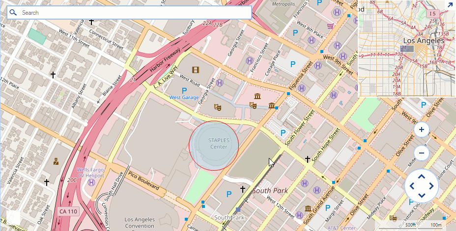

## Environment
<table>
	<tr>
		<td>Product Version</td>
		<td>2018.3.1016</td>
	</tr>
	<tr>
		<td>Product</td>
		<td>RadMap for WinForms</td>
	</tr>
</table>


## Description

An example demonstrating how the **MapPoint** element can be customized to paint a circle with a predefined radius.  

## Solution

The **MapPoint** class accepts a System.Drawing.Size object in its constructor and depending on the specified size the control will paint a circular element. A common requirement is to specify a radius for the map point and have its size adjusted according the radius and the current zoom level of the view port. The solution in this article demonstrates a possible custom implementation introducing a new **RadiusInMeters** property.

>caption Figure 1: Custom Map Point


#### Updating Header Implementation

````C#
public class CustomMapPoint : MapPoint
{
    private int radiusInMeters;

    public CustomMapPoint(PointG location) : base(location)
    { }

    public CustomMapPoint(PointG location, Size size) 
        : base(location, size)
    { }

    public int RadiusInMeters
    {
        get
        {
            return this.radiusInMeters;
        }
        set
        {
            this.radiusInMeters = value;
        }
    }

    public override void ViewportChanged(IMapViewport viewport, ViewportChangeAction action)
    {
        double onePixelInMeters = MapTileSystemHelper.GroundResolution(this.Location.Latitude, viewport.ZoomLevel);

        int scale = -1;
        scale = (int)(this.RadiusInMeters * 2 / onePixelInMeters);
        Size newSize = Size.Empty;
        if (scale > 1)
            newSize = new Size(scale, scale);

        this.Size = newSize;

        base.ViewportChanged(viewport, action);
    }
}


````
````VB.NET
Public Class CustomMapPoint
    Inherits MapPoint

    Public Sub New(location As PointG)
        MyBase.New(location)
    End Sub

    Public Sub New(location As PointG, size As Size)
        MyBase.New(location, size)
    End Sub

    Private _radius As Integer
    Public Property RadiusInMeters() As Integer
        Get
            Return _radius
        End Get
        Set(ByVal value As Integer)
            _radius = value
        End Set
    End Property

    Public Overrides Sub ViewportChanged(viewport As IMapViewport, action As ViewportChangeAction)
        Dim onePixelInMeters = MapTileSystemHelper.GroundResolution(Me.Location.Latitude, viewport.ZoomLevel)

        Dim scale = -1.0F
        scale = Me.RadiusInMeters * 2 / onePixelInMeters
        Dim newSize = Size.Empty
        If scale > 1 Then
            newSize = New Size(scale, scale)

        End If

		Me.Size = newSize

        MyBase.ViewportChanged(viewport, action)
    End Sub
End Class
````

#### Initial Setup

````C#
public RadForm1()
{
    InitializeComponent();

    MapLayer pointLayer = new MapLayer("PointG");
    this.radMap1.Layers.Add(pointLayer);

    CustomMapPoint element = new CustomMapPoint(new PointG(34.04302, -118.26725));
    element.RadiusInMeters = 100;
    element.BackColor = Color.FromArgb(125, Color.LightBlue);
    element.BorderColor = Color.Red;
    this.radMap1.Layers["PointG"].Add(element);
}

````
````VB.NET
 Public Sub New()
        InitializeComponent()

        Dim pointLayer As MapLayer = New MapLayer("PointG")
        Me.radMap1.Layers.Add(pointLayer)

        Dim element As CustomMapPoint = New CustomMapPoint(New PointG(34.04302, -118.26725))
        element.RadiusInMeters = 100
        element.BackColor = Color.FromArgb(125, Color.LightBlue)
        element.BorderColor = Color.Red
        Me.radMap1.Layers("PointG").Add(element)
    End Sub
````

# See Also
* [Exporting RadMap to an Image]()
* [Adding an Image to a Map Pin]()