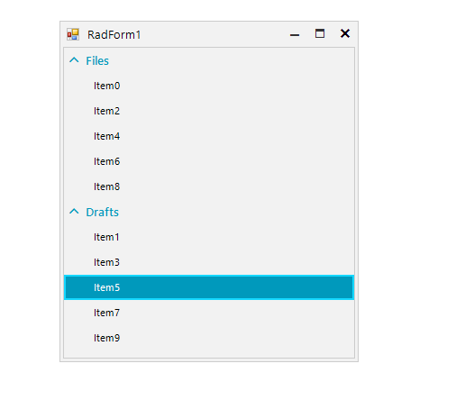

## Environment
|Product Version|Product|Author|
|----|----|----|
|2021.2.511|RadListView for WinForms|[Desislava Yordanova](https://www.telerik.com/blogs/author/desislava-yordanova)|

## Description

**RadListView** supports drag and drop behavior out of the box when using [unbound mode](). However, if [grouping]()	 is enabled, there is not default logic to handle the drag and drop operation.

This tutorial demonstrates how to plug into the [ListViewDragDropService]() and achieve moving the items between the groups or within the group itself:

 

## Solution

**RadListView** handles the whole drag and drop operation by its [ListViewDragDropService](). The **PreviewDragOver** event allows you to control on what targets the item(s) being dragged can be dropped on. The **PreviewDragDrop** event allows you to get a handle on all the aspects of the drag and drop operation, the source (drag) list view, the destination (target) control, as well as the item being dragged. This is where we will initiate the actual physical move of the item(s) from one group to the same or another group. 


````C#
public RadForm1()
{
    InitializeComponent();

    for (int i = 0; i < 10; i++)
    {
        ListViewDataItem item = new ListViewDataItem();
        item.Value = i;
        item.Text = "Item" + i;
        this.radListView1.Items.Add(item);
    }

    radListView1.EnableGrouping = true;
    radListView1.EnableCustomGrouping = true;
    radListView1.ShowGroups = true;
    ListViewDataItemGroup group1 = new ListViewDataItemGroup("Files");
    ListViewDataItemGroup groupd2 = new ListViewDataItemGroup("Drafts");
    radListView1.Groups.Add(group1);
    radListView1.Groups.Add(groupd2);
    for (int i = 0; i < this.radListView1.Items.Count; i++)
    {
        if (i % 2 == 0)
        {
            this.radListView1.Items[i].Group = group1;
        }
        else
        {
            this.radListView1.Items[i].Group = groupd2;
        }
    }


    this.radListView1.AllowDragDrop = true;
    this.radListView1.ListViewElement.DragDropService.PreviewDragOver += DragDropService_PreviewDragOver;
    this.radListView1.ListViewElement.DragDropService.PreviewDragDrop += DragDropService_PreviewDragDrop;
}

private void DragDropService_PreviewDragOver(object sender, RadDragOverEventArgs e)
{
    SimpleListViewVisualItem targetItem = e.HitTarget as SimpleListViewVisualItem;
    SimpleListViewVisualItem sourceItem = e.DragInstance as SimpleListViewVisualItem;
    if (targetItem != null && sourceItem != null)
    {
        e.CanDrop = true;
    }
    else
    {
        e.CanDrop = false;
    }
}

private void DragDropService_PreviewDragDrop(object sender, RadDropEventArgs e)
{
    e.Handled = true;

    SimpleListViewVisualItem targetItem = e.HitTarget as SimpleListViewVisualItem;
    SimpleListViewVisualItem sourceItem = e.DragInstance as SimpleListViewVisualItem;
    SimpleListViewElement viewElement = e.HitTarget as SimpleListViewElement;
    if ((targetItem == null || sourceItem == null) && viewElement == null)
    {
        return;
    }


    targetIndex = targetItem.Data.ListView.Items.IndexOf(targetItem.Data);
    sourceIndex = sourceItem.Data.ListView.Items.IndexOf(sourceItem.Data);
    target = targetItem.Data;
    source = sourceItem.Data;
    if (sourceIndex<targetIndex)
    {
        targetIndex -= 1;
    }
    ListViewDataItem clonedSourceData = new ListViewDataItem(source.Text);
    ListViewDataItemGroup group = target.Group;
    target.ListView.BeginUpdate();
    for (int i = 0; i < target.ListView.Items.Count; i++)
    {
        if (target.ListView.Items[i].Group == group)
        {
            target.ListView.Items[i].Group = null;
        }
    }
    target.ListView.Items.Insert(targetIndex, clonedSourceData);
   
    for (int i = 0; i < target.ListView.Items.Count; i++)
    {
        if (target.ListView.Items[i].Group == null)
        {
            target.ListView.Items[i].Group = group;
        }
    }
    target.ListView.Items.Remove(source);

       target.ListView.EndUpdate();
}

ListViewDataItem target = null;
ListViewDataItem source = null;
int targetIndex = -1;
int sourceIndex = -1;


````
````VB.NET
Public Sub New()
    InitializeComponent()

    For i As Integer = 0 To 10 - 1
        Dim item As ListViewDataItem = New ListViewDataItem()
        item.Value = i
        item.Text = "Item" & i
        Me.RadListView1.Items.Add(item)
    Next

    RadListView1.EnableGrouping = True
    RadListView1.EnableCustomGrouping = True
    RadListView1.ShowGroups = True
    Dim group1 As ListViewDataItemGroup = New ListViewDataItemGroup("Files")
    Dim groupd2 As ListViewDataItemGroup = New ListViewDataItemGroup("Drafts")
    RadListView1.Groups.Add(group1)
    RadListView1.Groups.Add(groupd2)

    For i As Integer = 0 To Me.RadListView1.Items.Count - 1

        If i Mod 2 = 0 Then
            Me.RadListView1.Items(i).Group = group1
        Else
            Me.RadListView1.Items(i).Group = groupd2
        End If
    Next

    Me.RadListView1.AllowDragDrop = True
    AddHandler Me.RadListView1.ListViewElement.DragDropService.PreviewDragOver, AddressOf DragDropService_PreviewDragOver
    AddHandler Me.RadListView1.ListViewElement.DragDropService.PreviewDragDrop, AddressOf DragDropService_PreviewDragDrop
End Sub

Private Sub DragDropService_PreviewDragOver(ByVal sender As Object, ByVal e As RadDragOverEventArgs)
    Dim targetItem As SimpleListViewVisualItem = TryCast(e.HitTarget, SimpleListViewVisualItem)
    Dim sourceItem As SimpleListViewVisualItem = TryCast(e.DragInstance, SimpleListViewVisualItem)

    If targetItem IsNot Nothing AndAlso sourceItem IsNot Nothing Then
        e.CanDrop = True
    Else
        e.CanDrop = False
    End If
End Sub

Private Sub DragDropService_PreviewDragDrop(ByVal sender As Object, ByVal e As RadDropEventArgs)
    e.Handled = True
    Dim targetItem As SimpleListViewVisualItem = TryCast(e.HitTarget, SimpleListViewVisualItem)
    Dim sourceItem As SimpleListViewVisualItem = TryCast(e.DragInstance, SimpleListViewVisualItem)
    Dim viewElement As SimpleListViewElement = TryCast(e.HitTarget, SimpleListViewElement)

    If (targetItem Is Nothing OrElse sourceItem Is Nothing) AndAlso viewElement Is Nothing Then
        Return
    End If

    targetIndex = targetItem.Data.ListView.Items.IndexOf(targetItem.Data)
    sourceIndex = sourceItem.Data.ListView.Items.IndexOf(sourceItem.Data)
    target = targetItem.Data
    source = sourceItem.Data

    If sourceIndex < targetIndex Then
        targetIndex -= 1
    End If

    Dim clonedSourceData As ListViewDataItem = New ListViewDataItem(source.Text)
    Dim group As ListViewDataItemGroup = target.Group
    target.ListView.BeginUpdate()

    For i As Integer = 0 To target.ListView.Items.Count - 1

        If target.ListView.Items(i).Group.Equals(group) Then
            target.ListView.Items(i).Group = Nothing
        End If
    Next

    target.ListView.Items.Insert(targetIndex, clonedSourceData)

    For i As Integer = 0 To target.ListView.Items.Count - 1

        If target.ListView.Items(i).Group Is Nothing Then
            target.ListView.Items(i).Group = group
        End If
    Next

    target.ListView.Items.Remove(source)
    target.ListView.EndUpdate()
End Sub

Private target As ListViewDataItem = Nothing
Private source As ListViewDataItem = Nothing
Private targetIndex As Integer = -1
Private sourceIndex As Integer = -1


````

{{endregion}}

# See Also

* [ListViewDragDropService]()
* [Grouping]()
* [Unbound Mode]()
