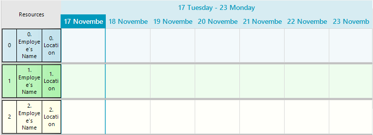

## Environment
 
|Product Version|Product|Author|
|----|----|----|
|2020.3.1020|RadScheduler for WinForms|[Desislava Yordanova](https://www.telerik.com/blogs/author/desislava-yordanova)|
 
## Description

By default, when **RadScheduler** is grouped by resources, the resource headers show only the resource name. A common requirement is to show columns and display more information, e.g. Id, Location, etc.



## Solution 

The above design can be achieved in **RadScheduler** using Timeline view with a custom **SchedulerResourceHeaderCellElement** composed of several **LightVisualElements** hosted in a horizontal **StackLayoutPanel**. The custom cell can replace the default one with the help of [Scheduler Element Provider ](). 
  
The following code snippet demonstrates a sample approach:   

````C#

public static List<Person> employees = new List<Person>();

public RadForm1()
{
    InitializeComponent(); 

    Color[] colors = new Color[]
    {
        Color.LightBlue, Color.LightGreen, Color.LightYellow,
        Color.Red, Color.Orange, Color.Pink, Color.Purple, Color.Peru, Color.PowderBlue
    };
    for (int i = 0; i < 9; i++)
    { 
        employees.Add(new Person(i, i + ". Employee's Name", i + ". Location")); 

        Resource resource = new Resource();
        resource.Id = new EventId(i);
        resource.Name = i + ". Employee's Name";
        resource.Color = colors[i]; 
        this.radScheduler1.Resources.Add(resource);
    }
    
    this.radScheduler1.GroupType = GroupType.Resource;

    this.radScheduler1.ElementProvider = new MyElementProvider(this.radScheduler1);

    this.radScheduler1.ActiveViewType = SchedulerViewType.Timeline;
    this.radScheduler1.ActiveView.ResourcesPerView = 5;

    TimelineGroupingByResourcesElement timelineElement = this.radScheduler1.SchedulerElement.ViewElement as TimelineGroupingByResourcesElement;
    timelineElement.ResourceHeaderWidth = 120; 

    SchedulerCellElement headerCornerCell = timelineElement.FindDescendant<SchedulerCellElement>();
    headerCornerCell.DrawText = true;
    headerCornerCell.Text = "Resources";
}

public static Person GetEmployeeById(int id)
{
    Person m = null;
    foreach (Person item in employees)
    {
        if (item.Id == id)
        {
            m = item;
            break;
        }
    }
    return m;
}

public class MySchedulerResourceHeaderCellElement : SchedulerResourceHeaderCellElement
{ 
    public MySchedulerResourceHeaderCellElement(RadScheduler scheduler, SchedulerView view) : base(scheduler, view)
    {
    }
    
    StackLayoutPanel container = new StackLayoutPanel();
    LightVisualElement idElement = new LightVisualElement();
    LightVisualElement nameElement = new LightVisualElement();
    LightVisualElement locationElement = new LightVisualElement();

    protected override void CreateChildElements()
    {
        base.CreateChildElements();
      
        container.AngleTransform = 90;
        container.StretchHorizontally = true;

        container.Children.Add(idElement);
        idElement.DrawBorder = true;
        idElement.BorderColor = Color.Black;
        idElement.BorderGradientStyle = GradientStyles.Solid; 
        idElement.MinSize = new Size(30, 0);
        idElement.MaxSize = new Size(30, 0);
        idElement.TextWrap = true;

        container.Children.Add(nameElement);
        nameElement.DrawBorder = true;
        nameElement.BorderColor = Color.Black;
        nameElement.BorderGradientStyle = GradientStyles.Solid;
        nameElement.BorderBoxStyle = Telerik.WinControls.BorderBoxStyle.FourBorders;
        nameElement.BorderLeftWidth = 0;
        nameElement.BorderRightWidth = 0;
        nameElement.BorderTopWidth = 1;
        nameElement.BorderTopColor = Color.Black;
        nameElement.BorderBottomWidth = 1;
        nameElement.BorderBottomColor = Color.Black;
        nameElement.MinSize = new Size(50, 0);
        nameElement.MaxSize = new Size(50, 0);
        nameElement.TextWrap = true;

        container.Children.Add(locationElement);
        locationElement.TextWrap = true; 
        locationElement.MinSize = new Size(39, 0);
        locationElement.MaxSize = new Size(39, 0);
        locationElement.DrawBorder = true;
        locationElement.BorderColor = Color.Black;
        locationElement.BorderGradientStyle = GradientStyles.Solid;
        this.Children.Add(container);
        this.DrawText = false;
    }

    public override string Text
    {
        get
        {
            Person m = GetEmployeeById((int)this.ResourceId.KeyValue);
            if (m != null)
            {
                idElement.Text = m.Id.ToString();
                nameElement.Text = m.Name;
                locationElement.Text = m.Location;
            }
            return base.Text;
        }
        set
        {
            base.Text = value;
        }
    }
}

public class MyElementProvider : SchedulerElementProvider
{
    public MyElementProvider(RadScheduler scheduler) : base(scheduler)
    {
    }

    protected override T CreateElement<T>(SchedulerView view, object context)
    {
        if (typeof(T) == typeof(SchedulerResourceHeaderCellElement))
        {
            return new MySchedulerResourceHeaderCellElement(this.Scheduler, view)as T;
        }
        return base.CreateElement<T>(view, context);
    }
}

public class Person
{
    public int Id { get; set; }

    public string Name { get; set; }

    public string Location { get; set; }

    public Person(int id, string name, string location)
    {
        this.Id = id;
        this.Name = name;
        this.Location = location;
    }
}

````
````VB.NET
Public Shared employees As List(Of Person) = New List(Of Person)()

Public Sub New()
    InitializeComponent()
    Dim colors As Color() = New Color() {Color.LightBlue, Color.LightGreen, Color.LightYellow, _
                            Color.Red, Color.Orange, Color.Pink, Color.Purple, Color.Peru, Color.PowderBlue}

    For i As Integer = 0 To 9 - 1
        employees.Add(New Person(i, i & ". Employee's Name", i & ". Location"))
        Dim resource As Resource = New Resource()
        resource.Id = New EventId(i)
        resource.Name = i & ". Employee's Name"
        resource.Color = colors(i)
        Me.RadScheduler1.Resources.Add(resource)
    Next

    Me.RadScheduler1.GroupType = GroupType.Resource
    Me.RadScheduler1.ElementProvider = New MyElementProvider(Me.RadScheduler1)
    Me.RadScheduler1.ActiveViewType = SchedulerViewType.Timeline
    Me.RadScheduler1.ActiveView.ResourcesPerView = 5
    Dim timelineElement As TimelineGroupingByResourcesElement = TryCast(Me.RadScheduler1.SchedulerElement.ViewElement, TimelineGroupingByResourcesElement)
    timelineElement.ResourceHeaderWidth = 120
    Dim headerCornerCell As SchedulerCellElement = timelineElement.FindDescendant(Of SchedulerCellElement)()
    headerCornerCell.DrawText = True
    headerCornerCell.Text = "Resources"
End Sub

Public Shared Function GetEmployeeById(ByVal id As Integer) As Person
    Dim m As Person = Nothing

    For Each item As Person In employees

        If item.Id = id Then
            m = item
            Exit For
        End If
    Next

    Return m
End Function

Public Class MySchedulerResourceHeaderCellElement
Inherits SchedulerResourceHeaderCellElement

    Public Sub New(ByVal scheduler As RadScheduler, ByVal view As SchedulerView)
        MyBase.New(scheduler, view)
    End Sub

    Private container As StackLayoutPanel
    Private idElement As LightVisualElement
    Private nameElement As LightVisualElement
    Private locationElement As LightVisualElement

    Protected Overrides Sub CreateChildElements()
        MyBase.CreateChildElements()

        container = New StackLayoutPanel()
        idElement = New LightVisualElement()
        nameElement = New LightVisualElement()
        locationElement = New LightVisualElement()
        container.AngleTransform = 90
        container.StretchHorizontally = True
        container.Children.Add(idElement)
        idElement.DrawBorder = True
        idElement.BorderColor = Color.Black
        idElement.BorderGradientStyle = GradientStyles.Solid
        idElement.MinSize = New Size(30, 0)
        idElement.MaxSize = New Size(30, 0)
        idElement.TextWrap = True
        container.Children.Add(nameElement)
        nameElement.DrawBorder = True
        nameElement.BorderColor = Color.Black
        nameElement.BorderGradientStyle = GradientStyles.Solid
        nameElement.BorderBoxStyle = Telerik.WinControls.BorderBoxStyle.FourBorders
        nameElement.BorderLeftWidth = 0
        nameElement.BorderRightWidth = 0
        nameElement.BorderTopWidth = 1
        nameElement.BorderTopColor = Color.Black
        nameElement.BorderBottomWidth = 1
        nameElement.BorderBottomColor = Color.Black
        nameElement.MinSize = New Size(50, 0)
        nameElement.MaxSize = New Size(50, 0)
        nameElement.TextWrap = True
        container.Children.Add(locationElement)
        locationElement.TextWrap = True
        locationElement.MinSize = New Size(39, 0)
        locationElement.MaxSize = New Size(39, 0)
        locationElement.DrawBorder = True
        locationElement.BorderColor = Color.Black
        locationElement.BorderGradientStyle = GradientStyles.Solid
        Me.Children.Add(container)
        Me.DrawText = False
    End Sub

    Public Overrides Property Text As String
        Get
            Dim m As Person = GetEmployeeById(CInt(Me.ResourceId.KeyValue))

            If m IsNot Nothing Then
                idElement.Text = m.Id.ToString()
                nameElement.Text = m.Name
                locationElement.Text = m.Location
            End If

            Return MyBase.Text
        End Get
        Set(ByVal value As String)
            MyBase.Text = value
        End Set
    End Property
End Class

Public Class MyElementProvider
Inherits SchedulerElementProvider

    Public Sub New(ByVal scheduler As RadScheduler)
        MyBase.New(scheduler)
    End Sub

    Protected Overrides Function CreateElement(Of T As SchedulerVisualElement)(view As SchedulerView, context As Object) As T
        If GetType(T) = GetType(SchedulerResourceHeaderCellElement) Then
            Return TryCast(New MySchedulerResourceHeaderCellElement(Me.Scheduler, view), T)
        End If

        Return MyBase.CreateElement(Of T)(view, context)
    End Function
    
End Class

Public Class Person
    Public Property Id As Integer
    Public Property Name As String
    Public Property Location As String

    Public Sub New(ByVal id As Integer, ByVal name As String, ByVal location As String)
        Me.Id = id
        Me.Name = name
        Me.Location = location
    End Sub
End Class

````

 

# See Also

* [Scheduler Element Provider ]()
* [Working with Resources]()

