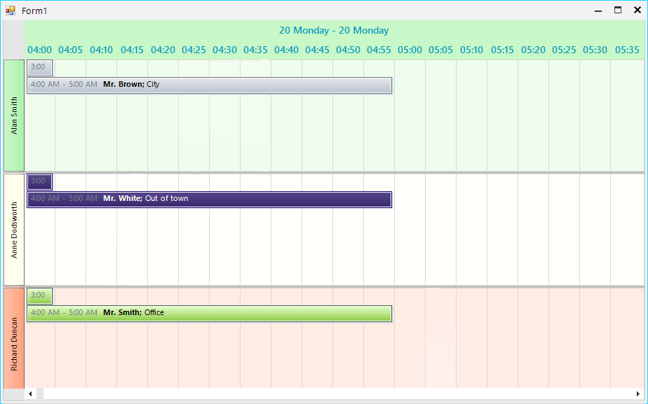

## Environment
<table>
	<tr>
		<td>Product Version</td>
		<td>2019.3.911</td>
	</tr>
	<tr>
		<td>Product</td>
		<td>RadScheduler for WinForms</td>
	</tr>
</table>


## Description

When set up in *timeline view*, **RadScheduler** can work with a time scale of predefined values: [Setting the Default Time Scale](https://docs.telerik.com/devtools/winforms/scheduler/views/timeline-view#setting-the-default-time-scale). This KB article demonstrates how a custom **MinutesScale** class can be created working with at a scale of 5 minutes.  

## Solution

Create a custom scale inheriting the **MinutesTimescale** class and override its **ScalingFactor** property.

>note A small time scale will create more elements inside the header. In some cases the available space might not be enough and these elements may be squeezed. The [DisplayedCellsCount](https://docs.telerik.com/devtools/winforms/scheduler/views/timeline-view#getting-the-scale) property of the scale object determines how many elements will be simultaneously visible. The screen shot below shows 20 cells and the rest of cells can be seen using the scrollbar at the bottom.

>caption Figure 1: Custom Time Scale


#### Custom Scale Class

````C#            
public class FiveMinutesTimescale : MinutesTimescale
{
    public override int ScalingFactor
    {
        get
        {
            return 5;
        }
    }
}

````
````VB.NET
Public Class FiveMinutesTimescale
    Inherits MinutesTimescale

    Public Overrides ReadOnly Property ScalingFactor As Integer
        Get
            Return 5
        End Get
    End Property
End Class

````

#### Form`s Class

````C#            
public partial class Form1 : Form
{
    public Form1()
    {
        InitializeComponent();

        //Set up the scheduler and add appointments
        //...

        this.radScheduler1.GroupType = GroupType.Resource;
        this.radScheduler1.ActiveViewType = Telerik.WinControls.UI.SchedulerViewType.Timeline;
        SchedulerTimelineView activeTimelineView = (SchedulerTimelineView)this.radScheduler1.ActiveView;
        activeTimelineView.ResourcesPerView = 3;

        FiveMinutesTimescale scale = new FiveMinutesTimescale();
        activeTimelineView.SchedulerTimescales.Add(scale);
        scale.Visible = true;

		this.radScheduler1.GetTimelineView().GetScaling().DisplayedCellsCount = 25;

    }
}

````
````VB.NET
Public Partial Class Form1
    Inherits Form

    Public Sub New()
        InitializeComponent()
		
		'Set up the scheduler and add appointments
		'...		

        Me.radScheduler1.GroupType = GroupType.Resource
        Me.radScheduler1.ActiveViewType = Telerik.WinControls.UI.SchedulerViewType.Timeline
        Dim activeTimelineView As SchedulerTimelineView = CType(Me.radScheduler1.ActiveView, SchedulerTimelineView)
        activeTimelineView.ResourcesPerView = 3
        Dim scale As FiveMinutesTimescale = New FiveMinutesTimescale()
        activeTimelineView.SchedulerTimescales.Add(scale)
        scale.Visible = True
		
		Me.radScheduler1.GetTimelineView().GetScaling().DisplayedCellsCount = 25

    End Sub
End Class

````

# See Also
* [Timeline View]()