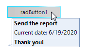

## Environment
 
|Product Version|Product|Author|
|----|----|----|
|2020.2.512|RadGridView for WinForms|[Nadya Karaivanova](https://www.telerik.com/blogs/author/nadya-karaivanova)|
 
## Description

A common requirement is to display a baloon that shows additional information about warnings, hints or other useful information similarly to [callouts](https://en.wikipedia.org/wiki/Callout). This article demonstrates how you can achieve a similar look by using [RadScreenTip](https://docs.telerik.com/devtools/winforms/telerik-presentation-framework/tooltips-and-screentips/screen-tips).

 


## Solution 

The possible solution is by customizeng the **RadScreenTips**. **RadScreenTip** is a UI feature which consists of a small window that appears when the mouse cursor is hovered over a particular element. You can create a [custom shape](https://docs.telerik.com/devtools/winforms/telerik-presentation-framework/shapes/custom-shapes) and assign it to the screen tip in the **ScreenTipNeeded** event. Thus, you have the ability to design any custom shape that is most suitable for your specific needs.

A full code snippet is illustrated below:

````C#
    public RadForm1()
    {
        InitializeComponent();
        RadControlSpyForm spyForm = new RadControlSpyForm();
        spyForm.Show();

        this.radButton1.ScreenTipNeeded += this.RadButton1_ScreenTipNeeded;
    }
 
    private void RadButton1_ScreenTipNeeded(object sender, ScreenTipNeededEventArgs e)
    {
        RadButtonElement buttonElement = e.Item as RadButtonElement;
        if (buttonElement != null)
        {
            RadOffice2007ScreenTipElement screenTip = new RadOffice2007ScreenTipElement();
            CustomShape shape = new CustomShape();
        
            screenTip.CaptionLabel.Text = "Send the report";
            screenTip.MainTextLabel.Text = "Current date: " + DateTime.Now.ToShortDateString();
            screenTip.FooterTextLabel.Text = "Thank you!";
            screenTip.FooterVisible = true;
            
            shape.AsString = "20,20,200,100:32,19.91453,False,0,0,0,0,0:220,20,False,0,0,0,0,0:220,120,False,0,0,0,0,0:32,120.0855," +
           "False,0,0,0,0,0:32,116.6667,False,0,0,0,0,0:21.36752,113.9316,False,0,0,0,0,0:32,111.1966,False,0,0,0,0,0:";
            screenTip.Shape = shape;
            screenTip.Padding = new Padding(10, 0, 0, 0);
            buttonElement.ScreenTip = screenTip;

            PropertyInfo barProperty = ((ComponentBehavior)this.radButton1.Behavior).GetType().GetProperty("ScreenPresenter", BindingFlags.NonPublic | BindingFlags.Instance);
            Form screenTipForm = barProperty.GetValue(((ComponentBehavior)this.radButton1.Behavior), null) as Form;
            screenTipForm.BackColor = this.BackColor;
            screenTipForm.TransparencyKey = this.BackColor;
            IntPtr hWnd = screenTipForm.Handle;
            int GCL_STYLE = -26;
            int ClassLong = NativeMethods.GetClassLongPtr(new HandleRef(null, hWnd), GCL_STYLE).ToInt32();
            if ((ClassLong & NativeMethods.CS_DROPSHADOW) != 0)
            {
                ClassLong ^= NativeMethods.CS_DROPSHADOW;
                NativeMethods.SetClassLong(new HandleRef(null, hWnd), GCL_STYLE, (IntPtr)ClassLong);
            }
        }
    }

````
````VB.NET
Public Sub New()
    InitializeComponent()
    AddHandler Me.RadButton1.ScreenTipNeeded, AddressOf Me.RadButton1_ScreenTipNeeded
End Sub

Private Sub RadButton1_ScreenTipNeeded(ByVal sender As Object, ByVal e As ScreenTipNeededEventArgs)
    Dim buttonElement As RadButtonElement = TryCast(e.Item, RadButtonElement)

    If buttonElement IsNot Nothing Then
        Dim screenTip As RadOffice2007ScreenTipElement = New RadOffice2007ScreenTipElement()
        Dim shape As CustomShape = New CustomShape()
        screenTip.CaptionLabel.Text = "Send the report"
        screenTip.MainTextLabel.Text = "Current date: " & DateTime.Now.ToShortDateString()
        screenTip.FooterTextLabel.Text = "Thank you!"
        screenTip.FooterVisible = True
        shape.AsString = "20,20,200,100:32,19.91453,False,0,0,0,0,0:220,20,False,0,0,0,0,0:220,120,False,0,0,0,0,0:32,120.0855," & "False,0,0,0,0,0:32,116.6667,False,0,0,0,0,0:21.36752,113.9316,False,0,0,0,0,0:32,111.1966,False,0,0,0,0,0:"
        screenTip.Shape = shape
        screenTip.Padding = New Padding(10, 0, 0, 0)
        buttonElement.ScreenTip = screenTip
        Dim barProperty As PropertyInfo = (CType(Me.RadButton1.Behavior, ComponentBehavior)).[GetType]().GetProperty("ScreenPresenter", BindingFlags.NonPublic Or BindingFlags.Instance)
        Dim screenTipForm As Form = TryCast(barProperty.GetValue((CType(Me.RadButton1.Behavior, ComponentBehavior)), Nothing), Form)
        screenTipForm.BackColor = Me.BackColor
        screenTipForm.TransparencyKey = Me.BackColor
        Dim hWnd As IntPtr = screenTipForm.Handle
        Dim GCL_STYLE As Integer = -26
        Dim ClassLong As Integer = NativeMethods.GetClassLongPtr(New HandleRef(Nothing, hWnd), GCL_STYLE).ToInt32()

        If (ClassLong And NativeMethods.CS_DROPSHADOW) <> 0 Then
            ClassLong = ClassLong Xor NativeMethods.CS_DROPSHADOW
            NativeMethods.SetClassLong(New HandleRef(Nothing, hWnd), GCL_STYLE, CType(ClassLong, IntPtr))
        End If
    End If
End Sub

````

