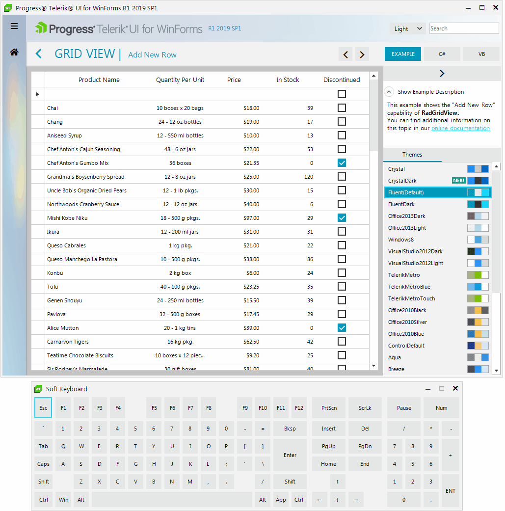

## Environment
 
|Product Version|Product|Author|
|----|----|----|
|2019.1.219|UI for WinForms|[Desislava Yordanova](https://www.telerik.com/blogs/author/desislava-yordanova)|
 

## Description

A common requirement is to display a virtual keyboard for editing fields in your application. However, it is quite important to introduce consistent look and feel to the end users. This SDK example aims to introduce a sample approach how to achieve the illustrated behavior below. 
 

## Solution 

The following MSDN solution is used as a starting point. It is just extended to use the Telerik UI for WinForms suite with the Fluent theme applied: [Create a soft keyboard (CSSoftKeyboard)](https://code.msdn.microsoft.com/CSSoftKeyboard-0a86f914)

The sample demonstrates how to create a soft keyboard. It has the following 
features

1. It will not get focus when a key button is clicked.

2. If the user presses the left mouse button within its non-client area (such as the
  title bar), it will be activated. When the left mouse button is released, it will
  activate the previous foreground Window.

3. When user clicks a character on it, like `A` or `1`, it will send the key to 
 the active application.

4. It supports special keys, like "WinKey" "Delete".

5. It supports the combination of keys, like `Ctrl+C`.

NOTE: `Ctrl+Alt+Del` is not supported as it will cause security issue.

>tip A complete solution providing a C# and VB.NET project is available [here](https://github.com/telerik/winforms-sdk/tree/master/VirtualKeyboard).

 

