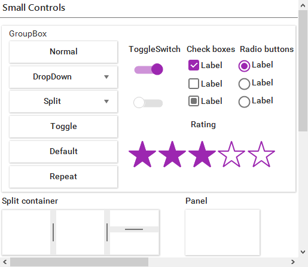
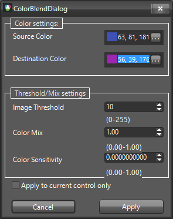

# Customizing the Material Theme

As of the R2 2017 the **Material**, **MaterialBlueGray**, **MaterialPink**, and the **MaterialTeal** themes are built-in and redistributed with our suite. This tutorial will provide the necessary steps to create a new Material inspired theme. We are going to use the **Material** theme as our source and based on it build a new **MaterialPurple** theme.

|Material|MaterialPurple|
|----|----|
||

There are different material design color palettes and each palette comprises primary and accent colors. 
You can find more information about them on the following links:

* [Material Color Palette](https://material.io/guidelines/style/color.html#color-color-palette)
* [Material Colors](https://www.materialui.co/colors)  

As you can see there are 19 primary and 16 accent colors available. Enormous amount of primary-accent color combinations is available and according to the latest design trends we have created 4 material themes in our suite (indigo – orange, pink – blue, teal – red, bluegrey - green).

* **MaterialPink**: Pink(primary) and Blue(accent)
* **MaterialTeal**: Teal(primary) and Red(accent)
* **MaterialBlueGrey**: BlueGrey(primary) and Green(accent)

In this article you will find the exact steps how to create a new material theme with primary and accent colors of your choice. You can also change only the primary or accent color to create a new theme.

Each palette has a wide range of colors and we need to say which colors we are going to use:

* Primary – 500
* PrimaryHover – 700
* PrimaryPressed – 900
* PrimaryFocus – 200
* Accent – A200
* AccentHover – A100
* AccentPressed – A400

The number on the right is the color ID and can be found in the links mentioned above. Now we know the exact colors that we are going to use and we can start creating new material theme. First we need to open VisualStyleBuilder.

As a foundation we are going to use the first Material theme, so we can open Material.tssp for modification. Now using the ColorBlending dialog the new theme will be ready in a dozen of steps. 

>note One should use the Visual Style Builder from the R3 2017 release onward as it brings major improvements in how the source and destination colors are being blended.

Open ColorBlending dialog and use the following settings for all color modifications:

1\. **Uniform Color Blending**: Image Treshold – 10; Color Mix – 1.00; Color Sensitivity – 0.00

>caption Figure 1: Color Blending Settings

2\. **Primary**: Source – 63, 81, 181; Destination – 156, 39, 176

3\. **PrimaryHover**: Source – 48, 63, 159; Destination – 123, 31, 162

4\. **PrimaryPressed**: Source – 26, 35, 126; Destination – 106, 27, 154

5\. **PrimaryFocus**: Source – 159, 168, 218; Destination – 206, 147, 216

6\. **Primary128Opacity(50%)(white background)**: Source – 206, 210, 235; Destination – 205, 146, 215

7\. **Primary51Opacity(20%)(white background)**: Source – 215, 219, 239; Destination – 235, 211, 239

8\. **Accent**: Source – 255, 171, 64; Destination – 178, 255, 89

9\. **AccentHover**: Source – 255, 209, 128; Destination – 204, 255, 144

10\. **AccentPressed**: Source – 255, 145, 0; Destination – 118, 255, 3

11\. **AccentHover30PercentOpacity(77 opacity)(white background)**: Source – 255, 241, 216; Destination – 239, 255, 221

12\. **Inactive text - White color with 97 opacity(38%)(PrimaryFocus background)**: Source – 195, 200, 216; Destination – 224, 188, 230

13\. **Grid SearchRow Highlight text - AccentHover color with 178 opacity(70%)(white background)**: Source – 255, 223, 166; Destination – 219, 255, 177

14\. **Grid Alternating Row Color - PrimaryFocus with 51opacity(20%)(white background)**: Source – 234, 236, 246; Destination – 245, 233, 247

>note **RadCheckmark/RadCheckbox** uses images for its different states and the Color Blending wizard may not convert all the pixels correctly. So you can replace these images with your custom ones.

# See Also

* [Touch Themes]()

* [Color Blending]()

* [Visual Style Builder]()

