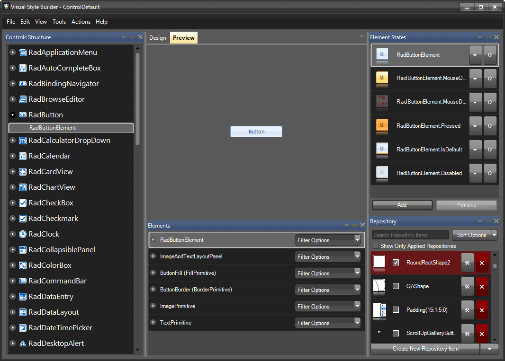
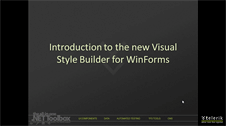

# Visual Style Builder

[Visual Style Builder]() is a standalone application that comes with the Telerik UI for for WinForms suite. This application allows you to create new or edit the predefined themes. With Visual Style Builder you can:

* Set properties 

* Inherit properties 

* Animate changes 

* Save themes

* [Extract and edit the predefined themes]()

For additional information about Visual Style Builder, please refer to [this documentation section](). Bellow the image you can find some videos as well.

>caption Figure 1: Visual Style Builder

| RELATED VIDEOS |  |
| ------ | ------ |
|[What's New in Visual Style Builder for R1 2010](http://tv.telerik.com/watch/winforms/visualstylebuilder/whats-new-visual-style-builder-q1-2010) In this video, you will learn about all of the incredible new features included with the R1 2010 version of Visual Style Builder. (Runtime: 15:13)||
|[Styling Basics with Visual Style Builder for WinForms](http://tv.telerik.com/watch/winforms/visualstylebuilder/styling-basics-with-visual-style-builder-winforms) In this video, you will learn how to create a basic theme using repositories in Visual Style Builder for WinForms. You will then learn how to use this theme in your Telerik UI for for WinForms based applications. (Runtime: 09:12)||
|[Introduction to the Visual Style Builder for WinForms](http://tv.telerik.com/watch/winforms/visualstylebuilder/introduction-new-visual-style-builder-winforms) In this recorded webinar, you will learn how to build themes using the latest version of Visual Style Builder. You will also learn what Theme Repositories are and how they make creating themes easier. (Runtime: 42:56)|
|[Changing Themes at Run Time with Telerik UI for for WinForms](http://tv.telerik.com/watch/winforms/visualstylebuilder/changing-themes-at-run-time-with-radcontrols-winforms) In this video, you will learn how to give your users the ability to choose between Telerik themes and custom themes at run time. (Runtime: 08:42)||
|[Episode 1: Creating a Custom Theme for the RadScrollBar Component of RadScheduler](http://tv.telerik.com/watch/winforms/episode-1-creating-custom-skin-for-radscheduler-with-visual-style-builder-for-winforms) This video is the first in a series of videos about creating a custom skin for RadScheduler using Visual Style Builder for WinForms.In this video, you will learn how to begin using Visual Style Builder. You will also learn what components make up the RadScheduler. Finally, you will learn how to create a theme for the RadScrollBar component of RadScheduler.||
|[Episode 2: Creating a Custom Theme for the RadScheduler Component of RadScheduler](http://tv.telerik.com/watch/winforms/episode-2-creating-custom-skin-for-radscheduler-with-visual-style-builder) This video is the second in a series of videos about creating a custom skin for RadScheduler using Visual Style Builder for WinForms. In this video, you will learn how to create a custom theme for the actual RadScheduler component.||
|[Episode 3: Creating a Custom Theme for the RadForm Component of RadScheduler](http://tv.telerik.com/watch/winforms/episode-3-creating-custom-skin-for-radscheduler-with-visual-style-builder-for-winforms) This video is the third in a series of videos about creating a custom skin for RadScheduler using Visual Style Builder for WinForms. In this video, you will learn how to create a custom theme for the RadForm component of the EditAppointmentDialog.||
|[Episode 4: Creating a Custom Theme for the RadTextBox Component of RadScheduler](http://tv.telerik.com/watch/winforms/episode-4-creating-custom-skin-for-radscheduler-with-visual-style-builder-for-winforms) This video is the fourth in a series of videos about creating a custom skin for RadScheduler using Visual Style Builder for WinForms. In this video, you will learn how to create a custom theme for the RadTextBox component contained within the EditAppointmentDialog.||
|[Episode 5: Creating a Custom Theme for the RadDropDownList Component of RadScheduler](http://tv.telerik.com/watch/winforms/episode-5-creating-custom-theme-for-raddropdownlist-component-radscheduler) This video is the fifth in a series of videos about creating a custom skin for RadScheduler using Visual Style Builder for WinForms. In this video, you will learn how to create a custom theme for the RadDropDownList component contained within the EditAppointmentDialog.||
|[Episode 6: Creating a Custom Theme for the RadSpinEditor, RadButton, and RadSeparator Components of RadScheduler](http://tv.telerik.com/watch/winforms/episode-7-creating-custom-theme-for-radspineditor-radbutton-radseparator-components-radscheduler) This video is the seventh in a series of videos about creating a custom skin for RadScheduler using Visual Style Builder for WinForms. In this video, you will learn how to create a custom theme for the RadSpinEditor, RadButton, and RadSeparator components contained within the EditAppointmentDialog.||

# See Also
* [Touch Enabled Themes]()

* [Using a Default Theme for the Entire Application]()

* [Using custom themes]()

* [Using Themes]()

