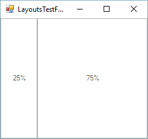
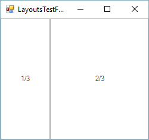
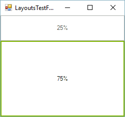
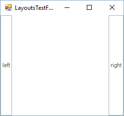
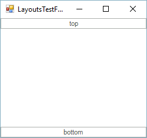

# BoxLayout

__BoxLayout__ is a panel that arranges its items according to three predefined settings:__Proportion__, __Orientation__ and __StripPosition__.
	   

### __Methods and properties:__

* __SetProportion(RadElement element, float proportion):__ A static method that sets the proportion of the total area each element will cover.
		  	

* __Orientation:__ Is a property that indicates whether the panel should stack its items horizontally (from left to right) or vertically (from top to bottom).
		  	

* __StripPosition:__ A static property that specifies whether each element will be treated as first or last child. When the Orientation is horizontal, a child with StripPosition First will be positioned to the most left, while a child with  StripPosition Last will be positioned to the most right. Respectively, when the Orientation is vertical, the First child is positioned at the top, while the Last child appears at the bottom.

Here is how to create a element with BoxLayout and set the Proportion:

#### Creating box layout panel element

{{source=..\SamplesCS\TPF\Layouts\PredefinedLayoutPanels\MyBoxLayoutPanelElement.cs region=myBoxLayoutPanelElement}} 
{{source=..\SamplesVB\TPF\Layouts\PredefinedLayoutPanels\MyBoxLayoutPanelElement.vb region=myBoxLayoutPanelElement}} 

````C#
public class MyBoxLayoutPanelElement : RadElement
{
    protected override void CreateChildElements()
    {
        BoxLayout boxPanel = new BoxLayout();
        RadButtonElement button1 = new RadButtonElement("25%");
        BoxLayout.SetProportion(button1, 1f);
        RadButtonElement button2 = new RadButtonElement("75%");
        BoxLayout.SetProportion(button2, 3f);
        boxPanel.Children.Add(button1);
        boxPanel.Children.Add(button2);
        this.Children.Add(boxPanel);
        base.CreateChildElements();
    }

````
````VB.NET
Public Class MyBoxLayoutPanelElement
    Inherits RadElement
    Protected Overrides Sub CreateChildElements()
        Dim boxPanel As New BoxLayout()
        Dim button1 As New RadButtonElement("25%")
        BoxLayout.SetProportion(button1, 1.0F)
        Dim button2 As New RadButtonElement("75%")
        BoxLayout.SetProportion(button2, 3.0F)
        boxPanel.Children.Add(button1)
        boxPanel.Children.Add(button2)
        Me.Children.Add(boxPanel)
        MyBase.CreateChildElements()
    End Sub

````

{{endregion}} 

And here is how to embed this element in a class:

#### Using the element in a control

{{source=..\SamplesCS\TPF\Layouts\PredefinedLayoutPanels\MyBoxLayoutPanelElement.cs region=boxLayoutClass}} 
{{source=..\SamplesVB\TPF\Layouts\PredefinedLayoutPanels\MyBoxLayoutPanelElement.vb region=boxLayoutClass}} 

````C#
public class MyBoxLayoutPanelControl : RadControl
{
    protected override void CreateChildItems(RadElement parent)
    {
        base.CreateChildItems(parent);
        parent.Children.Add(new MyBoxLayoutPanelElement());
    }
}

````
````VB.NET
Class MyBoxLayoutPanelControl
    Inherits RadControl
    Protected Overrides Sub CreateChildItems(parent As RadElement)
        MyBase.CreateChildItems(parent)
        parent.Children.Add(New MyBoxLayoutPanelElement())
    End Sub
End Class

````

{{endregion}} 



Because the proportion of "button1" and "button2" is 1:3, "button1" covers exactly one quarter of the panel and "button2" fills the remaining three quarters. Changing the proportion to 1:2 will make the two buttons become one third and two thirds respectively:
		


To arrange the elements in the panel vertically set the __Orientation__ of the BoxLayout to *Vertical*:

#### Set orientation

{{source=..\SamplesCS\TPF\Layouts\PredefinedLayoutPanels\MyBoxLayoutPanelElement.cs region=orientation}} 
{{source=..\SamplesVB\TPF\Layouts\PredefinedLayoutPanels\MyBoxLayoutPanelElement.vb region=orientation}} 

````C#
boxPanel.Orientation = Orientation.Vertical;

````
````VB.NET
boxPanel.Orientation = Orientation.Vertical

````

{{endregion}} 



The __StripPosition__ property allows the BoxLayout to treat each element as *First* or *Last*. Children with __StripPosition__ set to *First* are always positioned to the left when the __Orientation__ is horizontal and the top when the __Orientation__ is vertical. Children with __StripPosition__ set to *Last* are always located to the right, when the __Orientation__ is horizontal and to the bottom when the __Orientation__ is vertical.

For example, two if RadButtonElements, one *First* and the other *Last*, are added to a BoxLayout, the result will be the following:

#### Set position

{{source=..\SamplesCS\TPF\Layouts\PredefinedLayoutPanels\MyBoxLayoutPanelElement.cs region=position1}} 
{{source=..\SamplesVB\TPF\Layouts\PredefinedLayoutPanels\MyBoxLayoutPanelElement.vb region=position1}} 

````C#
BoxLayout boxPanel = new BoxLayout();
RadButtonElement button1 = new RadButtonElement("left");
button1.StretchHorizontally = false;
button1.SetValue(BoxLayout.StripPositionProperty, BoxLayout.StripPosition.First);
button1.Size = new System.Drawing.Size(20, 20);
RadButtonElement button2 = new RadButtonElement("right");
button2.SetValue(BoxLayout.StripPositionProperty, BoxLayout.StripPosition.Last);
button2.StretchHorizontally = false;
button2.Size = new System.Drawing.Size(20, 20);
boxPanel.Orientation = Orientation.Horizontal;
boxPanel.Children.Add(button1);
boxPanel.Children.Add(button2);

````
````VB.NET
Dim boxPanel As New BoxLayout()
Dim button1 As New RadButtonElement("left")
button1.StretchHorizontally = False
button1.SetValue(BoxLayout.StripPositionProperty, BoxLayout.StripPosition.First)
button1.Size = New System.Drawing.Size(20, 20)
Dim button2 As New RadButtonElement("right")
button2.SetValue(BoxLayout.StripPositionProperty, BoxLayout.StripPosition.Last)
button2.StretchHorizontally = False
button2.Size = New System.Drawing.Size(20, 20)
boxPanel.Orientation = Orientation.Horizontal
boxPanel.Children.Add(button1)
boxPanel.Children.Add(button2)

````

{{endregion}} 



When the __Orientation__ is vertical the elements will be positioned in the following manner:



# See Also
* [DockLayout]()

* [GridLayout]()

* [ImageAndTextLayoutPanel]()

* [StackLayoutPanel]()

* [WrapLayoutPanel]()

