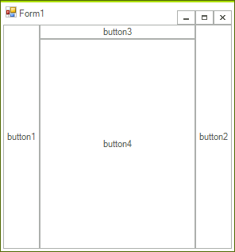

# DockLayout

__DockLayoutPanel__ is a panel that docks its child elements to a predefined-position. The possible Dock positions are *Left*, *Top*, *Right* and *Bottom*.

__Methods and properties:__

* __SetDock(RadElement element, Dock dock):__ A static method that assigns an element a given docking position.

* __LastChildFill:__ - Indicates whether the dock position of the last child should be ignored, so that the element stretches to fill the area left by the other children elements. When this property is set to *false* the dock position of the last child is taken under consideration, thus leaving an empty area in the center of the panel.

The Dock of each element is set through the static __SetDock__ method.

{{source=..\SamplesCS\TPF\Layouts\PredefinedLayoutPanels\MyDockLayoutPanelElement.cs region=snippet1}} 
{{source=..\SamplesVB\TPF\Layouts\PredefinedLayoutPanels\MyDockLayoutPanelElement.vb region=snippet1}} 

````C#
RadButtonElement button = new RadButtonElement("button1");
DockLayoutPanel.SetDock(button, Telerik.WinControls.Layouts.Dock.Left);

````
````VB.NET
Dim button As New RadButtonElement("button1")
DockLayoutPanel.SetDock(button, Telerik.WinControls.Layouts.Dock.Left)

````

{{endregion}} 

Essential for the final layout of the DockLayoutPanel is the sequence in which elements are added to the panel. Consider the following four RadButtonElements:

{{source=..\SamplesCS\TPF\Layouts\PredefinedLayoutPanels\MyDockLayoutPanelElement.cs region=snippet2}} 
{{source=..\SamplesVB\TPF\Layouts\PredefinedLayoutPanels\MyDockLayoutPanelElement.vb region=snippet2}} 

````C#
RadButtonElement button1 = new RadButtonElement("button1");
DockLayoutPanel.SetDock(button1, Telerik.WinControls.Layouts.Dock.Left);
RadButtonElement button2 = new RadButtonElement("button2");
DockLayoutPanel.SetDock(button2, Telerik.WinControls.Layouts.Dock.Right);
RadButtonElement button3 = new RadButtonElement("button3");
DockLayoutPanel.SetDock(button3, Telerik.WinControls.Layouts.Dock.Top);
RadButtonElement button4 = new RadButtonElement("button4");
DockLayoutPanel.SetDock(button4, Telerik.WinControls.Layouts.Dock.Bottom);

````
````VB.NET
Dim button1 As New RadButtonElement("button1")
DockLayoutPanel.SetDock(button1, Telerik.WinControls.Layouts.Dock.Left)
Dim button2 As New RadButtonElement("button2")
DockLayoutPanel.SetDock(button2, Telerik.WinControls.Layouts.Dock.Right)
Dim button3 As New RadButtonElement("button3")
DockLayoutPanel.SetDock(button3, Telerik.WinControls.Layouts.Dock.Top)
Dim button4 As New RadButtonElement("button4")
DockLayoutPanel.SetDock(button4, Telerik.WinControls.Layouts.Dock.Bottom)

````

{{endregion}} 

Adding the above in the following order results in the layout below:

{{source=..\SamplesCS\TPF\Layouts\PredefinedLayoutPanels\MyDockLayoutPanelElement.cs region=snippet3}} 
{{source=..\SamplesVB\TPF\Layouts\PredefinedLayoutPanels\MyDockLayoutPanelElement.vb region=snippet3}} 

````C#
DockLayoutPanel dockPanel = new DockLayoutPanel();
dockPanel.Children.Add(button1);
dockPanel.Children.Add(button2);
dockPanel.Children.Add(button3);
dockPanel.Children.Add(button4);

````
````VB.NET
Dim dockPanel As New DockLayoutPanel()
dockPanel.Children.Add(button1)
dockPanel.Children.Add(button2)
dockPanel.Children.Add(button3)
dockPanel.Children.Add(button4)

````

{{endregion}} 



However, if the same elements are added in a reversed order, the outcome will be different:

{{source=..\SamplesCS\TPF\Layouts\PredefinedLayoutPanels\MyDockLayoutPanelElement.cs region=snippet4}} 
{{source=..\SamplesVB\TPF\Layouts\PredefinedLayoutPanels\MyDockLayoutPanelElement.vb region=snippet4}} 

````C#
DockLayoutPanel dockPanel = new DockLayoutPanel();
dockPanel.Children.Add(button4);
dockPanel.Children.Add(button3);
dockPanel.Children.Add(button2);
dockPanel.Children.Add(button1);

````
````VB.NET
Dim dockPanel As New DockLayoutPanel()
dockPanel.Children.Add(button4)
dockPanel.Children.Add(button3)
dockPanel.Children.Add(button2)
dockPanel.Children.Add(button1)

````

{{endregion}} 


>note In both examples above the Dock setting of the last added child is ignored, i.e. in the first example *button4* is docked, so that it fills the area left by the other buttons. In the second example *button1* docking setting is not taken under consideration and the element fills the empty panel area. Setting the __LastChildFill__ property to *false* , however, transforms the above layouts, so that the last added children are not stretched:
>


Here is an example of creating a control holding custom DockPanelElement:

{{source=..\SamplesCS\TPF\Layouts\PredefinedLayoutPanels\MyDockLayoutPanelElement.cs region=dockLayoutClass}} 
{{source=..\SamplesVB\TPF\Layouts\PredefinedLayoutPanels\MyDockLayoutPanelElement.vb region=dockLayoutClass}} 

````C#
class MyDockLayoutPanelControl : RadControl
{
    protected override void CreateChildItems(RadElement parent)
    {
        base.CreateChildItems(parent);
        parent.Children.Add(new MyDockLayoutPanelElement());
    }
}

````
````VB.NET
Public Class MyDockLayoutPanelControl
    Inherits RadControl
    Protected Overrides Sub CreateChildItems(parent As RadElement)
        MyBase.CreateChildItems(parent)
        parent.Children.Add(New MyDockLayoutPanelElement())
    End Sub
End Class

````

{{endregion}} 

And here is the element itself:

{{source=..\SamplesCS\TPF\Layouts\PredefinedLayoutPanels\MyDockLayoutPanelElement.cs region=myDockLayoutPanelElement}} 
{{source=..\SamplesVB\TPF\Layouts\PredefinedLayoutPanels\MyDockLayoutPanelElement.vb region=myDockLayoutPanelElement}} 

````C#
public class MyDockLayoutPanelElement : RadElement
{
    protected override void CreateChildElements()
    {
        RadButtonElement button1 = new RadButtonElement("button1");
        DockLayoutPanel.SetDock(button1, Telerik.WinControls.Layouts.Dock.Left);
        RadButtonElement button2 = new RadButtonElement("button2");
        DockLayoutPanel.SetDock(button2, Telerik.WinControls.Layouts.Dock.Right);
        RadButtonElement button3 = new RadButtonElement("button3");
        DockLayoutPanel.SetDock(button3, Telerik.WinControls.Layouts.Dock.Top);
        RadButtonElement button4 = new RadButtonElement("button4");
        DockLayoutPanel.SetDock(button4, Telerik.WinControls.Layouts.Dock.Bottom);
        DockLayoutPanel dockPanel = new DockLayoutPanel();
        dockPanel.Children.Add(button4);
        dockPanel.Children.Add(button3);
        dockPanel.Children.Add(button2);
        dockPanel.Children.Add(button1);
    }

````
````VB.NET
Public Class MyDockLayoutPanelElement
    Inherits RadElement
    Protected Overrides Sub CreateChildElements()
        Dim button1 As New RadButtonElement("button1")
        DockLayoutPanel.SetDock(button1, Telerik.WinControls.Layouts.Dock.Left)
        Dim button2 As New RadButtonElement("button2")
        DockLayoutPanel.SetDock(button2, Telerik.WinControls.Layouts.Dock.Right)
        Dim button3 As New RadButtonElement("button3")
        DockLayoutPanel.SetDock(button3, Telerik.WinControls.Layouts.Dock.Top)
        Dim button4 As New RadButtonElement("button4")
        DockLayoutPanel.SetDock(button4, Telerik.WinControls.Layouts.Dock.Bottom)
        Dim dockPanel As New DockLayoutPanel()
        dockPanel.Children.Add(button4)
        dockPanel.Children.Add(button3)
        dockPanel.Children.Add(button2)
        dockPanel.Children.Add(button1)
    End Sub

````

{{endregion}}

# See Also
* [BoxLayout]()

* [GridLayout]()

* [ImageAndTextLayoutPanel]()

* [StackLayoutPanel]()

* [WrapLayoutPanel]()

