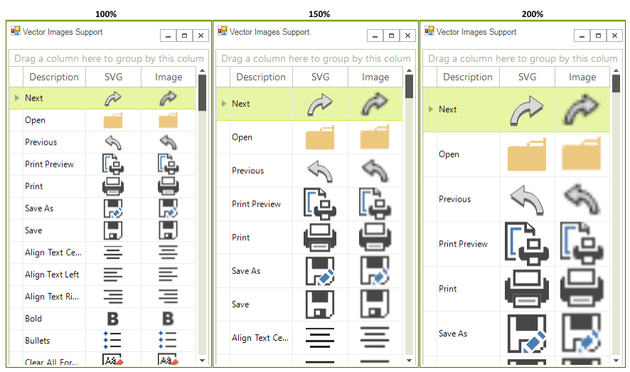
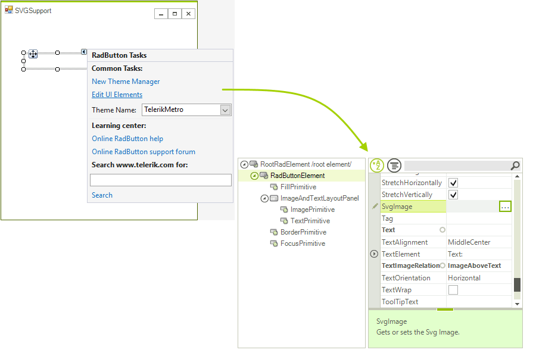
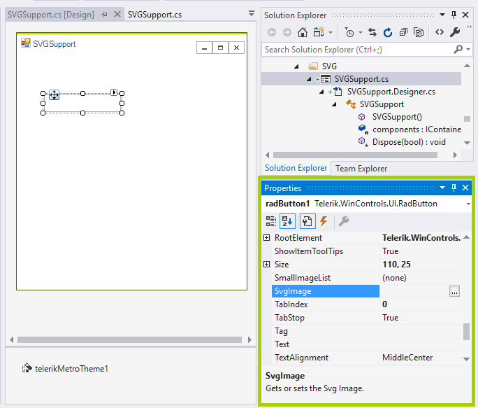

# Support for vector images

**RadControls** support displaying vector graphics for building high DPI applications and providing excellent end user experience. Scalable Vector Graphics (SVG) defines vector-based graphics in XML format. SVG file can be scaled to different sizes without loоsing quality so they scale appropriately on all DPI settings. You can apply SVG image on a control just by using the **SvgImage** property that is integrated in [LightVisualElement]() and [ImagePrimitive](). The **SvgImage** property acts the same way as the **Image** property, so **TextImageAlignment**, **ImageLayout** and other image related properties are respected by **RadSvgImage**.

>note SVG image support is available only in .NET 4.0 and above.

Here is an example with screenshots on different scaling monitors with **RadGridView** that contains two **GridViewImageColumns**: one column is with SVG image, the other with png image. You can notice that the second image column becomes blurry unlike the SVG column which looks fine even on high scaling:



### How to enable SVG images in your application

>important In R2 2020 we introduced the **EnableSvgImages** property that indicates whether SVG images will be drawn in **ImagePrimitive** and **LightVisualElement** objects. This property allows you to enable/disable SVG images on a global level. It is a static property of **RadControl** and should be set before any controls are initialized. For example in the form's constructor. 

If you set **EnableSvgImages** to *false* it will draw the corresponding **Image** property if applicable.

#### Enable SVG images

{{source=..\SamplesCS\TPF\SvgSupport\SVGSupport.cs region=EnableSvgImages}} 
{{source=..\SamplesVB\TPF\SvgSupport\SVGSupport.vb region=EnableSvgImages}}
````C#
RadControl.EnableSvgImages = true;

````
````VB.NET
RadControl.EnableSvgImages = True

````

{{endregion}} 

You can control whether Image or SvgImage will be painted on an element level as well. This can be done via the the **ImageDrawType** enumeration that offers two options: Svg or Image. Note that if there is no SvgImage set, this property will return **ImageDrawType.Image**.

For example you may prefer to use bitmap images for your application but use SVG image for а specific element:

{{source=..\SamplesCS\TPF\SvgSupport\SVGSupport.cs region=EnableSvgForSpecificElement}} 
{{source=..\SamplesVB\TPF\SvgSupport\SVGSupport.vb region=EnableSvgForSpecificElement}}
````C#
RadControl.EnableSvgImages = false;
this.radButton1.ButtonElement.ImagePrimitive.ImageDrawType = ImageDrawType.Svg;

````
````VB.NET
RadControl.EnableSvgImages = False
Me.radButton1.ButtonElement.ImagePrimitive.ImageDrawType = ImageDrawType.Svg

````

{{endregion}} 


### Assign SVG image programmatically

**RadSvgImage** offers three ways to load SVG image to a control from different resources:

* **FromFile** – creates a **RadSvgImage** from the specified file name.

{{source=..\SamplesCS\TPF\SvgSupport\SVGSupport.cs region=FromFile}} 
{{source=..\SamplesVB\TPF\SvgSupport\SVGSupport.vb region=FromFile}}
````C#
string fileName = @"C:/Users/*username*/Pictures/record.svg";
this.radButton1.SvgImage = RadSvgImage.FromFile(fileName);

````
````VB.NET
Dim fileName As String = "C:/Users/*username*/Pictures/mail.svg"
Me.RadButton1.SvgImage = RadSvgImage.FromFile(fileName)

````

{{endregion}} 

* **FromStream** - creates a **RadSvgImage** from the specified data stream.

{{source=..\SamplesCS\TPF\SvgSupport\SVGSupport.cs region=FromStream}} 
{{source=..\SamplesVB\TPF\SvgSupport\SVGSupport.vb region=FromStream}}
````C#
string file = @"C:/Users/*username*/Pictures/mail.svg";
using (Stream stream = new FileStream(file, FileMode.Open))
{
RadSvgImage svg = RadSvgImage.FromStream(stream);
this.radButton1.SvgImage = svg;
}
````
````VB.NET
Dim file As String = "C:/Users/*username*/Pictures/mail.svg"
Using stream As Stream = New FileStream(file, FileMode.Open)
Dim svg As RadSvgImage = RadSvgImage.FromStream(stream)
Me.RadButton1.SvgImage = svg
End Using

````

{{endregion}} 

* **FromXml** - creates a **RadSvgImage** from the specified XML string.

{{source=..\SamplesCS\TPF\SvgSupport\SVGSupport.cs region=FromXml}} 
{{source=..\SamplesVB\TPF\SvgSupport\SVGSupport.vb region=FromXml}}
````C#
string xml = "<svg xmlns=\"http://www.w3.org/2000/svg\" width=\"16\" height=\"16\" viewBox=\"0 0 16 16\" >" + "<circle cx=\"8\" cy=\"8\" r=\"8\" fill=\"#00BFE8\" />" + "<text x=\"4\" y=\"13\" fill=\"white\" font-family=\"Consolas, Helvetica, sans-serif\" font-size=\"14px\" font-weight=\"bold\">i</text>" + "</svg>";
this.radButton1.SvgImage = RadSvgImage.FromXml(xml);

````
````VB.NET
Dim xml As String = "<svg xmlns=""http://www.w3.org/2000/svg"" width=""16"" height=""16"" viewBox=""0 0 16 16"" >" & "<circle cx=""8"" cy=""8"" r=""8"" fill=""#00BFE8"" />" & "<text x=""4"" y=""13"" fill=""white"" font-family=""Consolas, Helvetica, sans-serif"" font-size=""14px"" font-weight=""bold"">i</text>" & "</svg>"
Me.RadButton1.SvgImage = RadSvgImage.FromXml(xml)

````

{{endregion}} 

Here is the result when using custom xml string for creating SVG:


### Assign SVG image at design time

You can easily assign SVG image through the Smart Tag at the upper right corner of the controls. For example, let's add a **RadButton** from the Toolbox and open its Smart tag. Then, click the *Edit UI Elements*. From the *Element Hierarchy Editor* you can find the **SvgImage** property and assign a SVG image to **RadButton**.



Another way is to find the **SvgImage** property in the drop down list of the Visual Studio Property Window, and choose an image of your choice.



#### Sizing SVG image 

You can easily change the default size of the SVG image by setting the following properties:

- **Size** - Gets or sets the default size of the SVG image.
- **Height** - Gets or sets the default height of the SVG image.
- **Width** -  Gets or sets the default width of the SVG image.

#### GetRasterImage method

**RadSvgImage** offers **GetRasterImage** method that returns a raster bitmap by given size for the loaded SVG document. This method has two overloads:

- **GetRasterImage()** - Returns a raster bitmap with the default width and height for the loaded SVG document.
- **GetRasterImage(Size size)** - Returns a raster bitmap with a given width and height for the loaded SVG document.

>note Since R2 2020 **ControlDefault** theme comes with SVG images by default.
