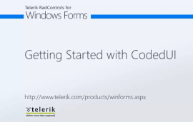
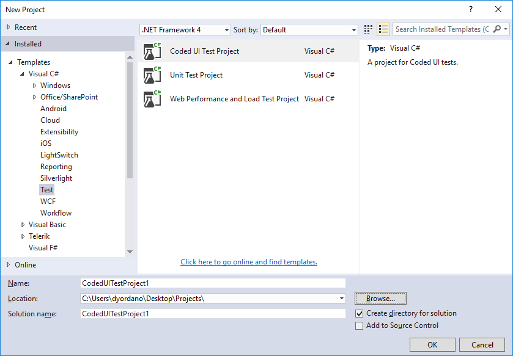
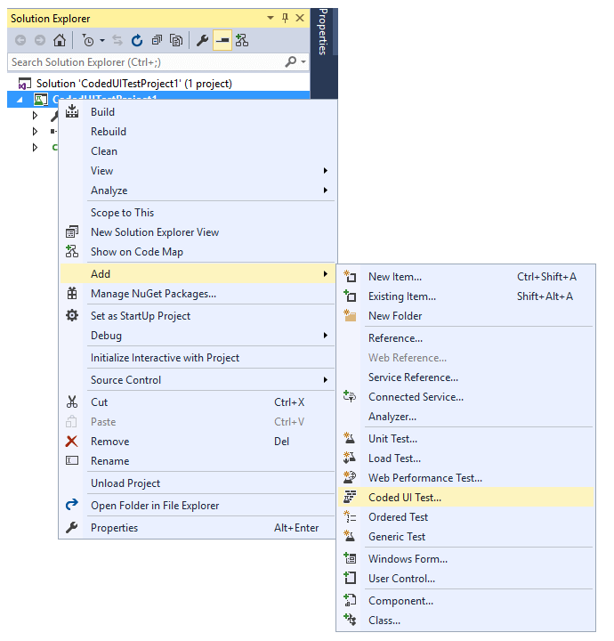
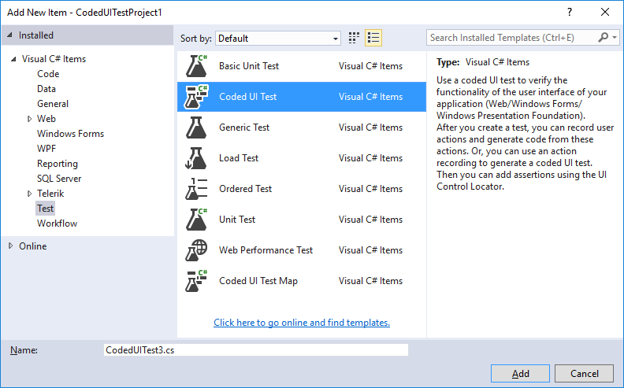
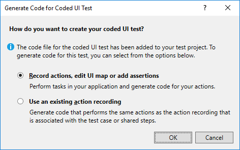
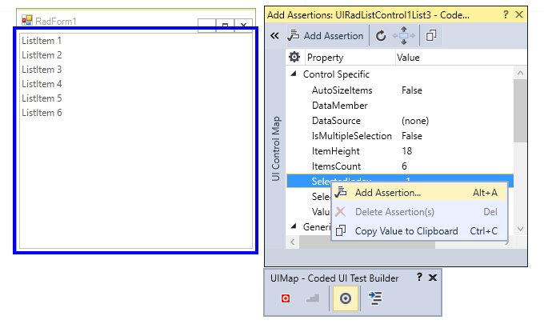
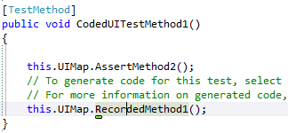
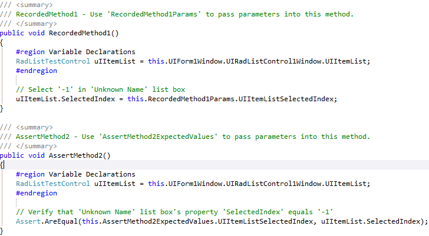

# Getting Started

| RELATED VIDEOS |  |
| ------ | ------ |
|[What is new in R3 2012 Telerik UI for WinForms](http://www.telerik.com/videos/winforms/what-is-new-in-q3-2012-radcontrols-for-winforms) This webinar examines the new features found in Telerik UI for WinForms. Included in the R3 2012 release is RadPivotGrid (Beta), Coded UI Testing Support, touch, legend and financial charts for RadChartView, Visual Studio 2012 compliance and much much more. Get started with Coded UI Test and Telerik UI for WinForms now! (25:02 - 31:32)||
|[Getting Started with Coded UI for WinForms](http://tv.telerik.com/watch/radcontrols-for-winforms/getting-started-with-coded-ui-for-winforms) Telerik UI for WinForms R3 2012 introduces full support for Coded UI Tests implementing all four Coded UI Test levels. These enhancements are available not only in Visual Studio 2010, but also in the new Visual Studio 2012. Today, we will take a look at Getting started with CodedUI testing using Telerik UI for WinForms.||

This article will demonstrate how to create a simple test with **RadListControl** and CodedUI:

1\. Create a **Coded UI Test Project**:

2\. Right click over the project file and select *Coded UI Test* to create a new test.

3\. Alternatively, you can select *Add >> New Item* option and select *Coded UI Test* and click `Add`.

4\. Select the first option - *"Record actions, edit UI map or add assertions"*

>note It is necessary to set **EnableCodedUITests** property to *true* for each control that is contained in the form for which you record a CodedUI test. In R2 2017 we introduced the static RadControl.**EnableCodedUITestsDefaultValue** property which controls the default value for enabling CodedUI for all controls from UI for WinForms suite. It is recommended to set the property before calling **InitializeComponent** method. 

5\. Then, start an application created with Telerik UI for WinForms - in our case this is a form with **RadListControl**.

6\. Once the test has been recorded, choose "Generate Code" from the Record window and then add an Assertion from Coded UI Spy to check the __SelectedIndex__ property value.

7\. In the generated code you can see the recorded actions aggregated into corresponding properties sets:

8\. You can run the test from Visual Studio menu *Test -> Run -> Run Test*.
            
