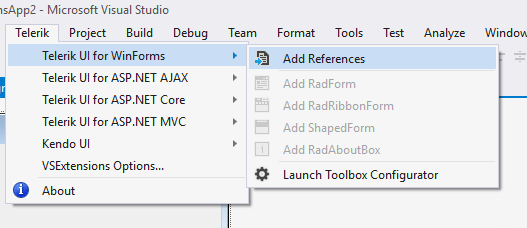
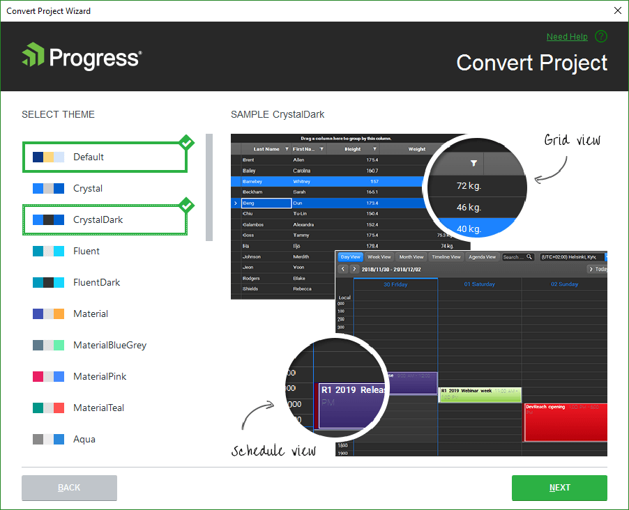

# Convert project

__Add References__

Telerik Visual Studio extensions Convert Project Wizard could be accessed through the Telerik menu when you need to convert an existing WinForms application to a Telerik WinForms application:

The wizard could be also reached through the context menu counterparts accessed by right clicking on the project you want to convert.

The Convert Project Wizard lets you tune your project's use of Telerik UI for WinForms.

The wizard’s first page lets you:

* Select a Telerik UI version from the list of versions detected on your system

* Download the latest versions available on our website using the __GET LATEST__ button

* Specify which assemblies your project would use. When selecting a Telerik UI for WinForms assembly all dependent controls are selected automatically and vice-versa.

>tip GET LATEST button is available only when there is a newer version released on our web site.
>
> If you prefer the Telerik assemblies to be copied into your solution folder, the __Copy referenced assemblies to solution and source control__ option could be selected only into the [Visual Studio Extensions Options]().

Through the Convert Project Wizard’s second page you can:

* Select which theme will be applied to your project. Check the content of each theme or see the preview of it when select it into the Convert Project.

Through the Convert Project Wizard’s third page you can:

* Select the "Enable HDPI" option in order to add support for high DPI awareness in your application.

>important Note that the "Enable HDPI" option is availaible from version 2019.1

When you click the Finish button:

* The selected assembly references get added to your project

* A default application-wide theme gets set according to the selected theme.

* An app.manifest file is included to your project if you have selected the "Enable HDPI" option.

# See Also

 * [Automatic Dependency Resolving]()

 * [Upgrade Project]()

 * [Download New Version]()